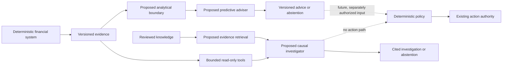

{/* Generated canonical editorial projection. Do not edit directly. */}

# Evidence-Grounded AI for Trading Systems

Latency-sensitive financial systems can use predictive models and
evidence-grounded investigation without transferring execution authority to
probabilistic software.

## The engineering problem

Latency-sensitive financial systems make exact decisions under incomplete and
rapidly changing information. They combine checked arithmetic, strict policy,
bounded time, partial observations, and actions whose consequences cannot be
delegated to a plausible explanation.

Two useful intelligence problems emerge:

1. **Prediction:** estimate one uncertain aspect of execution quality from
   information genuinely available at decision time.
2. **Investigation:** help an engineer find, compare, and explain the evidence
   surrounding an outcome.

Prediction is primarily a numerical modeling problem. It should begin with
transparent deterministic and statistical baselines. Investigation is where
retrieval and language models may help, provided their claims remain cited,
their uncertainty remains visible, and they have no authority to act.

The two capabilities can share a governed evidence foundation, but they need
different methods, evaluations, and trust boundaries. Combining them in an
unconstrained agent makes both harder to test and govern.

## Facts and lineage before models

An intelligence system is only as trustworthy as the facts it can reconstruct.
Before training or retrieval, the underlying platform needs stable identity,
provenance, time semantics, deterministic validation, and an explicit record
of missing evidence.

Useful foundations include:

- versioned facts and stable identities;
- deterministic validation, comparison, and replay;
- evidence-strength distinctions that keep observations separate from
  conclusions;
- explicit incomplete, unknown, and abstained outcomes; and
- durable operational evidence and observability.

These foundations are valuable without AI. They let engineers inspect
decisions and test hypotheses with deterministic tools. They also prevent an
AI layer from silently redefining what happened.

Every derived result should trace to the evidence, code revision, and method
that produced it. A model evaluation without lineage is not repeatable. A
generated explanation without citations is not auditable. A missing fact is
not a negative example.

Salus provides evidence and deterministic architecture foundations, but its
current evidence coverage is not sufficient to claim production-ready
modeling. That limitation points to a data-readiness audit, not permission to
infer the missing history.

## Deterministic authority versus probabilistic advice

The central authority split is simple:

| Deterministic system authority | Probabilistic assistance |
|---|---|
| Identity and input validation | Bounded estimates |
| Checked arithmetic and invariants | Uncertainty and calibration |
| Policy and risk limits | Evidence ranking |
| Final action or refusal | Cited synthesis |
| Recovery and rollback | Abstention |

Probabilistic output is evidence offered to deterministic policy. It is not an
instruction. The deterministic system validates the output's version,
freshness, lineage, range, and abstention state before deciding whether it is
admissible.

No language model belongs in the execution hot path. No model should possess
credentials, action tools, or a path around a deterministic limit. That
boundary remains in force even if later shadow evaluation shows a useful
prediction.

## A bounded intelligence plane

The proposed intelligence plane sits beside the existing deterministic system:



The arrows are as important as the components. Evidence may feed prediction
and investigation. Advice may later be considered by deterministic policy only
after separate authorization. The investigator has no control path.

The first evaluation does not require a large AI platform. A bounded
analytical store, reproducible transformation jobs, an experiment record, and
a narrow inference boundary are enough to test one predictive question.
Hybrid retrieval and an investigator should follow only when their evidence
and evaluation sets are ready.

This architecture depends on lineage, authority, and evaluation contracts
rather than any particular database, model framework, or agent library.

## Predictive ML for execution-quality advice

A predictive adviser should estimate one narrowly defined aspect of execution
quality. It does not choose an action, set a limit, or optimize an open-ended
goal.

The first comparison is a constant baseline and a small deterministic
baseline. A learned model is worth retaining only when it improves
out-of-sample calibration or discrimination, remains within its latency
budget, and abstains when input is stale or unfamiliar.

Only contemporaneous, governance-approved evidence is admissible. Information
learned after a decision cannot become an input for that decision. Sensitive
identifiers and competitive implementation detail remain excluded unless a
separate review establishes a genuine modeling need.

Advice needs enough context to be judged: version, evidence lineage,
uncertainty, freshness, and any abstention reason. Deterministic code remains
responsible for arithmetic, risk, policy, and the final decision. A baseline, a
statistical model, or no model at all can therefore produce the same bounded
kind of advice without changing execution authority.

## Evidence-grounded retrieval and investigative agents

An investigative capability can answer bounded engineering questions about
retained evidence. It may locate relevant facts, compare explanations,
identify contradictions, and state what remains unknown.

Retrieval should combine:

1. exact lookup for known identities and cited facts;
2. lexical search over reviewed knowledge; and
3. semantic search for candidate discovery.

Exact evidence outranks similarity. Retrieved text is untrusted input, not an
instruction. Each material claim should cite a versioned fact or reviewed
source and distinguish observation, comparison, association, and unresolved
evidence.

The investigator is not a causal oracle. It may organize comparative evidence
and propose a hypothesis for human review. It cannot turn temporal proximity
or a persuasive narrative into proof.

Tool use remains narrow and read-only. Each tool has validated inputs, bounded
output, an enforced resource limit, and a specific purpose. There is no generic
mutation tool, unrestricted query interface, arbitrary network access, or
execution capability.

## Point-in-time correctness and leakage prevention

Financial data is particularly vulnerable to time leakage. Event time alone is
not enough: a fact can describe an earlier event while becoming available only
after the decision being modeled.

The admissibility rule is:

```text
evidence was available before the decision
```

Every transformation should preserve both when something happened and when it
became knowable. Dataset construction enforces the decision-time cutoff,
records exclusions, and remains reproducible from immutable inputs.

Evaluation splits should follow time and isolate strongly correlated groups.
Randomly distributing near-duplicate observations across training and
evaluation can produce impressive but meaningless results. Post-outcome facts,
revised records, and future-derived summaries must not leak into
decision-time inputs.

Unknown, incomplete, and abstained evidence stay distinct. They do not become
convenient negative outcomes.

## Abstention, bounded tools, and least authority

Abstention is required system behavior. The system should return no advice when
evidence is missing, stale, unsupported, outside the evaluated distribution,
or below an approved confidence standard.

Least authority applies to models and agents:

- read only the minimum evidence needed;
- expose only allowlisted tools;
- validate structured inputs and outputs;
- enforce deadlines, size limits, and concurrency limits;
- omit credentials and action capabilities; and
- fail closed on malformed, stale, or untraceable output.

A human-readable explanation never overrides a machine-enforced refusal. Human
review is required when an investigation informs engineering or policy
changes.

## Evaluation, shadow operation, and graduation gates

The proposed graduation path is staged:

| Stage | Permitted behavior | Evidence gate |
|---|---|---|
| Data-readiness audit | Validate lineage and reject unusable evidence. | Reproducibility, time correctness, and explicit exclusions. |
| Offline evaluation | Compare deterministic baselines and conventional models. | Independent evaluation, calibration, and error analysis. |
| Shadow operation | Retain advice beside existing decisions without influence. | Stable quality, latency, availability, drift, and abstention. |
| Human advisory | Surface reviewed output to engineers. | Useful evaluations, security review, and rollback process. |
| Bounded policy input | Deterministic policy may consider one narrow estimate. | Separate authorization, monitored limits, canary, and rollback. |

Each stage has independent failure conditions. Passing offline evaluation does
not authorize shadow operation. Passing shadow evaluation does not authorize
policy influence. No stage gives an agent autonomous execution authority.

Investigation evaluation should test citation accuracy, unsupported-claim
refusal, contradictory and missing evidence, prompt-injection attempts, tool
failure, and abstention. Model, retrieval, prompt, tool, and evaluation
versions remain traceable.

## Implemented, proposed, and not implemented

Salus currently has deterministic execution and evidence foundations.
Execution is implemented but not fully validated. Its core
data-to-evaluation pipeline is implemented and verified, while newer
state-change ordering research remains passive or test-only and is not fully
validated. Causality is partially implemented, and retained comparative
evidence is negative or inconclusive. Existing deterministic behavior remains
authoritative.

| Capability | Status |
|---|---|
| Versioned facts, deterministic validation and replay, evidence-strength handling, and operational observability | Implemented foundation |
| Evidence coverage needed for reliable modeling | Incomplete |
| Analytical foundation and governed learning pipeline | Proposed |
| Predictive execution-quality adviser | Proposed |
| Evidence retrieval and causal investigator | Proposed |
| Production ML, RAG, or agent service | Not implemented |
| AI-controlled execution or autonomous capital authority | Not implemented |
| AI-derived profitability | Not established |

These labels are part of the architecture. They prevent a design direction from
being presented as shipped software. Model advice cannot bypass deterministic
safety, economic, or execution controls.

## Security and prompt-injection boundaries

Retrieval systems must assume that documents and tool results can contain
hostile instructions. Prompt injection is handled as a least-authority and
input-validation problem, not as something solved by one system prompt.

Controls include separating instructions from evidence, allowlisting tools,
validating parameters, constraining access, limiting resource use, validating
structured output, retaining citations, and monitoring refusals and failures.
Secrets and private infrastructure remain outside model context.

Observability should correlate evidence, model or prompt version, advice,
deterministic decision, and later evaluation without exposing sensitive data.
Malformed output, missing lineage, tool failure, or excessive latency fails
closed.

## Limitations

This is a proposed architecture, not a deployment record. Salus does not claim
production ML, a production retrieval or agent service, AI-controlled
execution, autonomous agents, or AI-derived profitability.

Current evidence and deterministic architecture foundations exist, and Salus
can retain evidence suitable for future learning and investigation. Complete
point-in-time joins, representative datasets, feature and label pipelines,
production ML, retrieval-augmented generation, and agent capabilities remain
proposed or not implemented. Causality evidence is partial and inconclusive.

Financial outcomes are non-stationary and partially observed. Historical
evaluation may fail under a new regime. Calibration, drift monitoring,
abstention, deterministic limits, and human review reduce risk but do not
eliminate it.

The first useful result may be a documented finding that the evidence is not
ready for modeling. That is a successful governance outcome because it avoids
building confidence on unreliable data.

## Applying the architecture

Salus is one reference implementation supplying evidence for this pattern, not
the definition of it. The same boundary applies to payment routing, fraud
detection, credit decision support, market surveillance, and other systems
where probabilistic assistance can add value but must not silently acquire
action authority.

Start with one bounded prediction or investigation question. Define the
deterministic authority, admissible evidence, abstention conditions,
evaluation set, and graduation gate before selecting technology. If the
evidence or authority boundary cannot be stated precisely, the system is not
ready for a model or agent.

## Engineering Implementation Notes

### Implemented authority substrate, not an AI feature

```rust
pub struct SourceBlockIdentityV1 {
    pub schema_version: u16,
    pub chain: ChainName,
    pub chain_id: u64,
    pub block_number: u64,
    pub block_hash: String,
    pub parent_hash: Option<String>,
    pub block_timestamp_unix_seconds: Option<i64>,
    pub state_root: SourceBlockStateRootV1,
}
```

This typed identity is implemented infrastructure for establishing what a
source observation refers to. It is a concrete example of the authority and
lineage layer described above; it is **not** an implementation of the proposed
AI model, agent, or production AI execution plane.

## Go deeper

- Start with the [Salus engineering case study](/work/salus) for the project
  context and its current evidence limits.
- See [Deterministic Replay as Engineering Evidence](/research/deterministic-replay-as-engineering-evidence)
  and [What Trading-System Validation Evidence Can Prove](/research/trading-system-validation-evidence)
  for the evidence boundaries.
- Continue to [Designing Evidence-Aware Trading-System Pipelines](/architecture/trading-system-execution-pipelines)
  and [Inspectable Read Models for Trading Systems](/architecture/inspectable-trading-read-models)
  for deterministic authority and retained-evidence design.
- Read [Solving, Arbitrage & Market Making](/writing/solving-arbitrage-market-making)
  for the longer engineering narrative behind the Salus evidence foundation.
- Read the original [Retrieval-Augmented Generation paper](https://arxiv.org/abs/2005.11401),
  [OWASP prompt-injection guidance](https://genai.owasp.org/llmrisk/llm01-prompt-injection/),
  and the [NIST AI Risk Management Framework](https://www.nist.gov/itl/ai-risk-management-framework)
  for external research and control context.
