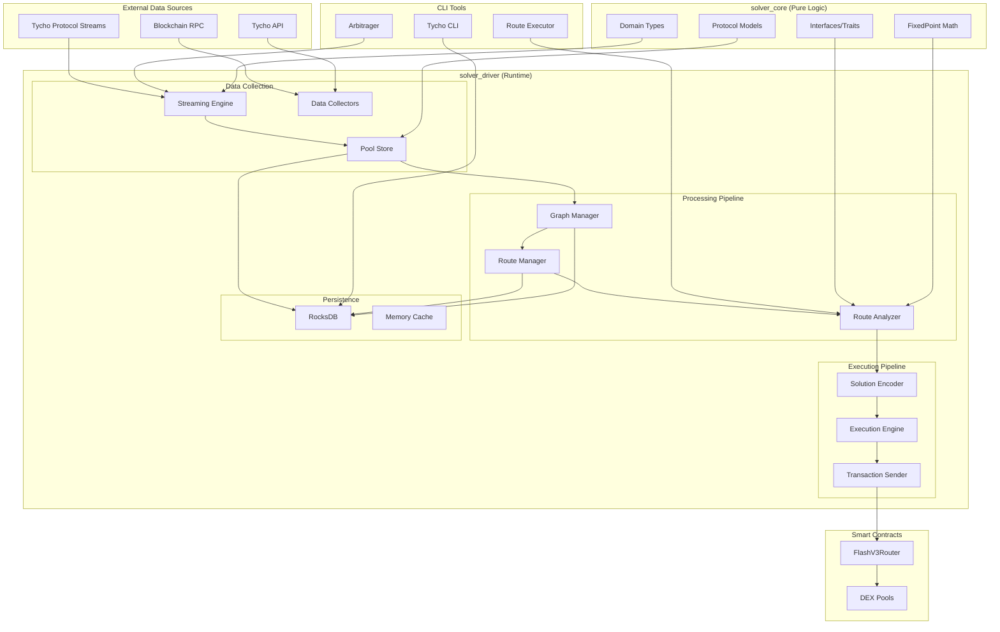

# Product

## Overview

This section contains information about productizing research with the current focuse being high performance solving Infrastructure.
🚧 ⛏️ Under Construction

> Previous work relates to the research done and products built with varying degrees of success.
> Some won prizes in hackathons, others had seed funding commitments but did not launch.
> The majority of the research and design here lead to permanent roles with organizations building in the same space.
> For deeper research on solving, arbitrage, bridging, zero knowledge and chain consensus and signing see [research](/research/intro.mdx).
> This section is where that research was brought together to form an idea of a platform.

## Solving Architecture

The solver system implements a liqudity mapping layer, coupled with high performance route evaluation (over 1000 routes per second).
The reference implementation implements a sophisticated arbitrage bot capable of generating profit with **no upfront capital** through flash loan-based execution.

The architecture follows a **streaming-first approach** that processes real-time blockchain data to identify and execute profitable arbitrage opportunities.

#### Core Design Principles

1. **Collectors → Strategies → Execution**: Modular architecture with clear separation of concerns
2. **Real-time Processing**: Live blockchain data streaming via Tycho protocol streams
3. **Capital Efficiency**: Flash loan integration eliminates upfront capital requirements
4. **Multi-protocol Support**: Uniswap V2, V3, V4 with extensible protocol framework
5. **Performance Optimization**: Microsecond-level route evaluation and execution

#### System Architecture

