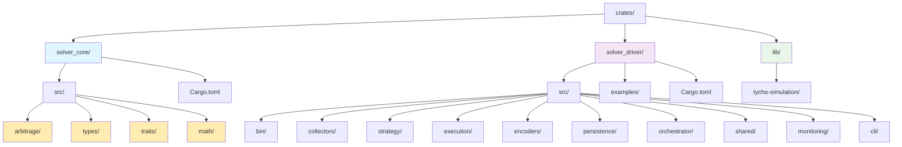

# DeFi Arbitrage Solver - Implementation Documentation

## Table of Contents

1. [Codebase Structure](#codebase-structure)
2. [Core Implementation Components](#core-implementation-components)
3. [Data Flow Implementation](#data-flow-implementation)
4. [Key Algorithms](#key-algorithms)
5. [Performance Optimizations](#performance-optimizations)
6. [Database Implementation](#database-implementation)
7. [Error Handling & Logging](#error-handling--logging)
8. [Configuration System](#configuration-system)
9. [Testing Infrastructure](#testing-infrastructure)
10. [Deployment & Operations](#deployment--operations)

## Codebase Structure

### Project Layout



### Architecture Principles

#### 1. Separation of Concerns
- **solver_core**: Pure business logic, algorithms, and domain models
- **solver_driver**: I/O operations, orchestration, and runtime concerns
- **Clear boundaries**: No I/O operations in core, no business logic in driver

#### 2. Dependency Injection
- Components accept trait objects rather than concrete implementations
- Enables easy testing and swapping of implementations
- Facilitates modular development and maintenance

#### 3. Error Handling Strategy
- **thiserror**: Custom error types with proper error chaining
- **anyhow**: Context-rich error handling in application layer
- **Result\<T, E\>**: Explicit error handling throughout codebase

## Core Implementation Components

### 1. Collectors Layer (`crates/solver_driver/src/collectors/`)

#### Pool Store (`store.rs`)
```rust
pub trait PoolStore: Send + Sync {
    async fn get_protocol_state(&self, pool_id: &str) -> Option<ProtocolComponent>;
    async fn set_protocol_state(&self, pool_id: String, component: ProtocolComponent);
    async fn get_all_pools(&self) -> Vec<ProtocolComponent>;
}

pub struct InMemoryPoolStore {
    pools: Arc<RwLock<HashMap<String, ProtocolComponent>>>,
    state_updates: Arc<Mutex<VecDeque<StateUpdate>>>,
}
```

**Key Features**:
- Thread-safe concurrent access with `RwLock`
- Real-time state updates via `VecDeque`
- Memory-efficient storage with lazy loading
- Protocol-agnostic interface supporting V2/V3/V4

#### Graph Manager (`graph_manager.rs`)
```rust
pub struct GraphManager {
    graph: Graph,
    compact_graph: CompactGraph,
    compact_id_map: CompactIdMap,
    tokens: HashMap<Bytes, Token>,
    pools: HashMap<String, ProtocolComponent>,
}

impl GraphManager {
    pub async fn build_or_update_graph(&mut self, pools: &[ProtocolComponent]) -> Result<()>;
    pub async fn calculate_routes_for_pools(&mut self, pools: &[ProtocolComponent], max_hops: usize) -> Result<Vec<RouteMinimal>>;
}
```

**Key Features**:
- **CompactGraph**: Memory-optimized graph representation using integer IDs
- **Incremental Updates**: Only processes new pools/tokens
- **Multi-hop Route Generation**: 3, 4, and 5-hop route discovery
- **Performance**: Microsecond-level graph operations

#### Route Manager (`route_manager.rs`)
```rust
pub struct RouteManager {
    routes: HashMap<String, RouteMinimal>,
    route_pool_index: HashMap<String, HashSet<String>>,
    flash_loan_manager: FlashLoanManager,
}

impl RouteManager {
    pub async fn create_routes_for_pools(&mut self, pools: &[ProtocolComponent], max_hops: usize) -> Result<Vec<RouteMinimal>>;
    pub async fn get_routes_for_pools(&self, pool_ids: &[String]) -> Vec<RouteMinimal>;
    pub async fn add_flash_loan_to_route(&self, route: &mut RouteMinimal) -> Result<()>;
}
```

**Key Features**:
- **Route Deduplication**: Keccak256-based route hashing
- **Flash Loan Integration**: Automatic flash loan selection
- **O(1) Pool Lookup**: Reverse index for affected route discovery
- **Memory Efficiency**: In-memory caching with smart indexing

#### Token Manager (`tokens.rs`)
```rust
pub struct TokenManager {
    tokens: HashMap<Bytes, Token>,
    token_blacklist: HashSet<Bytes>,
    quality_filters: TokenQualityFilters,
}

impl TokenManager {
    pub async fn load_tokens_from_rpc(&mut self, rpc_client: &RpcClient) -> Result<()>;
    pub async fn get_token_info(&self, address: &Bytes) -> Option<&Token>;
    pub fn is_token_blacklisted(&self, address: &Bytes) -> bool;
}
```

**Key Features**:
- **Multi-chain Support**: Chain-specific token handling
- **Quality Filtering**: Token validation and quality scoring
- **Blacklist Management**: Configurable token blacklists
- **Decimal Handling**: Proper decimal precision management

### 2. Strategy Layer (`crates/solver_driver/src/strategy/`)

#### Route Analyzer (`route_analyzer_queue.rs`)
```rust
pub struct QueueBasedRouteAnalyzer {
    route_evaluator: Arc<dyn RouteEvaluator + Send + Sync>,
    execution_engine: Option<ExecutionEngine>,
    token_map: HashMap<Bytes, Token>,
}

impl QueueBasedRouteAnalyzer {
    pub async fn analyze_routes_with_enhanced_token_selection(
        &self,
        routes: Vec<RouteMinimal>,
        strategy_config: &StrategyConfig,
    ) -> Result<usize>;

    pub async fn select_best_route_from_token_group_with_details(
        &self,
        routes: Vec<RouteMinimal>,
    ) -> Result<Vec<RouteEvaluationResult>>;
}
```

**Key Features**:
- **TOKEN Strategy**: Groups routes by input token, executes best per group
- **CARB Strategy**: Traditional cyclical arbitrage with profit optimization
- **Profit Calculation**: Real-time profitability using `get_amount_out`
- **Blacklist Integration**: Pre-evaluation route filtering
- **Forced Execution**: TOKEN strategy executes even negative profit routes

#### Amount Calculator (`amount_calculator.rs`)
```rust
pub struct AmountCalculator {
    precision: u32,
    max_iterations: usize,
    tolerance: f64,
}

impl AmountCalculator {
    pub async fn find_optimal_input_amount(
        &self,
        route: &RouteMinimal,
        pool_store: &dyn PoolStore,
        token_map: &HashMap<Bytes, Token>,
    ) -> Result<u128>;

    pub fn binary_search_optimal_amount(
        &self,
        route: &RouteMinimal,
        min_amount: u128,
        max_amount: u128,
        simulator: &dyn RouteSimulator,
    ) -> Result<u128>;
}
```

**Key Features**:
- **Binary Search Optimization**: Finds optimal trade amounts
- **Precision Control**: Configurable precision and iteration limits
- **Slippage Protection**: Accounts for slippage in calculations
- **Gas Cost Integration**: Factors gas costs into profit calculations

### 3. Execution Layer (`crates/solver_driver/src/execution/`)

#### Execution Engine (`route_executor.rs`)
```rust
pub struct RouteExecutor {
    client: Arc<dyn Provider>,
    chain_enum: Chain,
    signer: EthereumWallet,
    dry_run: bool,
}

impl RouteExecutor {
    pub async fn execute_signal_with_retry(&mut self, signal: &RouteSignal, no_preflight: bool) -> Result<RouteExecutionResult>;
    pub async fn validate_and_prepare_route(&self, signal: &RouteSignal) -> Result<()>;
    pub async fn simulate_transaction_execution(&self, signal: &RouteSignal) -> Result<()>;
}
```

**Key Features**:
- **Preflight Validation**: Comprehensive pre-execution checks
- **Transaction Simulation**: On-chain simulation before sending
- **Automatic Blacklisting**: Failed routes added to blacklist
- **Retry Logic**: Nonce synchronization and retry mechanisms
- **Gas Optimization**: Dynamic gas parameter adjustment

#### Transaction Builder (`transaction_builder.rs`)
```rust
pub struct AtomicTransactionBuilder {
    chain_id: u64,
    gas_estimator: GasEstimator,
    balance_validator: BalanceValidator,
}

impl AtomicTransactionBuilder {
    pub async fn build_flash_transaction(&self, signal: &RouteSignal) -> Result<TransactionRequest>;
    pub async fn estimate_gas_cost(&self, signal: &RouteSignal) -> Result<u64>;
    pub async fn validate_balance(&self, address: &Address, estimated_cost: U256) -> Result<()>;
}
```

**Key Features**:
- **EIP-1559 Support**: Modern transaction format with dynamic fees
- **Gas Estimation**: Accurate gas cost prediction
- **Balance Validation**: Pre-execution balance checks
- **Transaction Encoding**: ABI-compliant calldata generation

### 4. Persistence Layer (`crates/solver_driver/src/persistence/`)

#### Database Manager (`repositories/`)
```rust
pub trait Repository<T> {
    async fn save(&self, item: &T) -> Result<()>;
    async fn get(&self, id: &str) -> Result<Option<T>>;
    async fn delete(&self, id: &str) -> Result<()>;
    async fn list(&self) -> Result<Vec<T>>;
}

pub struct TokenRepository {
    db: Arc<RocksDB>,
    cf_handle: ColumnFamily,
}

pub struct RouteRepository {
    db: Arc<RocksDB>,
    cf_handle: ColumnFamily,
    batch_writer: BatchWriter,
}
```

**Key Features**:
- **Column Family Architecture**: Separate storage for different data types
- **Batch Operations**: WriteBatch for efficient bulk operations
- **Async Operations**: Non-blocking database operations
- **MVCC Support**: Multi-version concurrency control

#### Cache Layer (`cache/`)
```rust
pub struct MemoryCache<K, V> {
    cache: Arc<RwLock<HashMap<K, V>>>,
    max_size: usize,
    ttl: Duration,
}

impl<K, V> MemoryCache<K, V> {
    pub async fn get(&self, key: &K) -> Option<V>;
    pub async fn set(&self, key: K, value: V);
    pub async fn invalidate(&self, key: &K);
    pub async fn evict_expired(&self);
}
```

**Key Features**:
- **LRU Eviction**: Least recently used cache eviction
- **TTL Support**: Time-based cache expiration
- **Thread Safety**: Concurrent access with RwLock
- **Memory Management**: Configurable size limits

## Data Flow Implementation

### 1. Streaming Pipeline Flow

```rust
// Main streaming loop in MinimalStreamingEngine
pub async fn start_streaming(&mut self, config: StreamingConfig) -> Result<()> {
    // 1. Initialize WebSocket connection
    let mut ws_stream = self.connect_to_tycho_stream().await?;

    // 2. Process incoming messages
    while let Some(message) = ws_stream.next().await {
        match message {
            // New protocol components
            StreamMessage::NewPairs(pairs) => {
                self.process_new_pairs(pairs).await?;
            },

            // State updates
            StreamMessage::StateUpdate(update) => {
                self.process_state_update(update).await?;
            },

            // Other message types...
        }
    }
}

async fn process_new_pairs(&mut self, pairs: Vec<ProtocolComponent>) -> Result<()> {
    // 1. Update graph with new pools
    self.graph_manager.build_or_update_graph(&pairs).await?;

    // 2. Calculate routes for new pools
    let new_routes = self.graph_manager.calculate_routes_for_pools(&pairs, self.max_hops).await?;

    // 3. Store routes in memory and database
    self.route_manager.add_routes_to_memory(new_routes).await?;

    // 4. Queue routes for evaluation
    for route in &new_routes {
        self.evaluation_sender.send(route.clone())?;
    }

    Ok(())
}
```

### 2. Route Evaluation Flow

```rust
// Route evaluation in QueueBasedRouteAnalyzer
pub async fn analyze_routes_with_enhanced_token_selection(
    &self,
    routes: Vec<RouteMinimal>,
    strategy_config: &StrategyConfig,
) -> Result<usize> {
    // 1. Apply blacklist filtering
    let filtered_routes = self.apply_blacklist_filtering(routes).await?;

    // 2. Group routes by strategy
    let grouped_routes = match strategy_config.strategy {
        Strategy::TOKEN => self.group_routes_by_token(filtered_routes),
        Strategy::CARB => self.group_routes_by_profit(filtered_routes),
    };

    // 3. Evaluate each group
    let mut total_signals = 0;
    for (group_key, group_routes) in grouped_routes {
        let evaluations = self.evaluate_route_group(group_routes).await?;

        // 4. Select best route from group
        if let Some(best_route) = self.select_best_route(evaluations) {
            // 5. Execute if profitable (or forced)
            if best_route.is_profitable() || strategy_config.force_execution {
                self.execute_route(best_route).await?;
                total_signals += 1;
            }
        }
    }

    Ok(total_signals)
}
```

### 3. Transaction Execution Flow

```rust
// Transaction execution in RouteExecutor
pub async fn execute_signal_with_retry(
    &mut self,
    signal: &RouteSignal,
    no_preflight: bool,
) -> Result<RouteExecutionResult> {
    // 1. Validate route structure
    self.validate_route_structure(signal).await?;

    // 2. Pre-flight checks (if enabled)
    if !no_preflight {
        self.validate_and_prepare_route(signal).await?;
        self.simulate_transaction_execution(signal).await?;
    }

    // 3. Build transaction
    let tx_request = self.build_transaction(signal).await?;

    // 4. Send transaction with retry
    let mut attempts = 0;
    const MAX_ATTEMPTS: u32 = 3;

    while attempts < MAX_ATTEMPTS {
        match self.send_transaction(&tx_request).await {
            Ok(receipt) => {
                return Ok(RouteExecutionResult::Success {
                    tx_hash: receipt.transaction_hash,
                    gas_used: receipt.gas_used,
                });
            },
            Err(e) if self.is_retryable_error(&e) => {
                attempts += 1;
                self.sync_nonce().await?;
                continue;
            },
            Err(e) => {
                // Add to blacklist and return error
                self.blacklist_route(signal).await?;
                return Err(e);
            }
        }
    }

    Err(anyhow::anyhow!("Max retry attempts exceeded"))
}
```

## Key Algorithms

### 1. Graph Construction Algorithm

```rust
impl GraphManager {
    pub async fn build_or_update_graph(&mut self, pools: &[ProtocolComponent]) -> Result<()> {
        for pool in pools {
            // 1. Extract tokens from pool
            let tokens = self.extract_tokens_from_pool(pool)?;

            // 2. Add tokens as graph nodes
            for token in &tokens {
                if !self.graph.has_node(token) {
                    self.graph.add_node(token.clone());
                }
            }

            // 3. Add pool as bidirectional edges
            if tokens.len() >= 2 {
                let token_a = &tokens[0];
                let token_b = &tokens[1];

                // Add edge A -> B
                let edge_ab = GraphEdge {
                    from: token_a.clone(),
                    to: token_b.clone(),
                    pool_id: pool.id.clone(),
                    protocol: pool.protocol_system.clone(),
                    rate: self.calculate_rate(pool, token_a, token_b)?,
                };
                self.graph.add_edge(edge_ab);

                // Add edge B -> A
                let edge_ba = GraphEdge {
                    from: token_b.clone(),
                    to: token_a.clone(),
                    pool_id: pool.id.clone(),
                    protocol: pool.protocol_system.clone(),
                    rate: self.calculate_rate(pool, token_b, token_a)?,
                };
                self.graph.add_edge(edge_ba);
            }
        }

        Ok(())
    }
}
```

### 2. Route Discovery Algorithm

```rust
impl GraphManager {
    pub async fn calculate_routes_for_pools(
        &mut self,
        pools: &[ProtocolComponent],
        max_hops: usize,
    ) -> Result<Vec<RouteMinimal>> {
        let mut routes = Vec::new();

        // 1. Get tokens involved in new pools
        let involved_tokens: HashSet<Bytes> = pools
            .iter()
            .flat_map(|pool| self.extract_tokens_from_pool(pool).unwrap_or_default())
            .map(|token| token.address)
            .collect();

        // 2. Find routes for each token combination
        for start_token in &involved_tokens {
            for end_token in &involved_tokens {
                if start_token == end_token {
                    continue;
                }

                // 3. Generate routes of different hop lengths
                for hops in 3..=max_hops {
                    let paths = self.find_paths(start_token, end_token, hops)?;

                    for path in paths {
                        // 4. Create route from path
                        let route = self.create_route_from_path(path)?;

                        // 5. Add flash loan if eligible
                        if let Some(flash_loan) = self.find_flash_loan_for_route(&route)? {
                            route.flash_loan = Some(flash_loan);
                            routes.push(route);
                        }
                    }
                }
            }
        }

        // 6. Deduplicate routes
        self.deduplicate_routes(routes)
    }

    fn find_paths(
        &self,
        start: &Bytes,
        end: &Bytes,
        max_hops: usize,
    ) -> Result<Vec<Vec<GraphEdge>>> {
        let mut paths = Vec::new();
        let mut current_path = Vec::new();
        let mut visited = HashSet::new();

        self.dfs_find_paths(start, end, max_hops, &mut current_path, &mut visited, &mut paths);

        Ok(paths)
    }

    fn dfs_find_paths(
        &self,
        current: &Bytes,
        target: &Bytes,
        remaining_hops: usize,
        current_path: &mut Vec<GraphEdge>,
        visited: &mut HashSet<Bytes>,
        paths: &mut Vec<Vec<GraphEdge>>,
    ) {
        if remaining_hops == 0 {
            if current == target && current_path.len() >= 3 {
                paths.push(current_path.clone());
            }
            return;
        }

        visited.insert(current.clone());

        for edge in self.graph.get_edges_from(current) {
            if !visited.contains(&edge.to) {
                current_path.push(edge.clone());
                self.dfs_find_paths(&edge.to, target, remaining_hops - 1, current_path, visited, paths);
                current_path.pop();
            }
        }

        visited.remove(current);
    }
}
```

### 3. Flash Loan Selection Algorithm

```rust
impl FlashLoanManager {
    pub async fn find_best_flash_loan_for_route(&self, route: &RouteMinimal) -> Result<Option<FlashLoan>> {
        if route.path.is_empty() {
            return Ok(None);
        }

        let flash_token = &route.path[0]; // First token in route

        // 1. Find all eligible flash loan pools
        let mut candidates = Vec::new();

        for pool in self.pool_store.get_all_pools().await {
            if self.is_eligible_flash_pool(&pool, flash_token)? {
                let fee = self.calculate_flash_fee(&pool, flash_token)?;
                candidates.push(FlashLoanCandidate {
                    pool: pool.clone(),
                    fee,
                    liquidity: self.get_pool_liquidity(&pool, flash_token)?,
                });
            }
        }

        // 2. Sort by fee (ascending) and liquidity (descending)
        candidates.sort_by(|a, b| {
            a.fee.partial_cmp(&b.fee).unwrap()
                .then(b.liquidity.partial_cmp(&a.liquidity).unwrap())
        });

        // 3. Select best candidate
        if let Some(best) = candidates.first() {
            Ok(Some(FlashLoan {
                token: flash_token.clone(),
                component: best.pool.clone(),
                fee_percent: best.fee,
            }))
        } else {
            Ok(None)
        }
    }

    fn is_eligible_flash_pool(&self, pool: &ProtocolComponent, token: &Bytes) -> Result<bool> {
        // 1. Must be Uniswap V3 pool (current limitation)
        if pool.protocol_system != "uniswap_v3" {
            return Ok(false);
        }

        // 2. Must contain the flash token
        let pool_tokens = self.extract_tokens_from_pool(pool)?;
        if !pool_tokens.iter().any(|t| &t.address == token) {
            return Ok(false);
        }

        // 3. Must have sufficient liquidity
        let liquidity = self.get_pool_liquidity(pool, token)?;
        if liquidity < self.min_liquidity_threshold {
            return Ok(false);
        }

        Ok(true)
    }
}
```

### 4. Profit Calculation Algorithm

```rust
impl RouteEvaluator {
    pub async fn evaluate_route(
        &self,
        route: &RouteMinimal,
        input_amount: u128,
    ) -> Result<RouteEvaluation> {
        // 1. Simulate the route to get output amount
        let output_amount = self.simulate_route_execution(route, input_amount).await?;

        // 2. Calculate base profit (output - input)
        let base_profit = if output_amount > input_amount {
            (output_amount - input_amount) as f64
        } else {
            -((input_amount - output_amount) as f64)
        };

        // 3. Calculate flash loan fees
        let flash_loan_fee = if let Some(flash_loan) = &route.flash_loan {
            let fee_rate = flash_loan.fee_percent / 10000.0; // Convert basis points
            (input_amount as f64) * fee_rate
        } else {
            0.0
        };

        // 4. Estimate gas costs
        let gas_cost = self.estimate_gas_cost(route).await?;
        let gas_cost_usd = (gas_cost as f64) * self.gas_price_gwei * self.eth_price_usd / 1e9;

        // 5. Calculate net profit
        let net_profit = base_profit - flash_loan_fee - gas_cost_usd;

        // 6. Calculate profit percentage
        let profit_percentage = if input_amount > 0 {
            (net_profit / (input_amount as f64)) * 100.0
        } else {
            0.0
        };

        Ok(RouteEvaluation {
            route_id: route.route_id.clone(),
            input_amount,
            output_amount,
            profit_amount: net_profit,
            profit_percentage,
            gas_cost: gas_cost as u64,
            flash_loan_fee,
            is_profitable: net_profit > 0.0,
        })
    }

    async fn simulate_route_execution(
        &self,
        route: &RouteMinimal,
        input_amount: u128,
    ) -> Result<u128> {
        let mut current_amount = input_amount;

        // Simulate each hop in the route
        for (i, token_address) in route.path.iter().enumerate() {
            if i == route.path.len() - 1 {
                break; // Last token is the output
            }

            let next_token = &route.path[i + 1];

            // Find the pool connecting these tokens
            let pool = self.find_pool_for_pair(token_address, next_token)?;

            // Get current pool state
            let protocol_state = self.pool_store.get_protocol_state(&pool.id).await
                .ok_or_else(|| anyhow::anyhow!("Pool state not found: {}", pool.id))?;

            // Simulate the swap
            current_amount = self.simulate_swap(
                &protocol_state,
                token_address,
                next_token,
                current_amount,
            ).await?;
        }

        Ok(current_amount)
    }
}
```

## Performance Optimizations

### 1. Memory Management

#### In-Memory Route Caching
```rust
pub struct RouteManager {
    // O(1) route lookup
    routes_in_memory: Arc<Mutex<HashMap<String, MinimalRoute>>>,

    // O(1) pool-to-routes mapping
    route_pool_index: Arc<Mutex<HashMap<String, HashSet<String>>>>,

    // LRU cache for frequently accessed routes
    route_cache: Arc<Mutex<LruCache<String, MinimalRoute>>>,
}

impl RouteManager {
    pub async fn get_routes_for_pools(&self, pool_ids: &[String]) -> Vec<MinimalRoute> {
        let route_pool_index = self.route_pool_index.lock().await;
        let routes_in_memory = self.routes_in_memory.lock().await;

        let mut result_routes = Vec::new();

        // O(1) lookup per pool
        for pool_id in pool_ids {
            if let Some(route_ids) = route_pool_index.get(pool_id) {
                for route_id in route_ids {
                    if let Some(route) = routes_in_memory.get(route_id) {
                        result_routes.push(route.clone());
                    }
                }
            }
        }

        result_routes
    }
}
```

#### Compact Graph Representation
```rust
pub struct CompactGraph {
    // Use integer IDs instead of full addresses for memory efficiency
    nodes: Vec<u32>,                              // Token IDs
    edges: HashMap<u32, Vec<CompactEdge>>,        // From token ID -> edges
    id_map: CompactIdMap,                         // Address <-> ID mapping
}

pub struct CompactEdge {
    from: u32,           // 4 bytes vs 20 bytes for address
    to: u32,             // 4 bytes vs 20 bytes for address
    pool_id_hash: u64,   // 8 bytes vs variable string length
    protocol: u8,        // 1 byte vs string
    rate: u64,           // 8 bytes fixed point
}

impl CompactGraph {
    pub fn get_edges_from(&self, token_id: u32) -> &[CompactEdge] {
        self.edges.get(&token_id).map(|v| v.as_slice()).unwrap_or(&[])
    }

    // Memory usage: ~10MB savings on typical graphs with 1000+ tokens
}
```

### 2. Database Optimizations

#### Batch Write Operations
```rust
pub struct BatchWriter {
    batch: WriteBatch,
    pending_operations: usize,
    batch_size: usize,
    flush_interval: Duration,
    last_flush: Instant,
}

impl BatchWriter {
    pub async fn add_operation(&mut self, key: &[u8], value: &[u8]) -> Result<()> {
        self.batch.put(key, value);
        self.pending_operations += 1;

        // Flush if batch is full or enough time has passed
        if self.pending_operations >= self.batch_size ||
           self.last_flush.elapsed() >= self.flush_interval {
            self.flush().await?;
        }

        Ok(())
    }

    async fn flush(&mut self) -> Result<()> {
        if self.pending_operations > 0 {
            self.db.write(self.batch.clone())?;
            self.batch.clear();
            self.pending_operations = 0;
            self.last_flush = Instant::now();
        }
        Ok(())
    }
}
```

#### Column Family Optimization
```rust
pub struct DatabaseManager {
    db: Arc<RocksDB>,
    cf_tokens: ColumnFamily,
    cf_routes: ColumnFamily,
    cf_graph_nodes: ColumnFamily,
    cf_graph_edges: ColumnFamily,
    cf_signals: ColumnFamily,
}

impl DatabaseManager {
    pub fn new(path: &str) -> Result<Self> {
        let mut opts = Options::default();
        opts.create_if_missing(true);
        opts.create_missing_column_families(true);

        // Optimize for write-heavy workload
        opts.set_write_buffer_size(64 * 1024 * 1024); // 64MB
        opts.set_max_write_buffer_number(3);
        opts.set_target_file_size_base(64 * 1024 * 1024); // 64MB

        // Enable compression
        opts.set_compression_type(DBCompressionType::Lz4);

        let cf_descriptors = vec![
            ColumnFamilyDescriptor::new("tokens", opts.clone()),
            ColumnFamilyDescriptor::new("routes", opts.clone()),
            ColumnFamilyDescriptor::new("graph_nodes", opts.clone()),
            ColumnFamilyDescriptor::new("graph_edges", opts.clone()),
            ColumnFamilyDescriptor::new("signals", opts.clone()),
        ];

        let db = DB::open_cf_descriptors(&opts, path, cf_descriptors)?;

        Ok(Self {
            db: Arc::new(db),
            cf_tokens: db.cf_handle("tokens").unwrap(),
            cf_routes: db.cf_handle("routes").unwrap(),
            cf_graph_nodes: db.cf_handle("graph_nodes").unwrap(),
            cf_graph_edges: db.cf_handle("graph_edges").unwrap(),
            cf_signals: db.cf_handle("signals").unwrap(),
        })
    }
}
```

### 3. Concurrent Processing

#### Parallel Route Evaluation
```rust
pub struct ParallelRouteEvaluator {
    worker_pool: ThreadPool,
    max_concurrent_evaluations: usize,
}

impl ParallelRouteEvaluator {
    pub async fn evaluate_routes_parallel(
        &self,
        routes: Vec<MinimalRoute>,
    ) -> Result<Vec<RouteEvaluation>> {
        let chunk_size = (routes.len() / self.max_concurrent_evaluations).max(1);
        let chunks: Vec<_> = routes.chunks(chunk_size).collect();

        let mut handles = Vec::new();

        for chunk in chunks {
            let chunk = chunk.to_vec();
            let evaluator = self.route_evaluator.clone();

            let handle = self.worker_pool.spawn(async move {
                let mut results = Vec::new();
                for route in chunk {
                    match evaluator.evaluate_route(&route).await {
                        Ok(evaluation) => results.push(evaluation),
                        Err(e) => warn!("Route evaluation failed: {}", e),
                    }
                }
                results
            });

            handles.push(handle);
        }

        // Collect results from all workers
        let mut all_results = Vec::new();
        for handle in handles {
            let mut results = handle.await?;
            all_results.append(&mut results);
        }

        Ok(all_results)
    }
}
```

#### Async Stream Processing
```rust
pub struct StreamProcessor {
    message_buffer: VecDeque<StreamMessage>,
    processing_semaphore: Semaphore,
    max_concurrent_processing: usize,
}

impl StreamProcessor {
    pub async fn process_stream(&mut self, mut stream: impl Stream<Item = StreamMessage>) {
        while let Some(message) = stream.next().await {
            // Acquire permit for concurrent processing
            let permit = self.processing_semaphore.acquire().await.unwrap();

            let processor = self.clone();
            tokio::spawn(async move {
                if let Err(e) = processor.process_message(message).await {
                    error!("Failed to process stream message: {}", e);
                }
                drop(permit); // Release permit
            });
        }
    }

    async fn process_message(&self, message: StreamMessage) -> Result<()> {
        match message {
            StreamMessage::NewPairs(pairs) => {
                self.process_new_pairs(pairs).await?;
            },
            StreamMessage::StateUpdate(update) => {
                self.process_state_update(update).await?;
            },
            StreamMessage::BlockUpdate(block) => {
                self.process_block_update(block).await?;
            },
        }
        Ok(())
    }
}
```

## Database Implementation

### Schema Design

#### Column Family Structure
```rust
pub enum ColumnFamily {
    Tokens,      // Token metadata and configuration
    Routes,      // Calculated arbitrage routes
    GraphNodes,  // Graph node data (tokens)
    GraphEdges,  // Graph edge data (pools)
    Signals,     // Execution signals and results
}

// Key formats for each column family
impl ColumnFamily {
    pub fn key_format(&self) -> &'static str {
        match self {
            ColumnFamily::Tokens => "token:<chain>:<address>",
            ColumnFamily::Routes => "route:<route_id>",
            ColumnFamily::GraphNodes => "node:<token_address>",
            ColumnFamily::GraphEdges => "edge:<from_token>:<to_token>:<pool_id>",
            ColumnFamily::Signals => "signal:<signal_id>",
        }
    }
}
```

#### Data Serialization
```rust
use serde::{Serialize, Deserialize};
use bincode;

#[derive(Serialize, Deserialize, Clone, Debug)]
pub struct Token {
    pub address: Bytes,
    pub symbol: String,
    pub decimals: u8,
    pub chain: String,
    pub quality: u8,
}

#[derive(Serialize, Deserialize, Clone, Debug)]
pub struct RouteMinimal {
    pub route_id: String,
    pub path: Vec<Bytes>,
    pub protocols: Vec<String>,
    pub flash_loan: Option<FlashLoan>,
    pub created_at: u64,
}

impl DatabaseSerializable for Token {
    fn serialize(&self) -> Result<Vec<u8>> {
        Ok(bincode::serialize(self)?)
    }

    fn deserialize(data: &[u8]) -> Result<Self> {
        Ok(bincode::deserialize(data)?)
    }
}
```

### Transaction Management

#### Atomic Operations
```rust
pub struct AtomicTransaction {
    batch: WriteBatch,
    operations: Vec<Operation>,
}

impl AtomicTransaction {
    pub fn new() -> Self {
        Self {
            batch: WriteBatch::default(),
            operations: Vec::new(),
        }
    }

    pub fn add_token(&mut self, token: &Token) -> Result<()> {
        let key = format!("token:{}:{}", token.chain, hex::encode(&token.address));
        let value = token.serialize()?;

        self.batch.put_cf(&self.cf_tokens, key.as_bytes(), &value);
        self.operations.push(Operation::InsertToken(token.clone()));

        Ok(())
    }

    pub fn add_route(&mut self, route: &RouteMinimal) -> Result<()> {
        let key = format!("route:{}", route.route_id);
        let value = route.serialize()?;

        self.batch.put_cf(&self.cf_routes, key.as_bytes(), &value);
        self.operations.push(Operation::InsertRoute(route.clone()));

        Ok(())
    }

    pub async fn commit(&self, db: &RocksDB) -> Result<()> {
        // Atomic write - either all succeed or all fail
        db.write(&self.batch)?;

        info!("Committed atomic transaction with {} operations", self.operations.len());
        Ok(())
    }

    pub fn rollback(&mut self) {
        self.batch.clear();
        self.operations.clear();

        warn!("Rolled back transaction");
    }
}
```

### Query Optimization

#### Indexed Queries
```rust
pub struct QueryBuilder {
    cf: ColumnFamily,
    filters: Vec<Filter>,
    ordering: Option<Ordering>,
    limit: Option<usize>,
}

impl QueryBuilder {
    pub fn new(cf: ColumnFamily) -> Self {
        Self {
            cf,
            filters: Vec::new(),
            ordering: None,
            limit: None,
        }
    }

    pub fn filter(mut self, filter: Filter) -> Self {
        self.filters.push(filter);
        self
    }

    pub fn order_by(mut self, ordering: Ordering) -> Self {
        self.ordering = Some(ordering);
        self
    }

    pub fn limit(mut self, limit: usize) -> Self {
        self.limit = Some(limit);
        self
    }

    pub async fn execute<T: DatabaseSerializable>(&self, db: &RocksDB) -> Result<Vec<T>> {
        let iter = db.iterator_cf(&self.cf, IteratorMode::Start);
        let mut results = Vec::new();

        for item in iter {
            let (key, value) = item?;

            // Apply filters
            if self.apply_filters(&key, &value)? {
                let object = T::deserialize(&value)?;
                results.push(object);
            }

            // Check limit
            if let Some(limit) = self.limit {
                if results.len() >= limit {
                    break;
                }
            }
        }

        // Apply ordering
        if let Some(ordering) = &self.ordering {
            self.apply_ordering(&mut results, ordering);
        }

        Ok(results)
    }
}

// Usage example
let profitable_routes = QueryBuilder::new(ColumnFamily::Routes)
    .filter(Filter::GreaterThan("profit", 0.0))
    .order_by(Ordering::Descending("profit"))
    .limit(100)
    .execute::<RouteMinimal>(&db)
    .await?;
```

## Error Handling & Logging

### Error Type Hierarchy

```rust
use thiserror::Error;

#[derive(Error, Debug)]
pub enum SolverError {
    #[error("Database error: {0}")]
    Database(#[from] rocksdb::Error),

    #[error("Serialization error: {0}")]
    Serialization(#[from] bincode::Error),

    #[error("Network error: {0}")]
    Network(#[from] reqwest::Error),

    #[error("Route evaluation error: {message}")]
    RouteEvaluation { message: String },

    #[error("Transaction execution error: {message}")]
    TransactionExecution { message: String },

    #[error("Configuration error: {message}")]
    Configuration { message: String },

    #[error("Validation error: {field} - {message}")]
    Validation { field: String, message: String },
}

#[derive(Error, Debug)]
pub enum RouteError {
    #[error("Invalid route path: {0}")]
    InvalidPath(String),

    #[error("Missing flash loan data")]
    MissingFlashLoan,

    #[error("Token not found: {0}")]
    TokenNotFound(String),

    #[error("Pool not found: {0}")]
    PoolNotFound(String),

    #[error("Insufficient liquidity in pool {pool_id}")]
    InsufficientLiquidity { pool_id: String },
}

#[derive(Error, Debug)]
pub enum ExecutionError {
    #[error("Insufficient balance: required {required}, available {available}")]
    InsufficientBalance { required: U256, available: U256 },

    #[error("Transaction failed: {reason}")]
    TransactionFailed { reason: String },

    #[error("Gas estimation failed: {0}")]
    GasEstimationFailed(String),

    #[error("Nonce synchronization failed")]
    NonceSyncFailed,

    #[error("Preflight simulation failed: {0}")]
    PreflightFailed(String),
}
```

### Structured Logging Implementation

```rust
use tracing::{info, warn, error, debug, instrument};
use tracing_subscriber::{layer::SubscriberExt, util::SubscriberInitExt};

#[derive(Clone)]
pub struct LoggingConfig {
    pub level: tracing::Level,
    pub format: LogFormat,
    pub output: LogOutput,
}

pub enum LogFormat {
    Json,
    Compact,
    Pretty,
}

pub enum LogOutput {
    Stdout,
    File(String),
    Both(String),
}

impl LoggingConfig {
    pub fn init(&self) -> Result<()> {
        let subscriber = tracing_subscriber::registry();

        match self.output {
            LogOutput::Stdout => {
                subscriber
                    .with(self.create_stdout_layer())
                    .with(self.create_filter_layer())
                    .init();
            },
            LogOutput::File(ref path) => {
                subscriber
                    .with(self.create_file_layer(path)?)
                    .with(self.create_filter_layer())
                    .init();
            },
            LogOutput::Both(ref path) => {
                subscriber
                    .with(self.create_stdout_layer())
                    .with(self.create_file_layer(path)?)
                    .with(self.create_filter_layer())
                    .init();
            },
        }

        Ok(())
    }
}

// Structured logging throughout the application
#[instrument(skip(self), fields(route_id = %route.route_id))]
pub async fn evaluate_route(&self, route: &RouteMinimal) -> Result<RouteEvaluation> {
    debug!("Starting route evaluation");

    let start_time = Instant::now();

    match self.perform_evaluation(route).await {
        Ok(evaluation) => {
            let duration = start_time.elapsed();
            info!(
                profit_amount = evaluation.profit_amount,
                profit_percentage = evaluation.profit_percentage,
                gas_cost = evaluation.gas_cost,
                duration_ms = duration.as_millis(),
                "Route evaluation completed"
            );
            Ok(evaluation)
        },
        Err(e) => {
            let duration = start_time.elapsed();
            error!(
                error = %e,
                duration_ms = duration.as_millis(),
                "Route evaluation failed"
            );
            Err(e)
        }
    }
}

#[instrument(skip(self), fields(tx_hash))]
pub async fn execute_transaction(&mut self, signal: &RouteSignal) -> Result<TransactionReceipt> {
    info!("Starting transaction execution");

    // Log transaction details
    info!(
        route_id = %signal.route_id,
        input_amount = signal.input_amount,
        expected_profit = signal.expected_profit,
        "Transaction details"
    );

    match self.send_transaction(signal).await {
        Ok(receipt) => {
            tracing::Span::current().record("tx_hash", &format!("{:?}", receipt.transaction_hash));

            info!(
                tx_hash = ?receipt.transaction_hash,
                gas_used = receipt.gas_used,
                status = receipt.status,
                "Transaction executed successfully"
            );

            Ok(receipt)
        },
        Err(e) => {
            error!(
                error = %e,
                "Transaction execution failed"
            );
            Err(e)
        }
    }
}
```

### Error Recovery Strategies

```rust
pub struct ErrorRecoveryManager {
    retry_config: RetryConfig,
    circuit_breaker: CircuitBreaker,
    fallback_strategies: HashMap<ErrorType, Box<dyn FallbackStrategy>>,
}

#[derive(Clone)]
pub struct RetryConfig {
    pub max_attempts: u32,
    pub base_delay: Duration,
    pub max_delay: Duration,
    pub backoff_multiplier: f64,
}

impl ErrorRecoveryManager {
    pub async fn execute_with_recovery<F, T>(&self, operation: F) -> Result<T>
    where
        F: Fn() -> BoxFuture<'static, Result<T>>,
    {
        let mut attempt = 0;
        let mut delay = self.retry_config.base_delay;

        loop {
            // Check circuit breaker
            if !self.circuit_breaker.is_closed() {
                return Err(SolverError::CircuitBreakerOpen);
            }

            match operation().await {
                Ok(result) => {
                    self.circuit_breaker.record_success();
                    return Ok(result);
                },
                Err(e) => {
                    attempt += 1;
                    self.circuit_breaker.record_failure();

                    if attempt >= self.retry_config.max_attempts {
                        // Try fallback strategy
                        if let Some(fallback) = self.get_fallback_strategy(&e) {
                            warn!("Attempting fallback strategy for error: {}", e);
                            return fallback.execute().await;
                        }

                        return Err(e);
                    }

                    if !self.is_retryable_error(&e) {
                        return Err(e);
                    }

                    warn!(
                        attempt = attempt,
                        max_attempts = self.retry_config.max_attempts,
                        delay_ms = delay.as_millis(),
                        error = %e,
                        "Operation failed, retrying"
                    );

                    tokio::time::sleep(delay).await;
                    delay = std::cmp::min(
                        Duration::from_millis((delay.as_millis() as f64 * self.retry_config.backoff_multiplier) as u64),
                        self.retry_config.max_delay,
                    );
                }
            }
        }
    }

    fn is_retryable_error(&self, error: &SolverError) -> bool {
        match error {
            SolverError::Network(_) => true,
            SolverError::Database(_) => true,
            SolverError::TransactionExecution { message } => {
                // Retryable if it's a nonce or gas issue
                message.contains("nonce") || message.contains("gas")
            },
            _ => false,
        }
    }
}
```

## Configuration System

### Hierarchical Configuration

```rust
use serde::{Deserialize, Serialize};
use config::{Config, ConfigError, Environment, File};

#[derive(Debug, Deserialize, Serialize, Clone)]
pub struct SolverConfig {
    pub chains: HashMap<String, ChainConfig>,
    pub database: DatabaseConfig,
    pub streaming: StreamingConfig,
    pub execution: ExecutionConfig,
    pub logging: LoggingConfig,
}

#[derive(Debug, Deserialize, Serialize, Clone)]
pub struct ChainConfig {
    pub chain_id: u64,
    pub rpc_url: String,
    pub rpc_query_url: String,
    pub indexer_url: String,
    pub router_address: String,
    pub executor_address: String,
    pub gas_config: GasConfig,
    pub v4_config: V4Config,
}

#[derive(Debug, Deserialize, Serialize, Clone)]
pub struct DatabaseConfig {
    pub path: String,
    pub write_buffer_size: usize,
    pub max_open_files: i32,
    pub compression: CompressionType,
    pub batch_size: usize,
    pub flush_interval_ms: u64,
}

#[derive(Debug, Deserialize, Serialize, Clone)]
pub struct StreamingConfig {
    pub max_concurrent_streams: usize,
    pub reconnect_attempts: u32,
    pub reconnect_delay_ms: u64,
    pub message_buffer_size: usize,
    pub evaluation_batch_size: usize,
    pub evaluation_timeout_ms: u64,
}

#[derive(Debug, Deserialize, Serialize, Clone)]
pub struct ExecutionConfig {
    pub dry_run: bool,
    pub force_execution: bool,
    pub max_retry_attempts: u32,
    pub retry_delay_ms: u64,
    pub preflight_enabled: bool,
    pub profit_threshold: f64,
    pub gas_multiplier: f64,
}

impl SolverConfig {
    pub fn load() -> Result<Self, ConfigError> {
        let mut s = Config::new();

        // Start with default configuration
        s.merge(File::with_name("config/default"))?;

        // Layer environment-specific configuration
        let env = std::env::var("SOLVER_ENV").unwrap_or_else(|_| "development".into());
        s.merge(File::with_name(&format!("config/{}", env)).required(false))?;

        // Layer local configuration (not committed to git)
        s.merge(File::with_name("config/local").required(false))?;

        // Layer environment variables
        s.merge(Environment::with_prefix("SOLVER").separator("_"))?;

        s.try_into()
    }

    pub fn validate(&self) -> Result<(), ConfigError> {
        // Validate chain configurations
        for (chain_name, chain_config) in &self.chains {
            if chain_config.chain_id == 0 {
                return Err(ConfigError::Message(format!("Invalid chain_id for {}", chain_name)));
            }

            if chain_config.rpc_url.is_empty() {
                return Err(ConfigError::Message(format!("Missing rpc_url for {}", chain_name)));
            }

            // Validate URL format
            if let Err(_) = url::Url::parse(&chain_config.rpc_url) {
                return Err(ConfigError::Message(format!("Invalid rpc_url format for {}", chain_name)));
            }
        }

        // Validate database configuration
        if self.database.write_buffer_size == 0 {
            return Err(ConfigError::Message("Invalid write_buffer_size".into()));
        }

        // Validate execution configuration
        if self.execution.profit_threshold < 0.0 {
            return Err(ConfigError::Message("Profit threshold cannot be negative".into()));
        }

        Ok(())
    }
}
```

### Environment-Specific Configuration Files

#### `config/default.toml`
```toml
[database]
path = "data"
write_buffer_size = 67108864  # 64MB
max_open_files = 1000
compression = "lz4"
batch_size = 100
flush_interval_ms = 100

[streaming]
max_concurrent_streams = 10
reconnect_attempts = 5
reconnect_delay_ms = 1000
message_buffer_size = 1000
evaluation_batch_size = 200
evaluation_timeout_ms = 30000

[execution]
dry_run = false
force_execution = false
max_retry_attempts = 3
retry_delay_ms = 1000
preflight_enabled = true
profit_threshold = 0.0
gas_multiplier = 1.2

[logging]
level = "info"
format = "compact"
output = "stdout"

[chains.base]
chain_id = 8453
rpc_url = "${BASE_RPC_URL}"
indexer_url = "https://base-indexer.tychodex.com"
router_address = "0x..."
executor_address = "0x..."

[chains.base.gas_config]
base_fee = 100000
per_hop_fee = 50000
max_fee_per_gas = 5000000000  # 5 gwei
max_priority_fee = 1000000000  # 1 gwei

[chains.unichain]
chain_id = 130
rpc_url = "${UNICHAIN_RPC_URL}"
indexer_url = "https://unichain-indexer.tychodex.com"
router_address = "0x..."
executor_address = "0x..."
```

#### `config/production.toml`
```toml
[database]
path = "data/production"
write_buffer_size = 134217728  # 128MB
max_open_files = 2000
batch_size = 500
flush_interval_ms = 50

[streaming]
max_concurrent_streams = 20
evaluation_batch_size = 500
evaluation_timeout_ms = 60000

[execution]
dry_run = false
preflight_enabled = true
profit_threshold = 0.1  # Only execute profitable routes

[logging]
level = "info"
format = "json"
output = "both:/var/log/solver/solver.log"
```

#### `config/development.toml`
```toml
[database]
path = "datatest"
batch_size = 10
flush_interval_ms = 1000

[execution]
dry_run = true
force_execution = true
profit_threshold = -100.0  # Execute all routes for testing

[logging]
level = "debug"
format = "pretty"
output = "stdout"
```

### Runtime Configuration Management

```rust
pub struct ConfigManager {
    config: Arc<RwLock<SolverConfig>>,
    file_watcher: Option<RecommendedWatcher>,
}

impl ConfigManager {
    pub fn new() -> Result<Self> {
        let config = SolverConfig::load()?;
        config.validate()?;

        Ok(Self {
            config: Arc::new(RwLock::new(config)),
            file_watcher: None,
        })
    }

    pub fn get(&self) -> Arc<SolverConfig> {
        Arc::new(self.config.read().unwrap().clone())
    }

    pub fn update<F>(&self, update_fn: F) -> Result<()>
    where
        F: FnOnce(&mut SolverConfig),
    {
        let mut config = self.config.write().unwrap();
        update_fn(&mut config);
        config.validate()?;

        info!("Configuration updated");
        Ok(())
    }

    pub fn watch_for_changes(&mut self) -> Result<()> {
        let (tx, rx) = channel();
        let mut watcher = RecommendedWatcher::new(tx, Duration::from_secs(2))?;

        watcher.watch("config/", RecursiveMode::NonRecursive)?;

        let config = self.config.clone();
        tokio::spawn(async move {
            while let Ok(event) = rx.recv() {
                match event {
                    DebouncedEvent::Write(_) | DebouncedEvent::Create(_) => {
                        info!("Configuration file changed, reloading...");

                        match SolverConfig::load() {
                            Ok(new_config) => {
                                if let Err(e) = new_config.validate() {
                                    error!("Invalid configuration: {}", e);
                                    continue;
                                }

                                let mut config_guard = config.write().unwrap();
                                *config_guard = new_config;

                                info!("Configuration reloaded successfully");
                            },
                            Err(e) => {
                                error!("Failed to reload configuration: {}", e);
                            }
                        }
                    },
                    _ => {}
                }
            }
        });

        self.file_watcher = Some(watcher);
        Ok(())
    }
}
```

## Testing Infrastructure

### Test Organization

```rust
// tests/integration_tests.rs
use solver_driver::*;
use tempfile::TempDir;

pub struct TestEnvironment {
    pub temp_dir: TempDir,
    pub config: SolverConfig,
    pub db: DatabaseManager,
    pub pool_store: Arc<dyn PoolStore>,
    pub mock_rpc: MockRpcClient,
}

impl TestEnvironment {
    pub async fn new() -> Result<Self> {
        let temp_dir = TempDir::new()?;
        let db_path = temp_dir.path().join("test_db");

        let mut config = SolverConfig::load()?;
        config.database.path = db_path.to_string_lossy().to_string();

        let db = DatabaseManager::new(&config.database)?;
        let pool_store = Arc::new(InMemoryPoolStore::new());
        let mock_rpc = MockRpcClient::new();

        Ok(Self {
            temp_dir,
            config,
            db,
            pool_store,
            mock_rpc,
        })
    }

    pub async fn setup_test_data(&mut self) -> Result<()> {
        // Add test tokens
        let usdc = Token {
            address: Bytes::from_hex("0xA0b86a33E6441E")?,
            symbol: "USDC".to_string(),
            decimals: 6,
            chain: "base".to_string(),
            quality: 5,
        };

        let weth = Token {
            address: Bytes::from_hex("0x4200000000000000000000000000000000000006")?,
            symbol: "WETH".to_string(),
            decimals: 18,
            chain: "base".to_string(),
            quality: 5,
        };

        self.db.save_token(&usdc).await?;
        self.db.save_token(&weth).await?;

        // Add test pool
        let pool = ProtocolComponent {
            id: Bytes::from_hex("0x1234567890abcdef")?,
            protocol_system: "uniswap_v3".to_string(),
            static_attributes: serde_json::json!({
                "token0": usdc.address,
                "token1": weth.address,
                "fee": 500
            }),
            ..Default::default()
        };

        self.pool_store.set_protocol_state(
            hex::encode(&pool.id),
            pool.clone(),
        ).await;

        Ok(())
    }
}
```

### Mock Implementations

```rust
// src/mocks/pool_store.rs
pub struct MockPoolStore {
    pools: Arc<Mutex<HashMap<String, ProtocolComponent>>>,
    fail_on_get: bool,
    delay_ms: u64,
}

impl MockPoolStore {
    pub fn new() -> Self {
        Self {
            pools: Arc::new(Mutex::new(HashMap::new())),
            fail_on_get: false,
            delay_ms: 0,
        }
    }

    pub fn set_fail_on_get(&mut self, fail: bool) {
        self.fail_on_get = fail;
    }

    pub fn set_delay(&mut self, delay_ms: u64) {
        self.delay_ms = delay_ms;
    }
}

#[async_trait]
impl PoolStore for MockPoolStore {
    async fn get_protocol_state(&self, pool_id: &str) -> Option<ProtocolComponent> {
        if self.delay_ms > 0 {
            tokio::time::sleep(Duration::from_millis(self.delay_ms)).await;
        }

        if self.fail_on_get {
            return None;
        }

        let pools = self.pools.lock().await;
        pools.get(pool_id).cloned()
    }

    async fn set_protocol_state(&self, pool_id: String, component: ProtocolComponent) {
        let mut pools = self.pools.lock().await;
        pools.insert(pool_id, component);
    }

    async fn get_all_pools(&self) -> Vec<ProtocolComponent> {
        let pools = self.pools.lock().await;
        pools.values().cloned().collect()
    }
}

// src/mocks/route_evaluator.rs
pub struct MockRouteEvaluator {
    evaluations: HashMap<String, RouteEvaluation>,
    fail_probability: f64,
}

impl MockRouteEvaluator {
    pub fn new() -> Self {
        Self {
            evaluations: HashMap::new(),
            fail_probability: 0.0,
        }
    }

    pub fn add_evaluation(&mut self, route_id: String, evaluation: RouteEvaluation) {
        self.evaluations.insert(route_id, evaluation);
    }

    pub fn set_fail_probability(&mut self, probability: f64) {
        self.fail_probability = probability;
    }
}

#[async_trait]
impl RouteEvaluator for MockRouteEvaluator {
    async fn evaluate_route(&self, route: &RouteMinimal) -> Result<RouteEvaluation> {
        // Simulate random failures
        if rand::random::<f64>() < self.fail_probability {
            return Err(SolverError::RouteEvaluation {
                message: "Mock evaluation failure".to_string(),
            });
        }

        // Return predefined evaluation or default
        Ok(self.evaluations.get(&route.route_id)
            .cloned()
            .unwrap_or_else(|| RouteEvaluation {
                route_id: route.route_id.clone(),
                input_amount: 1000000, // 1 USDC
                output_amount: 1001000, // 1.001 USDC (0.1% profit)
                profit_amount: 1000.0,
                profit_percentage: 0.1,
                gas_cost: 50000,
                flash_loan_fee: 100.0,
                is_profitable: true,
            })
        )
    }
}
```

### Test Utilities

```rust
// tests/helpers/mod.rs
pub mod assertions {
    use super::*;

    pub fn assert_route_valid(route: &RouteMinimal) {
        assert!(!route.route_id.is_empty(), "Route ID cannot be empty");
        assert!(route.path.len() >= 3, "Route path must have at least 3 tokens");
        assert_eq!(route.path.first(), route.path.last(), "Route must be cyclical");
        assert!(route.flash_loan.is_some(), "Route must have flash loan");
    }

    pub fn assert_profit_calculation_accurate(
        evaluation: &RouteEvaluation,
        expected_profit: f64,
        tolerance: f64,
    ) {
        let diff = (evaluation.profit_amount - expected_profit).abs();
        assert!(
            diff <= tolerance,
            "Profit calculation inaccurate: expected {}, got {}, diff {}",
            expected_profit,
            evaluation.profit_amount,
            diff
        );
    }

    pub fn assert_transaction_valid(tx: &TransactionRequest) {
        assert!(tx.gas.unwrap_or_default() > U256::from(21000), "Gas too low");
        assert!(tx.max_fee_per_gas.is_some(), "Missing max_fee_per_gas");
        assert!(tx.max_priority_fee_per_gas.is_some(), "Missing max_priority_fee_per_gas");
        assert!(tx.data.is_some(), "Missing transaction data");
    }
}

pub mod builders {
    use super::*;

    pub struct RouteBuilder {
        route: RouteMinimal,
    }

    impl RouteBuilder {
        pub fn new() -> Self {
            Self {
                route: RouteMinimal {
                    route_id: format!("test_route_{}", uuid::Uuid::new_v4()),
                    path: Vec::new(),
                    protocols: Vec::new(),
                    flash_loan: None,
                    created_at: chrono::Utc::now().timestamp() as u64,
                },
            }
        }

        pub fn with_path(mut self, path: Vec<Bytes>) -> Self {
            self.route.path = path;
            self
        }

        pub fn with_protocols(mut self, protocols: Vec<String>) -> Self {
            self.route.protocols = protocols;
            self
        }

        pub fn with_flash_loan(mut self, flash_loan: FlashLoan) -> Self {
            self.route.flash_loan = Some(flash_loan);
            self
        }

        pub fn build(self) -> RouteMinimal {
            self.route
        }
    }

    pub fn create_test_route() -> RouteMinimal {
        let usdc = Bytes::from_hex("0xA0b86a33E6441E").unwrap();
        let weth = Bytes::from_hex("0x4200000000000000000000000000000000000006").unwrap();
        let dai = Bytes::from_hex("0x50c5725949A6F0c72E6C4a641F24049A917DB0Cb").unwrap();

        RouteBuilder::new()
            .with_path(vec![usdc.clone(), weth, dai, usdc])
            .with_protocols(vec![
                "uniswap_v3".to_string(),
                "uniswap_v3".to_string(),
                "uniswap_v3".to_string(),
            ])
            .build()
    }
}
```

### Performance Tests

```rust
// tests/performance_tests.rs
use criterion::{criterion_group, criterion_main, Criterion, BenchmarkId};

fn benchmark_route_evaluation(c: &mut Criterion) {
    let rt = tokio::runtime::Runtime::new().unwrap();
    let env = rt.block_on(TestEnvironment::new()).unwrap();

    let mut group = c.benchmark_group("route_evaluation");

    for route_count in [10, 100, 1000, 10000].iter() {
        group.bench_with_input(
            BenchmarkId::new("parallel", route_count),
            route_count,
            |b, &route_count| {
                let routes: Vec<RouteMinimal> = (0..route_count)
                    .map(|_| builders::create_test_route())
                    .collect();

                b.iter(|| {
                    rt.block_on(async {
                        let evaluator = ParallelRouteEvaluator::new(env.pool_store.clone());
                        evaluator.evaluate_routes_parallel(routes.clone()).await.unwrap()
                    })
                });
            },
        );
    }

    group.finish();
}

fn benchmark_graph_operations(c: &mut Criterion) {
    let rt = tokio::runtime::Runtime::new().unwrap();

    let mut group = c.benchmark_group("graph_operations");

    for pool_count in [10, 100, 1000].iter() {
        group.bench_with_input(
            BenchmarkId::new("graph_update", pool_count),
            pool_count,
            |b, &pool_count| {
                let pools: Vec<ProtocolComponent> = (0..pool_count)
                    .map(|i| create_test_pool(i))
                    .collect();

                b.iter(|| {
                    rt.block_on(async {
                        let mut graph_manager = GraphManager::new();
                        graph_manager.build_or_update_graph(&pools).await.unwrap()
                    })
                });
            },
        );
    }

    group.finish();
}

criterion_group!(benches, benchmark_route_evaluation, benchmark_graph_operations);
criterion_main!(benches);
```

## Deployment & Operations

### Containerization

```dockerfile
# Dockerfile
FROM rust:1.70 as builder

WORKDIR /app
COPY . .

# Build the application
RUN cargo build --release --bin arbitrager

FROM debian:bullseye-slim

# Install runtime dependencies
RUN apt-get update && apt-get install -y \
    ca-certificates \
    libssl1.1 \
    && rm -rf /var/lib/apt/lists/*

# Create app user
RUN useradd -m -u 1000 solver

# Copy binary
COPY --from=builder /app/target/release/arbitrager /usr/local/bin/arbitrager

# Copy configuration
COPY config/ /app/config/
RUN chown -R solver:solver /app

USER solver
WORKDIR /app

# Health check
HEALTHCHECK --interval=30s --timeout=10s --start-period=5s --retries=3 \
    CMD curl -f http://localhost:8080/health || exit 1

CMD ["arbitrager", "--config", "config/production.toml"]
```

### Kubernetes Deployment

```yaml
# k8s/deployment.yaml
apiVersion: apps/v1
kind: Deployment
metadata:
  name: solver
  labels:
    app: solver
spec:
  replicas: 3
  selector:
    matchLabels:
      app: solver
  template:
    metadata:
      labels:
        app: solver
    spec:
      containers:
      - name: solver
        image: solver:latest
        ports:
        - containerPort: 8080
        env:
        - name: SOLVER_ENV
          value: "production"
        - name: TYCHO_API_KEY
          valueFrom:
            secretKeyRef:
              name: solver-secrets
              key: tycho-api-key
        - name: SOLVER_KEY
          valueFrom:
            secretKeyRef:
              name: solver-secrets
              key: solver-private-key
        - name: BASE_RPC_URL
          valueFrom:
            configMapKeyRef:
              name: solver-config
              key: base-rpc-url
        volumeMounts:
        - name: data-volume
          mountPath: /app/data
        - name: config-volume
          mountPath: /app/config
        resources:
          requests:
            memory: "512Mi"
            cpu: "250m"
          limits:
            memory: "2Gi"
            cpu: "1000m"
        livenessProbe:
          httpGet:
            path: /health
            port: 8080
          initialDelaySeconds: 30
          periodSeconds: 10
        readinessProbe:
          httpGet:
            path: /ready
            port: 8080
          initialDelaySeconds: 5
          periodSeconds: 5
      volumes:
      - name: data-volume
        persistentVolumeClaim:
          claimName: solver-data-pvc
      - name: config-volume
        configMap:
          name: solver-config
```

### Monitoring & Observability

```rust
// src/monitoring/metrics.rs
use prometheus::{Counter, Histogram, Gauge, IntCounter, register_counter, register_histogram, register_gauge, register_int_counter};

pub struct Metrics {
    pub routes_evaluated: Counter,
    pub routes_executed: Counter,
    pub transactions_sent: Counter,
    pub transactions_successful: Counter,
    pub transactions_failed: Counter,
    pub route_evaluation_duration: Histogram,
    pub transaction_execution_duration: Histogram,
    pub active_routes: Gauge,
    pub database_operations: IntCounter,
}

impl Metrics {
    pub fn new() -> Result<Self> {
        Ok(Self {
            routes_evaluated: register_counter!(
                "solver_routes_evaluated_total",
                "Total number of routes evaluated"
            )?,
            routes_executed: register_counter!(
                "solver_routes_executed_total",
                "Total number of routes executed"
            )?,
            transactions_sent: register_counter!(
                "solver_transactions_sent_total",
                "Total number of transactions sent"
            )?,
            transactions_successful: register_counter!(
                "solver_transactions_successful_total",
                "Total number of successful transactions"
            )?,
            transactions_failed: register_counter!(
                "solver_transactions_failed_total",
                "Total number of failed transactions"
            )?,
            route_evaluation_duration: register_histogram!(
                "solver_route_evaluation_duration_seconds",
                "Time spent evaluating routes"
            )?,
            transaction_execution_duration: register_histogram!(
                "solver_transaction_execution_duration_seconds",
                "Time spent executing transactions"
            )?,
            active_routes: register_gauge!(
                "solver_active_routes",
                "Number of currently active routes"
            )?,
            database_operations: register_int_counter!(
                "solver_database_operations_total",
                "Total number of database operations"
            )?,
        })
    }
}

// Usage throughout the application
impl RouteAnalyzer {
    #[instrument(skip(self))]
    pub async fn evaluate_route(&self, route: &RouteMinimal) -> Result<RouteEvaluation> {
        let _timer = self.metrics.route_evaluation_duration.start_timer();

        let result = self.perform_evaluation(route).await;

        self.metrics.routes_evaluated.inc();

        match result {
            Ok(evaluation) => {
                if evaluation.is_profitable {
                    self.metrics.active_routes.inc();
                }
                Ok(evaluation)
            },
            Err(e) => {
                error!("Route evaluation failed: {}", e);
                Err(e)
            }
        }
    }
}
```

### Logging & Alerting

```yaml
# prometheus/rules.yaml
groups:
- name: solver.rules
  rules:
  - alert: SolverHighErrorRate
    expr: rate(solver_transactions_failed_total[5m]) / rate(solver_transactions_sent_total[5m]) > 0.1
    for: 2m
    labels:
      severity: warning
    annotations:
      summary: "High transaction failure rate"
      description: "Solver transaction failure rate is {{ $value | humanizePercentage }} over the last 5 minutes"

  - alert: SolverNoTransactions
    expr: rate(solver_transactions_sent_total[10m]) == 0
    for: 5m
    labels:
      severity: critical
    annotations:
      summary: "No transactions sent"
      description: "Solver has not sent any transactions in the last 10 minutes"

  - alert: SolverHighLatency
    expr: histogram_quantile(0.95, rate(solver_route_evaluation_duration_seconds_bucket[5m])) > 1.0
    for: 3m
    labels:
      severity: warning
    annotations:
      summary: "High route evaluation latency"
      description: "95th percentile route evaluation latency is {{ $value }}s"

  - alert: SolverDatabaseErrors
    expr: rate(solver_database_operations_total{result="error"}[5m]) > 10
    for: 1m
    labels:
      severity: critical
    annotations:
      summary: "High database error rate"
      description: "Database error rate is {{ $value }} errors/second"
```

### Operational Runbooks

```markdown
# Solver Operations Runbook

## Common Issues and Solutions

### 1. High Transaction Failure Rate

**Symptoms:**
- Alert: `SolverHighErrorRate`
- High number of failed transactions
- Routes being blacklisted frequently

**Investigation:**
1. Check transaction failure reasons in logs
2. Verify gas price settings
3. Check account balance
4. Examine route quality

**Solutions:**
- Adjust gas parameters if gas-related failures
- Fund account if balance insufficient
- Review route blacklist and remove invalid entries
- Adjust profit thresholds

### 2. No Transactions Being Sent

**Symptoms:**
- Alert: `SolverNoTransactions`
- No profitable routes found
- System appears idle

**Investigation:**
1. Check if routes are being discovered
2. Verify profit threshold settings
3. Check streaming connection status
4. Examine route evaluation logs

**Solutions:**
- Lower profit threshold temporarily
- Check Tycho API connectivity
- Restart streaming engine
- Verify chain configuration

### 3. High Memory Usage

**Symptoms:**
- Kubernetes pod restarts due to memory limits
- Slow performance
- Out of memory errors

**Investigation:**
1. Check route cache size
2. Monitor graph memory usage
3. Examine database cache settings

**Solutions:**
- Reduce route cache size
- Implement periodic cache cleanup
- Adjust database buffer sizes
- Scale up pod memory limits

### 4. Database Performance Issues

**Symptoms:**
- High database operation latency
- Write timeouts
- Read query slowness

**Investigation:**
1. Check RocksDB metrics
2. Monitor disk I/O
3. Examine write batch sizes

**Solutions:**
- Increase write buffer size
- Adjust flush intervals
- Optimize column family settings
- Scale up disk performance

## Maintenance Procedures

### Updating Configuration

1. Update configuration files in git repository
2. Update ConfigMap in Kubernetes
3. Restart pods to pick up new configuration
4. Monitor logs for configuration validation

### Database Maintenance

1. Stop the solver gracefully
2. Backup database using RocksDB backup tools
3. Perform maintenance operations
4. Restart solver and verify operation

### Upgrading the Application

1. Build new container image
2. Run tests in staging environment
3. Deploy to production using rolling update
4. Monitor metrics and logs for issues
5. Rollback if necessary
```

This implementation documentation provides a comprehensive view of how the DeFi Arbitrage Solver is actually built and operates, covering all the key technical aspects needed for development, deployment, and maintenance.