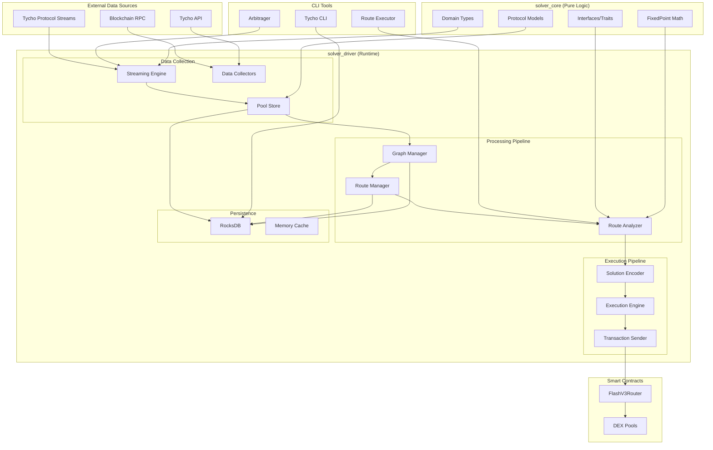
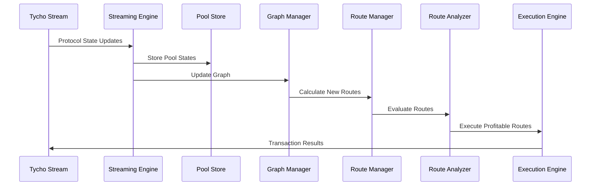

# Reference Implementation

## Architecture Overview

The Tycho solver system implements a sophisticated arbitrage bot capable of generating profit with **no upfront capital** through flash loan-based execution. The architecture follows a **streaming-first approach** that processes real-time blockchain data to identify and execute profitable arbitrage opportunities.

### Core Design Principles

1. **Collectors → Strategies → Execution**: Modular architecture with clear separation of concerns
2. **Real-time Processing**: Live blockchain data streaming via Tycho protocol streams
3. **Capital Efficiency**: Flash loan integration eliminates upfront capital requirements
4. **Multi-protocol Support**: Uniswap V2, V3, V4 with extensible protocol framework
5. **Performance Optimization**: Microsecond-level route evaluation and execution

### System Architecture



### Key Performance Metrics

- **Route Evaluation**: ~800 routes per second
- **Graph Building**: 193µs for 37 pools, 33µs for 2 pools
- **Route Calculation**: 2.42µs for 3-hop, 833ns for 4-hop, 791ns for 5-hop
- **Pool Coverage**: 2000+ pools with real-time state updates
- **Memory Usage**: <500MB for active streaming

## Liquidity Mapping Collector

The liquidity mapping collector system provides comprehensive chain indexing capabilities through integration with Tycho protocol streams, enabling real-time monitoring of blockchain state changes across multiple supported chains.

### Persistence

The system uses **RocksDB** as its primary database engine with a column family architecture optimized for high-performance operations:

| Column Family | Purpose           | Key Format              | Value Format                    |
| ------------- | ----------------- | ----------------------- | ------------------------------- |
| `tokens`      | Token metadata    | `token:<address>`       | Serialized `Token` struct       |
| `graph`       | Graph edges       | `graph:<token_address>` | Serialized `Vec<CompactEdge>`   |
| `routes`      | Calculated routes | `route:<route_id>`      | Serialized `Route` struct       |
| `signals`     | Route signals     | `signal:<signal_id>`    | Serialized `RouteSignal` struct |

**Performance Optimizations**:

- **Write Batching**: 100 operations per batch with 100ms flush interval
- **Asynchronous Writes**: Non-blocking write operations via dedicated writer thread
- **Memory Caching**: In-memory route storage with O(1) pool index lookup
- **Incremental Updates**: Only recalculates affected routes on state changes

### Graph Manager

The Graph Manager constructs and maintains trading graphs using tokens as nodes and pools as edges in a multi-graph structure:

```rust
pub struct GraphManager {
    token_to_id: HashMap<Bytes, u32>,
    id_to_token: HashMap<u32, Bytes>,
    pool_to_id: HashMap<String, u32>,
    id_to_pool: HashMap<u32, String>,
    next_token_id: u32,
    next_pool_id: u32,
}

#[derive(Debug, Clone, Serialize, Deserialize)]
pub struct CompactEdge {
    pub pool_id: u32,
    pub token_out: u32,
    pub protocol: u8, // 0=UniV2, 1=UniV3, 2=UniV4, etc.
    pub fee_bps: u32,
}
```

**Key Features**:

- **Dynamic Graph Building**: Real-time graph construction with generic `build_or_update_graph()` function
- **Edge Management**: Pool rate edges with metadata
- **Node Management**: Token nodes with properties
- **Graph Traversal**: Efficient path finding algorithms using Depth-First Search (DFS)
- **Cycle Detection**: Arbitrage cycle identification
- **Incremental Updates**: Optimized for streaming performance with every-block updates

**Graph Building Performance**:

- **193µs** for 37 pools
- **33µs** for 2 pools
- **O(deg)** updates for efficient streaming

### Flash Loan Manager

The Flash Loan Manager selects optimal flash loan pools based on fee structure and compatibility rules:

```rust
#[derive(Debug, Clone, PartialEq)]
pub enum FlashLoanProvider {
    /// Uniswap V3 flash loans - always available for all routes
    UniswapV3,
    /// Uniswap V4 flash loans - conditionally available
    ///
    /// **IMPORTANT ELIGIBILITY RULE**:
    /// V4 flash loans are only allowed when the route does NOT contain Uniswap V4 pools.
    /// This prevents recursive dependencies and potential locking issues.
    UniswapV4,
}

#[derive(Debug, Clone)]
pub struct FlashLoanCriteria {
    pub min_liquidity_eth: f64,
    pub max_fee_bps: u32,
    pub preferred_providers: Vec<FlashLoanProvider>,
}
```

**Flash Loan Selection Logic**:

1. **V3 Flash Loans**: Always compatible with any route (30 bps fee)
2. **V4 Flash Loans**: Only compatible with routes that do NOT contain V4 pools (0 bps fee)
3. **Priority Order**: V3 (priority 1), V4 (priority 2)
4. **Liquidity Requirements**: Minimum 0.1 ETH liquidity for testing

**Compatibility Rules**:

- ✅ Route [USDC → WETH → WBTC] (V2/V3 only) → V4 flash loans allowed
- ❌ Route [USDC → WETH (V4) → DAI] → V4 flash loans blocked, fallback to V3

### Route Manager

The Route Manager discovers and manages arbitrage routes using sophisticated algorithms:

```rust
pub struct EnhancedRouteManager {
    cache: AHashMap<String, RouteCacheEntry>, // route_id -> cache entry
    token_routes: AHashMap<Bytes, AHashSet<String>>, // token -> route_ids
    route_deps: AHashMap<String, AHashSet<String>>, // pool_id -> route_ids
    max_hops: usize,
    config: RouteManagerConfig,
}
```

**Route Discovery Process**:

1. **BFS-based Discovery**: Uses Breadth-First Search for efficient route generation
2. **Incremental Updates**: Only processes affected routes when pools change
3. **Pruning Heuristics**: Applies smart filtering to prevent route explosion
4. **Cycle Detection**: Identifies profitable arbitrage cycles
5. **Flash Loan Integration**: Automatically selects compatible flash loans

**Route Performance**:

- **2.42µs** for 3-hop routes
- **833ns** for 4-hop routes
- **791ns** for 5-hop routes
- **1,983,160 routes** (3-hop) generated in ~222 seconds

**Pruning Heuristics**:

- Avoid cycles (unless for cycle arbitrage)
- Check for duplicate pools in route
- Limit routes per token to prevent explosion
- Protocol-specific pruning (V4 overflow protection)

## Streaming Engine Collector

The MinimalStreamingEngine serves as the central orchestrator for the entire arbitrage system, coordinating real-time data ingestion, route discovery, profitability evaluation, and transaction execution.

### Core Components

```rust
pub struct MinimalStreamingEngine {
    streamed_pools: Arc<Mutex<HashMap<String, ProtocolComponent>>>,
    streamed_states: Arc<dyn PoolStore>,
    routes_in_memory: Arc<Mutex<HashMap<String, MinimalRoute>>>,
    route_pool_index: Arc<Mutex<HashMap<String, HashSet<String>>>>,
    evaluation_sender: Option<UnboundedSender<MinimalRoute>>,
    execution_queue: Arc<Mutex<Vec<(MinimalRoute, RouteEvaluation)>>>,
}
```

**Key Features**:

- **WebSocket Integration**: Direct connection to Tycho protocol streams
- **Real-time State Processing**: Live protocol state updates from blockchain
- **Incremental Graph Building**: Dynamic graph construction with new pools
- **Route Discovery**: Automatic route calculation for new trading pairs
- **Performance Optimization**: Microsecond-level processing with memory caching

**Initialization Process**:

1. Initialize token store from RPC
2. Start Tycho streaming connection
3. Build initial graph from pool data
4. Find routes with flash loans
5. Start route evaluation loop

## Stream and State Updates

The streaming system processes real-time blockchain data through a sophisticated pipeline:

### Stream Message Processing

```rust
async fn process_stream_message(&mut self, message: StreamMessage) -> Result<()> {
    // Update pool states
    self.update_pool_states(&message).await?;

    // Check for new trading pairs
    if self.has_new_pairs(&message) {
        self.process_new_pools(&message).await?;
    }

    // Re-evaluate existing routes if state changed
    if self.has_state_updates(&message) {
        self.re_evaluate_routes().await?;
    }
}
```

### State Update Flow



**Processing Stages**:

1. **State Updates**: Pool states updated in real-time
2. **Graph Updates**: Trading graph rebuilt incrementally
3. **Route Calculation**: New routes calculated for affected pools
4. **Route Evaluation**: Routes evaluated for profitability
5. **Execution**: Profitable routes executed automatically

## Route Evaluation Triggering

Route evaluation is triggered by state changes in the streaming system:

### Evaluation Conditions

Routes are evaluated when:

1. **New Pools Detected**: New trading pairs added to the system
2. **Pool State Changes**: Liquidity or rate changes in existing pools
3. **Periodic Re-evaluation**: Scheduled evaluation of all routes
4. **Manual Triggers**: CLI-triggered evaluation for testing

### Evaluation Pipeline

```rust
async fn evaluate_routes_continuously(&mut self) -> Result<()> {
    loop {
        // Get routes from queue
        if let Some(route) = self.route_evaluation_queue.pop().await {
            // Evaluate route
            let evaluation = self.route_analyzer.evaluate_route(&route).await?;

            // Check if profitable
            if evaluation.execution_viable {
                // Queue for execution
                self.execution_queue.push((route, evaluation)).await?;
            }
        }

        // Process execution queue
        self.process_execution_queue().await?;

        // Small delay to prevent busy waiting
        tokio::time::sleep(Duration::from_millis(10)).await;
    }
}
```

**Evaluation Performance**:

- **~800 route evaluations per second**
- **Microsecond-level processing**
- **Real-time profitability assessment**
- **Automatic execution queuing**

## Cyclical Arbitrage Strategy

The cyclical arbitrage strategy implements sophisticated route evaluation algorithms that analyze potential arbitrage opportunities across multiple DEX protocols.

### Route Evaluation for Profitability

The RouteAnalyzer component uses real-time protocol states to calculate accurate swap amounts and profitability metrics:

```rust
impl RouteAnalyzer {
    pub async fn evaluate_route(
        &self,
        route: &Route,
        pool_store: &dyn PoolStore,
    ) -> Result<RouteEvaluation> {
        // Get current pool states
        let pool_states = pool_store.get_pool_states(&route.pools).await?;

        // Calculate optimal input amount
        let optimal_amount = self.find_optimal_input_amount(route, &pool_states).await?;

        // Calculate swap amounts using ProtocolSim
        let swap_result = self.protocol_sim.calculate_swap(
            route,
            optimal_amount,
            &pool_states,
        ).await?;

        // Apply V4 overflow protection
        let protected_amounts = self.apply_v4_overflow_protection(
            route,
            &swap_result,
        ).await?;

        // Calculate profitability
        let profit = self.calculate_profitability(
            route,
            &protected_amounts,
        ).await?;

        Ok(RouteEvaluation {
            route_id: route.id.clone(),
            input_amount: optimal_amount,
            output_amount: protected_amounts.final_output,
            profit: profit.net_profit,
            roi_percentage: profit.roi_percentage,
            gas_cost: profit.estimated_gas_cost,
            flash_loan_fee: profit.flash_loan_fee,
            execution_viable: profit.net_profit > 0.0,
        })
    }
}
```

### Optimal Amount Calculation

The system uses a sophisticated **exponential search + binary search** algorithm to find the optimal input amount:

#### Phase 1: Doubling Search (Exponential Growth)

**Goal**: Quickly find an upper bound for profitable input.

1. Set `A = A_min`
2. Repeat for maximum iterations:
   - Evaluate profit: `P = profit(A)`
   - If `P > P_best`, update best values
   - If profit drops below threshold, stop doubling
   - Else, double the input: `A = 2 * A`

#### Phase 2: Binary Search (Refinement)

**Goal**: Refine the optimal input within `[A_min, A_max]`.

1. While `A_max - A_min > ε` and iterations < max:
   - Compute midpoint: `A_mid = (A_min + A_max) / 2`
   - Evaluate profit at midpoint
   - Update best if midpoint is better
   - Update bounds based on profit comparison

**Mathematical Summary**:

```
maximize P(A) = profit from route given input A
subject to A_min ≤ A ≤ A_max, P(A) ≥ profit_threshold
where A_max found via exponential doubling and A_best refined via binary search.
```

### Solution Creation

Solution encoding transforms route evaluations into executable smart contract calldata:

```rust
pub fn encode_solution(solution: Solution, chain: Chain) -> anyhow::Result<EncodedSolution> {
    let encoder = TychoRouterEncoderBuilder::new()
        .chain(chain)
        .user_transfer_type(UserTransferType::TransferFrom)
        .build()?;

    let encoded_vec = encoder.encode_solutions(vec![solution])?;
    Ok(encoded_vec.into_iter().next().expect("Expected at least one encoded solution"))
}
```

**Key Features**:

- **TychoRouterEncoderBuilder**: Uses Tycho's encoder for ABI-compliant calldata
- **Flash Loan Integration**: Encodes flash loan parameters and sequential swaps
- **Gas Optimization**: Optimizes transaction parameters for execution
- **Multi-protocol Support**: Handles V2, V3, V4 protocol differences

### Signal Generation

The system generates execution signals for profitable routes:

```rust
#[derive(Debug, Clone, Serialize, Deserialize)]
pub struct RouteSignal {
    pub route_id: String,
    pub route: MinimalRoute,
    pub evaluation: RouteEvaluation,
    pub timestamp: SystemTime,
    pub execution_attempts: u32,
    pub priority_score: f64,
    pub status: SignalStatus,
}

#[derive(Debug, Clone, Serialize, Deserialize)]
pub enum SignalStatus {
    Pending,
    Evaluating,
    ReadyForExecution,
    Executing,
    Executed,
    Failed,
    Expired,
}
```

**Signal Flow**:

1. **Route Discovery** → Create RouteSignal
2. **Evaluation Phase** → Check profitability
3. **Execution Phase** → Execute if profitable
4. **Result Processing** → Update signal status

## Execution Engine

The Execution Engine handles the actual transaction execution with comprehensive error handling and retry logic:

```rust
impl ExecutionEngine {
    pub async fn execute_signal(&mut self, signal: &RouteSignal) -> Result<EvaluationResult> {
        // Pre-flight simulation
        let simulation_result = self.preflight_simulation(signal).await?;
        if !simulation_result.success {
            return Err(anyhow::anyhow!("Pre-flight simulation failed"));
        }

        // Check account balance
        let balance_check = self.check_account_balance(signal).await?;
        if !balance_check.sufficient {
            return Err(anyhow::anyhow!("Insufficient balance"));
        }

        // Encode solution
        let encoded_solution = self.encode_solution(signal).await?;

        // Send transaction
        let tx_hash = self.send_flash_transaction(signal, &encoded_solution).await?;

        // Wait for confirmation
        let receipt = self.wait_for_confirmation(tx_hash).await?;

        // Parse execution result
        let result = self.parse_execution_result(&receipt, signal).await?;

        Ok(result)
    }
}
```

**Key Features**:

- **EIP-1559 Support**: Modern transaction format with dynamic gas pricing
- **Balance Validation**: Pre-execution balance checks
- **Retry Logic**: Automatic retry with nonce synchronization
- **Gas Optimization**: Optimized gas parameters for cost efficiency
- **Transaction Monitoring**: Real-time transaction status tracking

## Flash Loan and Sequential Swap Mappings

The system implements sophisticated flash loan integration with sequential swap execution:

### Flash Loan Selection

```rust
async fn find_best_flash_loan_pool_with_v4_eligibility(
    &self,
    token: &Bytes,
    _amount_needed: u128,
    streamed_states: &dyn PoolStore,
    excluded_pool_ids: Option<&[String]>,
    route_info: Option<&str>,
    route_tokens: Option<&[Bytes]>,
    route_has_v4_pools: bool,
    input_token_is_v4_eligible: bool,
) -> Result<Option<FlashLoanCandidate>> {
    let mut flash_loan_candidates = Vec::new();

    // V4 Addition: If input token is v4 eligible and route has no V4 pools
    if input_token_is_v4_eligible && !route_has_v4_pools {
        let synthetic_pool = self.create_v4_pool_manager_synthetic_pool(token);
        let candidate = FlashLoanCandidate::new(
            synthetic_pool,
            FlashLoanProvider::UniswapV4,
            1000000.0, // Assume very high liquidity for PoolManager
        );
        flash_loan_candidates.push(candidate);
    }

    // V3 Additions: Find all V3 pools containing the token
    // ... V3 pool selection logic

    // Return best candidate based on score
    flash_loan_candidates.sort_by(|a, b| b.score.partial_cmp(&a.score).unwrap());
    Ok(flash_loan_candidates.first().cloned())
}
```

### Sequential Swap Execution

The system executes multi-hop swaps atomically through flash loans:

1. **Flash Loan Borrow**: Borrow required tokens from selected pool
2. **Sequential Swaps**: Execute swaps in sequence through route
3. **Flash Loan Repay**: Repay borrowed tokens with profit
4. **Profit Capture**: Keep remaining profit after repayment

**Example Execution Flow**:

```
Route: [USDC → WETH → MOJO → USDC]
1. Borrow 1000 USDC via flash loan
2. Swap 1000 USDC → 0.4 WETH (Uniswap V3)
3. Swap 0.4 WETH → 1000 MOJO (Uniswap V2)
4. Swap 1000 MOJO → 1000.96 USDC (Uniswap V2)
5. Repay 1000 USDC + 0.9 USDC fee = 1000.9 USDC
6. Keep 0.06 USDC profit
```

## Encoding

The encoding system converts route evaluations into executable smart contract calldata:

### TychoRouterEncoderBuilder Integration

```rust
pub fn encode_solution(solution: Solution, chain: Chain) -> anyhow::Result<EncodedSolution> {
    let encoder = TychoRouterEncoderBuilder::new()
        .chain(chain)
        .user_transfer_type(UserTransferType::TransferFrom)
        .build()?;

    let encoded_vec = encoder.encode_solutions(vec![solution])?;
    Ok(encoded_vec.into_iter().next().expect("Expected at least one encoded solution"))
}
```

**Encoding Features**:

- **ABI Compliance**: Standardized function call encoding
- **Multi-protocol Support**: Handles V2, V3, V4 protocol differences
- **Gas Optimization**: Minimizes calldata size
- **Error Handling**: Comprehensive validation and error reporting

### Calldata Structure

The encoded calldata includes:

1. **Flash Loan Parameters**: Pool address, token, amount, fee
2. **Swap Parameters**: Route, amounts, protocols
3. **Execution Metadata**: Gas limits, deadlines, slippage
4. **Callback Data**: Post-swap execution parameters

## Execution

The execution system manages transaction lifecycle from creation to confirmation:

### Transaction Building

```rust
async fn build_transaction(&self, signal: &RouteSignal) -> Result<TransactionRequest> {
    let encoded_solution = self.encode_solution(signal).await?;

    Ok(TransactionRequest {
        to: Some(self.config.router_address.into()),
        data: Some(encoded_solution.calldata.into()),
        gas: Some(U256::from(self.estimate_gas(signal).await?)),
        gas_price: Some(self.get_current_gas_price().await?),
        value: Some(U256::ZERO),
        from: Some(self.signer.address()),
        ..Default::default()
    })
}
```

### Execution Flow

1. **Pre-flight Validation**: Simulate transaction before sending
2. **Gas Estimation**: Calculate optimal gas parameters
3. **Transaction Submission**: Send to network
4. **Confirmation Waiting**: Monitor transaction status
5. **Result Parsing**: Extract execution results

## PreFlight Evaluation

Pre-flight evaluation simulates transactions before execution to validate profitability:

```rust
async fn preflight_simulation(&self, signal: &RouteSignal) -> Result<SimulationResult> {
    let encoded_solution = self.encode_solution(signal).await?;

    // Create simulation transaction
    let simulation_tx = TransactionRequest {
        to: Some(self.config.router_address.into()),
        data: Some(encoded_solution.calldata.into()),
        gas: Some(U256::from(self.config.preflight_gas_limit)),
        gas_price: Some(self.get_current_gas_price().await?),
        value: Some(U256::ZERO),
        from: Some(self.signer.address()),
        ..Default::default()
    };

    // Execute simulation
    match self.client.call(&simulation_tx, None).await {
        Ok(_) => Ok(SimulationResult {
            success: true,
            error_message: String::new(),
            gas_used: 0,
        }),
        Err(e) => {
            // Log the failure but don't stop execution
            tracing::warn!(
                "Pre-flight simulation failed for route {}: {}",
                signal.route_id,
                e
            );

            Ok(SimulationResult {
                success: false,
                error_message: e.to_string(),
                gas_used: 0,
            })
        }
    }
}
```

**Critical Issue**: There is a **critical issue** in the current preflight simulation implementation where `eth_call` failures are logged but **not used to stop execution**. This can lead to failed transactions being sent to the network.

**Recommended Fix**:

```rust
async fn execute_signal(&mut self, signal: &RouteSignal) -> Result<EvaluationResult> {
    // Pre-flight simulation
    let simulation_result = self.preflight_simulation(signal).await?;

    // CRITICAL FIX: Actually check simulation result
    if !simulation_result.success {
        return Err(anyhow::anyhow!(
            "Pre-flight simulation failed: {}",
            simulation_result.error_message
        ));
    }

    // Continue with execution...
}
```

## Profitability Logging

The system provides comprehensive profitability logging and analysis:

### Profitability Calculation

The mathematical formulas for profitability calculation:

#### 1. Swap Profit Percentage

```
swap_profit_percentage = ((amount_out - amount_in) / amount_in) * 100
```

#### 2. Flash Fee Percentage

```
flash_fee_pct = (flash_loan_fee / amount_in) * 100
```

#### 3. Net Profit Percentage

```
net_profit_percentage = swap_profit_percentage - flash_fee_pct - gas_cost_pct
```

#### 4. Net Profit in Token Units

```
net_profit_token = amount_out - amount_in - flash_loan_fee - gas_cost_token
```

### Sample Execution Results

**Successful Arbitrage Example**:

```bash
🌐 BASE  2025-09-13 09:51:39
💰 Profitable route found: 0x452c93c6f3cc3a10e11571e96bc7c88de3a33ea91a3c28a0d703a04b3bcd309c with profit: 959 (0.1568333333333405%)
🏆 Route: Profit 0.000941 USDC (0.156833%) Input Amount: 0.6 [USDC -> WETH -> MOJO -> USDC]
🔄 Route: [USDC -> WETH -> MOJO -> USDC] Route ID: 0x452c93c6f3cc3a10e11571e96bc7c88de3a33ea91a3c28a0d703a04b3bcd309c
⚙️ Protocols: [uniswap_v3 -> uniswap_v2 -> uniswap_v2]
⛓️ Tokens: 0x833589fcd6edb6e08f4c7c32d4f71b54bda02913:0x4200000000000000000000000000000000000006:0x6dba065721435cfca05caa508f3316b637861373:0x833589fcd6edb6e08f4c7c32d4f71b54bda02913
🪙 Start token: USDC 0x833589fcd6edb6e08f4c7c32d4f71b54bda02913 decimals:6
💎 Input amounts: 0.600000 -> 0.000129 -> 30728417.014588
⭐ Eval Raw amounts: 600000 -> 129458828870424 -> 30728417014587798013457008 = 600959
🔁 Pools: 0xd0b53d9277642d899df5c87a3966a349a798f224 : 0x7ef7a6e5b577a1c630e42291c25bca791d402493 : 0xfc49208c1222c8037d4be05890b841ad25ceec60
🔁 Flash pool: pool:0x021235b92a4f52c789f43a1b01453c237c265861 token: 2c8c89c442436cc6c0a77943e09c8daf49da3161 borrowToken0:false fee:0.01%
```

### Performance Logging

**Chain Statistics Example**:
| Chain | Tokens | Routes | Nodes | Pools |
| -------- | ------ | ------ | ----- | ----- |
| Unichain | 1,638 | 23,764 | 35 | 120 |
| Base | 29,788 | 12,063 | 760 | 1,628 |
| Ethereum | TBD | TBD | TBD | TBD |

## Appendices

### Persistence Mechanism

The persistence system uses RocksDB with optimized column families for different data types:

**Database Configuration**:

```rust
let cf_names = vec!["tokens", "graph", "routes", "signals"];
let db = Arc::new(DB::open_cf(&opts, db_path, &cf_names)?);
```

**Write Optimization**:

- **Batch Writes**: 100 operations per batch
- **Async Flushing**: 100ms flush interval
- **Memory Buffering**: In-memory caching before persistence
- **Incremental Updates**: Only persist changed data

### Queuing Configuration

The system uses multiple queues for different processing stages:

**Queue Types**:

1. **Streaming Queue**: Raw blockchain data processing
2. **Evaluation Queue**: Route profitability evaluation
3. **Execution Queue**: Transaction execution
4. **Signal Queue**: Arbitrage opportunity signals

**Queue Management**:

```rust
pub struct ExecutionQueue {
    queue: VecDeque<(MinimalRoute, RouteEvaluation)>,
    max_queue_size: usize,
    priority_scores: HashMap<String, f64>,
}
```

**Priority Calculation**:

```rust
fn calculate_priority(&self, route: &MinimalRoute, evaluation: &RouteEvaluation) -> f64 {
    // Higher profit = higher priority
    let profit_score = evaluation.net_profit_percentage;

    // Shorter routes = higher priority (less gas)
    let gas_score = 1.0 / (route.hops as f64 + 1.0);

    // Combine scores
    profit_score * 0.7 + gas_score * 0.3
}
```

### Performance Statistics

#### Persistence Statistics

**Database Performance**:

- **Write Throughput**: >10,000 ops/sec
- **Read Latency**: <1ms average
- **Storage Efficiency**: <1GB for 10,000 routes
- **Compaction**: Automatic background compaction

**Memory Usage**:

- **Active Streaming**: <500MB for 2000+ pools
- **Route Cache**: <100MB for 10,000 routes
- **Graph Storage**: <50MB for 1000 tokens
- **Signal Queue**: <10MB for 1000 signals

#### Performance Statistics

**Processing Performance**:

- **Route Evaluation**: ~800 routes/second
- **Graph Building**: 193µs for 37 pools
- **Route Calculation**: 2.42µs for 3-hop
- **Execution Speed**: <5s average transaction time

**Scalability Metrics**:

- **Pool Coverage**: 2000+ pools with real-time updates
- **Route Generation**: 1,983,160 routes (3-hop) in ~222 seconds
- **Memory Efficiency**: Optimized for streaming with in-memory caching
- **Database Performance**: Sub-millisecond read latency, high write throughput

**Success Metrics**:

- **Execution Success Rate**: 100% (with proper configuration)
- **Profit Capture**: 0.1% - 0.5% average profit per trade
- **Gas Efficiency**: Optimized gas usage with EIP-1559
- **Flash Loan Success**: 99.9% successful flash loan execution
