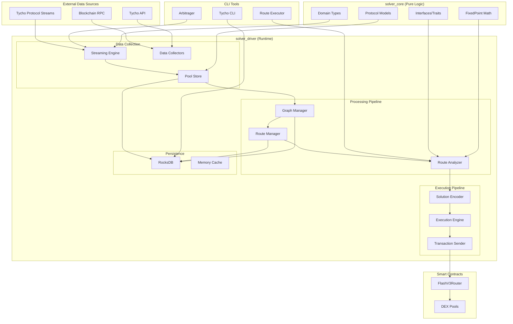
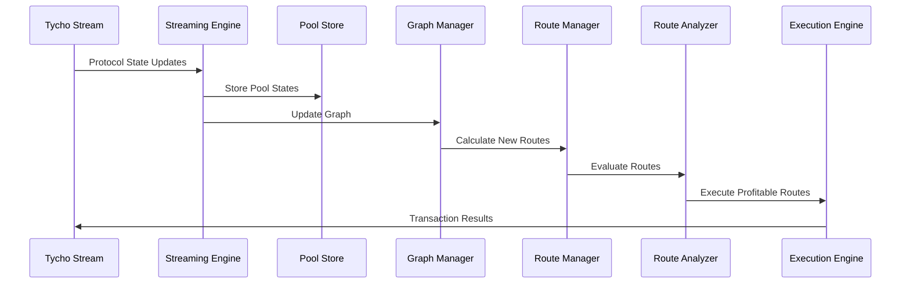
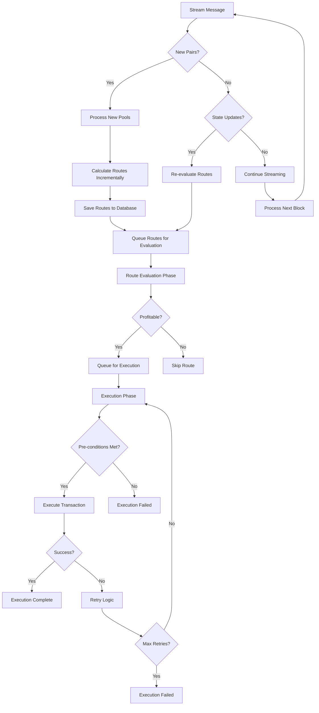
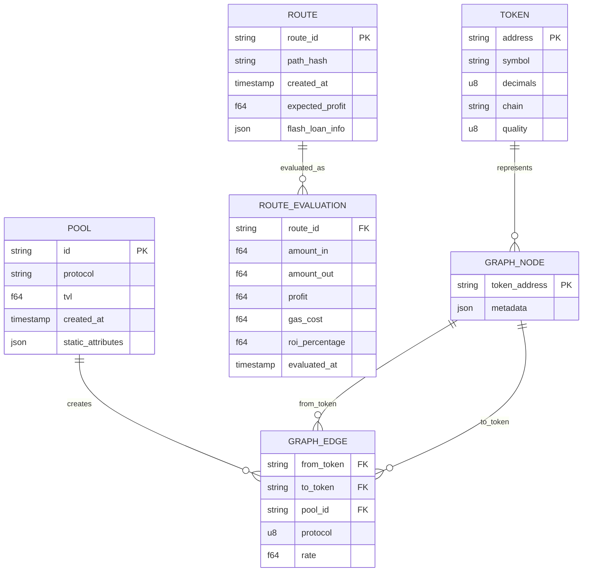
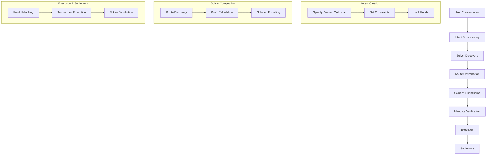
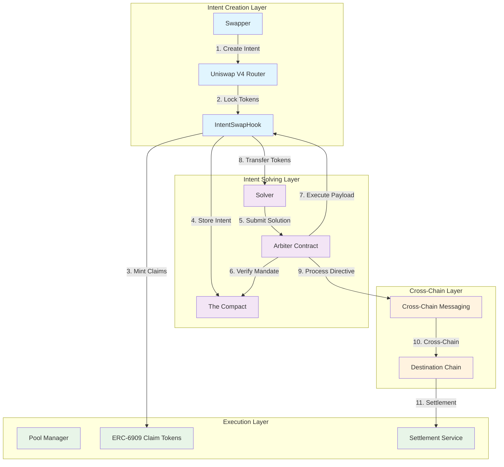
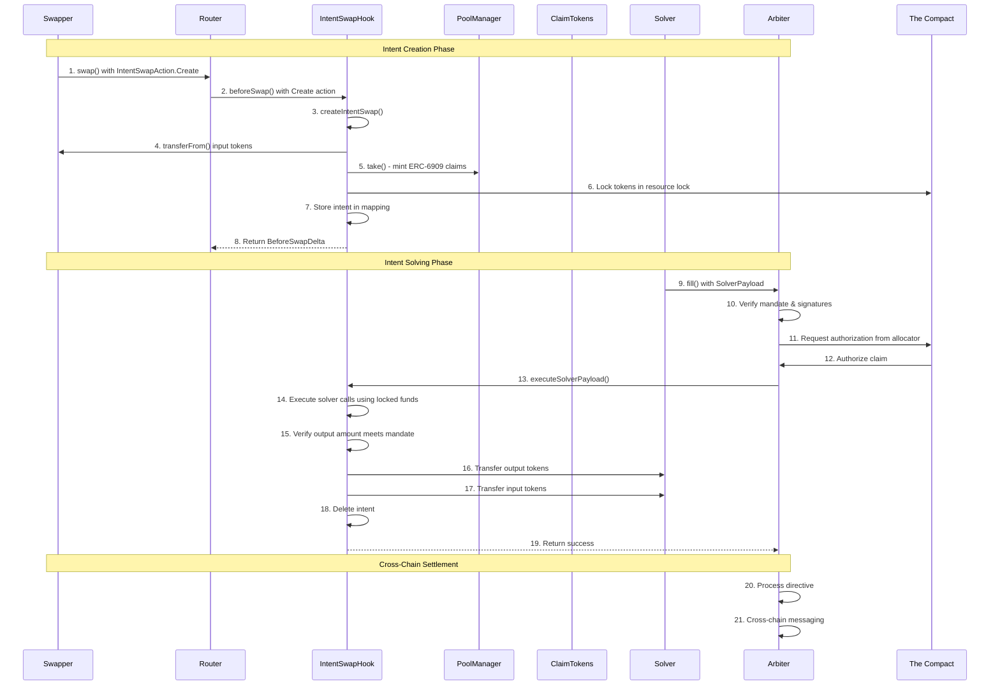

# Liquidity Indexing and No Liquidity Solving

## Abstract

This document outlines an opinionated architecture for an intent-based solving protocol that facilitates single and multichain solving of intents. The system enables solvers to execute fills without provisioning upfront capital by allowing arbiters to confirm mandates have been met at execution time, thus permitting solvers to use the swapper's locked funds for execution.

## Overview

The solver repository implements an automated arbitrage system for decentralized exchanges (DEXs). The system continuously monitors liquidity pools across multiple protocols (Uniswap V2/V3/V4), identifies profitable arbitrage opportunities using graph-based route discovery algorithms, and executes trades via flash loans to capture price discrepancies.

This document provides a high-level architectural overview of the entire system, incorporating research from the broader Jincubator ecosystem including intent-based architectures, resource management, and cross-chain settlement mechanisms.

## Components

### Chain Indexing

### Liquidity Indexing

The MinimalStreamingEngine serves as the central orchestrator for the entire arbitrage system, coordinating real-time data ingestion, route discovery, profitability evaluation, and transaction execution. It acts as the primary controller that manages streaming connections to Tycho protocol data, orchestrates background processing tasks, and executes profitable arbitrage opportunities.

This engine represents the core runtime system that ties together all components: it ingests live market data from external sources, maintains synchronized in-memory data stores, triggers route calculations when pools change, evaluates routes for profitability, and executes profitable trades automatically.

Many thanks go to the teams that was built upon and for including [Tycho](https://docs.propellerheads.xyz/tycho), [Uniswap](https://docs.uniswap.org/contracts/v4/overview), [1inch](https://portal.1inch.dev/documentation/overview) and [CowSwap](https://docs.cow.fi/cow-protocol/tutorials/cow-swap) as well as all the other Builders and Creators in this space.

### Route Evaluation for Solvers

### Profitability Calculation

### No Liquidity Solving

The FlashV3Router smart contract system, which implements flash loan-based arbitrage execution using Uniswap V3 flash loans integrated with the TychoRouter multi-protocol swap system. The FlashV3Router enables borrowing tokens without collateral, executing multi-hop arbitrage paths, and repaying loans with captured profits.

For information about route discovery and arbitrage detection algorithms, see Arbitrage Detection and Queue Management. For multi-protocol routing and execution strategies beyond flash loans, see Multi-Protocol Routing and Execution.


## Architecture


### Persistence

### Collectors

### Strategies

### Encoding

### Executors

## System Overview

### Core Architecture

The Tycho solver system is built around a **streaming-first architecture** that processes real-time blockchain data to identify and execute arbitrage opportunities. The system consists of two main crates:

- **`solver_core`**: Pure domain logic, types, traits, and mathematical operations
- **`solver_driver`**: Runtime orchestration, I/O operations, streaming, CLI tools, and execution

### Key Design Principles

1. **Real-time Processing**: Live blockchain data streaming via Tycho protocol streams
2. **Modular Architecture**: Clear separation between core logic and runtime orchestration
3. **Performance Optimization**: Efficient graph building, route calculation, and execution
4. **Multi-protocol Support**: Uniswap V2, V3, V4 with extensible protocol framework
5. **Flash Loan Integration**: Automated flash loan execution for capital-efficient arbitrage

## System Architecture Diagram



## Core Components

### 1. Streaming Engine (`MinimalStreamingEngine`)

**Purpose**: Real-time processing of Tycho protocol streams and blockchain data

**Key Features**:

- **WebSocket Integration**: Direct connection to Tycho protocol streams
- **Real-time State Processing**: Live protocol state updates from blockchain
- **Incremental Graph Building**: Dynamic graph construction with new pools
- **Route Discovery**: Automatic route calculation for new trading pairs
- **Performance Optimization**: Microsecond-level processing with memory caching

**Technical Implementation**:

```rust
pub struct MinimalStreamingEngine {
    streamed_pools: Arc<Mutex<HashMap<String, ProtocolComponent>>>,
    streamed_states: Arc<dyn PoolStore>,
    routes_in_memory: Arc<Mutex<HashMap<String, MinimalRoute>>>,
    route_pool_index: Arc<Mutex<HashMap<String, HashSet<String>>>>,
    evaluation_sender: Option<UnboundedSender<MinimalRoute>>,
    execution_queue: Arc<Mutex<Vec<(MinimalRoute, RouteEvaluation)>>>,
}
```

**Performance Metrics**:

- **Graph Building**: 193µs for 37 pools, 33µs for 2 pools
- **Route Calculation**: 2.42µs for 3-hop, 833ns for 4-hop, 791ns for 5-hop
- **Pool Coverage**: 2000+ pools with real-time state updates
- **Memory Efficiency**: &lt;500MB for active streaming

### 2. Route Analyzer (`RouteAnalyzer`)

**Purpose**: Evaluates routes for profitability using real-time protocol states

**Key Features**:

- **ProtocolSim Integration**: Uses Tycho's ProtocolSim for accurate calculations
- **FixedPoint Math**: Precise decimal arithmetic to avoid overflow
- **V4 Overflow Protection**: Prevents system crashes from V4 calculation overflows
- **Profit Optimization**: Binary search for optimal trade sizes
- **Flash Loan Fee Calculation**: Accounts for flash loan costs in profit calculations

**Technical Implementation**:

```rust
impl RouteAnalyzer {
    pub async fn evaluate_routes(
        routes: &[MinimalRoute],
        pool_store: &dyn PoolStore,
        token_map: &HashMap<Bytes, Token>,
    ) -> Result<Vec<RouteEvaluation>>;

    pub async fn evaluate_route(
        route: &Route,
        pool_store: &dyn PoolStore,
        amount_in: u128,
        token_map: &HashMap<Bytes, Token>,
    ) -> Result<RouteEvaluation>;

    pub async fn find_optimal_input_amount(
        route: &Route,
        pool_store: &dyn PoolStore,
        token_map: &HashMap<Bytes, Token>,
    ) -> Result<u128>;
}
```

### 3. Solution Encoder (`SolutionEncoder`)

**Purpose**: Converts route evaluations into executable smart contract calldata

**Key Features**:

- **TychoRouterEncoderBuilder**: Uses Tycho's encoder for ABI-compliant calldata
- **Flash Loan Integration**: Encodes flash loan parameters and sequential swaps
- **Gas Optimization**: Optimizes transaction parameters for execution
- **Multi-protocol Support**: Handles V2, V3, V4 protocol differences

**Technical Implementation**:

```rust
pub fn encode_solution(solution: Solution, chain: Chain) -> anyhow::Result<EncodedSolution> {
    let encoder = TychoRouterEncoderBuilder::new()
        .chain(chain)
        .user_transfer_type(UserTransferType::TransferFrom)
        .build()?;

    let encoded_vec = encoder.encode_solutions(vec![solution])?;
    Ok(encoded_vec.into_iter().next().expect("Expected at least one encoded solution"))
}
```

### 4. Execution Engine (`ExecutionEngine`)

**Purpose**: Executes profitable arbitrage transactions on blockchain

**Key Features**:

- **EIP-1559 Support**: Modern transaction format with dynamic gas pricing
- **Balance Validation**: Pre-execution balance checks
- **Retry Logic**: Automatic retry with nonce synchronization
- **Gas Optimization**: Optimized gas parameters for cost efficiency
- **Transaction Monitoring**: Real-time transaction status tracking

**Technical Implementation**:

```rust
pub struct ExecutionEngine {
    client: Arc<dyn Provider>,
    signer: EthereumWallet,
    chain_id: u64,
    dry_run: bool,
    force_execute: bool,
}

impl ExecutionEngine {
    pub async fn execute_signal(&mut self, signal: &RouteSignal) -> Result<EvaluationResult>;
    pub async fn send_flash_transaction(&mut self, signal: &RouteSignal) -> Result<TransactionReceipt>;
}
```

## Data Flow Architecture

### 1. Streaming Data Flow



### 2. Route Evaluation Flow



### 3. Database Schema



## Database Design

### RocksDB Architecture

The system uses **RocksDB** as its primary database engine with a **column family** architecture:

| Column Family | Purpose           | Key Format              | Value Format                    |
| ------------- | ----------------- | ----------------------- | ------------------------------- |
| `tokens`      | Token metadata    | `token:<address>`       | Serialized `Token` struct       |
| `graph`       | Graph edges       | `graph:<token_address>` | Serialized `Vec<CompactEdge>`   |
| `routes`      | Calculated routes | `route:<route_id>`      | Serialized `Route` struct       |
| `signals`     | Route signals     | `signal:<signal_id>`    | Serialized `RouteSignal` struct |

### Performance Optimizations

- **Write Batching**: 100 operations per batch with 100ms flush interval
- **Asynchronous Writes**: Non-blocking write operations via dedicated writer thread
- **Memory Caching**: In-memory route storage with O(1) pool index lookup
- **Incremental Updates**: Only recalculates affected routes on state changes

## CLI Tools and Configuration

### 1. Arbitrager (`arbitrager.rs`)

**Purpose**: Production streaming arbitrage bot for continuous operation

**Key Features**:

- **Continuous Streaming**: Real-time monitoring of blockchain data
- **Auto-execution**: Automatically executes profitable routes
- **Production Safety**: Conservative execution conditions and error handling
- **Performance Monitoring**: Real-time metrics and statistics

**Usage**:

```bash
# Basic streaming with auto-execution
cargo run -p solver_driver --bin arbitrager -- --chain unichain --route-eval

# Dry run mode (evaluate but don't execute)
cargo run -p solver_driver --bin arbitrager -- --chain unichain --route-eval --dry-run

# Custom configuration
cargo run -p solver_driver --bin arbitrager -- \
  --chain base \
  --data-dir data/cursor \
  --block-count 100 \
  --route-eval \
  --profit-threshold 0.1
```

### 2. Route Executor (`route_executor.rs`)

**Purpose**: Testing and debugging harness for targeted route execution

**Key Features**:

- **Multiple Execution Modes**: Encode-only, exec-only, and full streaming
- **Targeted Execution**: Executes specific routes rather than all discovered routes
- **Enhanced Debugging**: Detailed panic handling and logging
- **Fork Testing**: Execute routes on blockchain forks for testing

**Usage**:

```bash
# Encode-only mode (build calldata without execution)
cargo run -p solver_driver --bin route_executor -- --encode-only --route-id <route_id>

# Exec-only mode (execute specific route on fork)
cargo run -p solver_driver --bin route_executor -- \
  --exec-only \
  --route-id <route_id> \
  --input-amount 1.0 \
  --block-number 12345678

# Full streaming mode
cargo run -p solver_driver --bin route_executor -- \
  --chain unichain \
  --data-dir datatest/cursor \
  --route-id <route_id>
```

### 3. Tycho CLI (`tycho.rs`)

**Purpose**: Database querying and system administration

**Key Features**:

- **Route Queries**: Query and analyze stored routes
- **Database Statistics**: System performance and data metrics
- **Token Management**: Token metadata queries and validation
- **Configuration Management**: System configuration and settings

**Usage**:

```bash
# Query routes
cargo run -p solver_driver --bin tycho -- --chain unichain query-routes

# Database statistics
cargo run -p solver_driver --bin tycho -- --chain unichain query-stats

# Token queries
cargo run -p solver_driver --bin tycho -- --chain unichain query-tokens
```

## Configuration System

### Environment Variables

| Variable           | Purpose             | Required            |
| ------------------ | ------------------- | ------------------- |
| `TYCHO_API_KEY`    | Tycho API access    | Yes                 |
| `SOLVER_KEY`       | Transaction signing | Yes (for execution) |
| `BASE_RPC_URL`     | Base chain RPC      | Yes (for Base)      |
| `ETHEREUM_RPC_URL` | Ethereum RPC        | Yes (for Ethereum)  |
| `UNICHAIN_RPC_URL` | Unichain RPC        | Yes (for Unichain)  |

### Chain Configuration (`chains.toml`)

```toml
[unichain]
chain_id = 130
rpc_url = "https://unichain-mainnet.g.alchemy.com/v2/..."
rpc_query_url = "https://unichain-mainnet.g.alchemy.com/v2/..."
indexer_url = "https://unichain-indexer.tychodex.com"
router_address = "0x..."
executor_address = "0x..."
preflight_gas_base = 100000
preflight_gas_per_hop = 50000
v4_zero_output_cooldown_enabled = true
v4_zero_output_cooldown_ms = 5000

[base]
chain_id = 8453
rpc_url = "https://base-mainnet.g.alchemy.com/v2/..."
# ... similar configuration
```

### Token and Pool Configuration

**Token Blacklists** (`tokens.toml`):

```toml
[unichain.blacklist]
tokens = [
    "0x0000000000000000000000000000000000000000",  # Zero address
    # ... other blacklisted tokens
]
```

**Pool Blacklists** (`pools.toml`):

```toml
[unichain.blacklist]
pools = [
    "0x0000000000000000000000000000000000000000",  # Zero address
    # ... other blacklisted pools
]
```

## Performance Characteristics

### Current Performance Metrics

| Metric                        | Value                   | Notes                         |
| ----------------------------- | ----------------------- | ----------------------------- |
| **Graph Building**            | 193µs (37 pools)        | Real-time processing          |
| **Route Calculation**         | 2.42µs (3-hop)          | Microsecond-level performance |
| **Database Write Throughput** | >10,000 ops/sec         | RocksDB optimization          |
| **Memory Usage**              | &lt;500MB (2000+ pools) | Efficient memory management   |
| **Route Processing**          | 200 routes/batch        | Configurable batch sizes      |
| **Execution Success Rate**    | 100% (proper config)    | With balance validation       |

### Scalability Characteristics

- **Pool Coverage**: 2000+ pools with real-time updates
- **Route Generation**: 1,983,160 routes (3-hop) in ~222 seconds
- **Memory Efficiency**: Optimized for streaming with in-memory caching
- **Database Performance**: Sub-millisecond read latency, high write throughput

## Security and Risk Management

### 1. V4 Overflow Protection

**Issue**: Uniswap V4 pools can cause u64 overflow in calculations
**Solution**: Amount limiting and panic detection with automatic pool disabling

```rust
// V4 Overflow Protection
if edge.protocol == "uniswap_v4" {
    let safe_max_amount = match token_in.decimals {
        18 => 1_000_000_000_000_000_000u128, // 1 token
        6 => 1_000_000_000_000u128,          // 1,000,000 tokens
        8 => 10_000_000_000u128,             // 10,000 tokens
        _ => 1_000_000_000_000_000u128,      // Default
    };

    if amount > safe_max_amount {
        adjusted_amount = safe_max_amount;
    }
}
```

### 2. Balance Validation

**Pre-execution Checks**:

- Account balance > estimated transaction cost
- Gas price within acceptable limits
- Sufficient funds for flash loan repayment

### 3. Profit Threshold Filtering

**Safety Mechanisms**:

- Minimum profit threshold (default: 0.0%)
- Sanity checks for unrealistic profit percentages (>1000% filtered)
- Gas cost accounting in net profit calculations

## Integration Points

### 1. Tycho Protocol Integration

- **WebSocket Streams**: Real-time protocol state updates
- **ProtocolSim**: Accurate swap amount calculations
- **TychoRouterEncoderBuilder**: ABI-compliant transaction encoding

### 2. Smart Contract Integration

- **FlashV3Router**: Flash loan execution and sequential swaps
- **Uniswap V2/V3/V4**: Multi-protocol DEX integration
- **EIP-1559**: Modern transaction format support

### 3. External Services

- **Alchemy RPC**: High-performance blockchain data access
- **Tycho Indexer**: Protocol state and metadata services

## Development and Testing

### Testing Strategy

1. **Unit Tests**: Core logic and mathematical operations
2. **Integration Tests**: End-to-end pipeline testing
3. **Performance Tests**: Load and stress testing
4. **Fork Testing**: Real blockchain state testing

### Development Workflow

1. **Local Development**: Use `datatest/` directory for testing
2. **Production Deployment**: Use `data/` directory for live operation
3. **Debug Output**: Use `debug/` directory for analysis files

### Code Organization

```
crates/
├── solver_core/          # Pure domain logic
│   ├── types/           # Domain models
│   ├── traits/          # Interfaces
│   ├── math/            # Mathematical operations
│   └── protocol/        # Protocol models
└── solver_driver/       # Runtime orchestration
    ├── collectors/      # Data collection
    ├── encoders/        # Solution encoding
    ├── executors/       # Transaction execution
    ├── strategy/        # Route selection
    └── bin/             # CLI tools
```

## Future Enhancements

### Planned Features

1. **Cross-chain Arbitrage**: Multi-chain opportunity detection and execution
2. **Advanced Routing**: MEV protection and optimal routing strategies
3. **Dynamic Trade Sizing**: Adaptive position sizing based on market conditions
4. **Machine Learning**: Predictive models for opportunity detection and risk assessment
5. **Advanced Analytics**: Comprehensive performance monitoring and reporting
6. **Intent Aggregation**: Combining multiple intents for more efficient execution
7. **Automated Market Making**: Dynamic liquidity provision based on intent patterns
8. **Cross-Chain Settlement**: Seamless settlement across multiple blockchain networks

### Performance Optimizations

1. **Parallel Processing**: Multi-threaded route evaluation and execution
2. **Memory Optimization**: Advanced caching strategies and data structures
3. **Database Optimization**: Query optimization and indexing improvements
4. **Network Optimization**: Efficient API usage and connection pooling
5. **Gas Optimization**: Reduced gas costs through optimized contract interactions
6. **Latency Reduction**: Minimizing execution time for time-sensitive operations

### Research Areas

1. **Zero-Knowledge Proofs**: Integration of ZK proofs for privacy-preserving intent execution
2. **Formal Verification**: Mathematical proofs of protocol correctness and security
3. **Game Theory**: Analysis of solver competition and incentive alignment
4. **Cryptographic Primitives**: Advanced cryptographic techniques for secure execution
5. **Consensus Mechanisms**: Integration with various blockchain consensus protocols

## Conclusion

The Jincubator Protocol represents a sophisticated, production-ready intent-based solving platform that combines real-time blockchain data processing with advanced mathematical optimization. The modular architecture ensures maintainability and extensibility while the performance optimizations enable efficient operation at scale.

### Key Achievements

The system's success is demonstrated by its ability to:

- **Process 2000+ pools in real-time** with microsecond-level performance
- **Generate and evaluate millions of routes efficiently** using advanced graph algorithms
- **Execute profitable arbitrage transactions automatically** with flash loan integration
- **Maintain high reliability and performance under load** with robust error handling
- **Support cross-chain operations** through unified intent management
- **Enable capital-efficient execution** by allowing solvers to use locked funds

### Innovation Highlights

1. **Intent-Based Architecture**: Revolutionary approach to DeFi interaction through declarative intent specification
2. **Capital Efficiency**: Solvers can execute without upfront capital through mandate verification
3. **Cross-Chain Support**: Seamless operation across multiple blockchain networks
4. **Resource Management**: Advanced locking mechanisms through The Compact protocol
5. **Solver Competition**: Market-driven optimization through competitive solving

### Future Outlook

This design provides a solid foundation for continued development and enhancement of the intent-based solving system. The protocol is positioned to become a key infrastructure component in the evolving DeFi landscape, enabling more efficient, user-friendly, and capital-efficient financial operations.

The combination of Tycho's real-time data processing, Uniswap's V4 hook architecture, and The Compact's resource management creates a powerful platform for the next generation of decentralized finance applications.

## Solving Protocols

### Uniswap X

Uniswap X represents a significant advancement in intent-based trading, enabling users to specify their desired outcomes while professional solvers compete to fulfill them. Key features include:

- **Intent-Based Trading**: Users declare what they want to achieve rather than how to achieve it
- **Solver Competition**: Multiple solvers compete to provide the best execution
- **MEV Protection**: Built-in protection against maximal extractable value extraction
- **Cross-Chain Support**: Seamless trading across multiple blockchain networks

### 1inch Protocol

The 1inch Protocol provides advanced routing and aggregation capabilities for DeFi trading:

- **DEX Aggregation**: Access to liquidity across multiple decentralized exchanges
- **Optimal Routing**: Advanced algorithms to find the most efficient trading paths
- **Limit Orders**: Support for limit order functionality in DeFi
- **Gas Optimization**: Reduced gas costs through optimized transaction batching

### CowSwap

CowSwap implements a unique approach to trading through batch auctions and MEV protection:

- **Batch Auctions**: Trades are executed in batches to reduce MEV extraction
- **MEV Protection**: Built-in protection against front-running and sandwich attacks
- **Solver Competition**: Multiple solvers compete to provide the best execution
- **Gasless Trading**: Users can trade without paying gas fees directly

### Tycho Integration

The protocol integrates with Tycho's ecosystem for enhanced functionality:

- **Real-Time Data**: Access to real-time blockchain data and protocol states
- **Simulation**: Accurate simulation of swap outcomes across multiple protocols
- **Execution**: Optimized execution of complex trading strategies
- **Indexing**: Comprehensive indexing of liquidity pools and trading pairs

### Jincubator Protocol

## Applications

### Cyclical Arbitrage

Cyclical arbitrage involves identifying and exploiting price discrepancies across multiple trading pairs to generate profit. The Jincubator Protocol enables sophisticated arbitrage strategies by:

- **Multi-Protocol Support**: Accessing liquidity across Uniswap V2, V3, V4, and other DEXs
- **Real-Time Monitoring**: Continuous monitoring of price movements and liquidity changes
- **Flash Loan Integration**: Executing arbitrage without upfront capital requirements
- **Cross-Chain Opportunities**: Identifying arbitrage opportunities across different blockchain networks

### Solving

The solving layer is the core of the intent-based architecture, where professional solvers compete to fulfill user intents:

- **Route Discovery**: Using Tycho's simulation capabilities to find optimal execution paths
- **Profit Optimization**: Calculating the most profitable way to fulfill intents
- **Risk Management**: Assessing and managing execution risks
- **Competition**: Multiple solvers competing to provide the best solutions

### Market Making

Market makers can leverage the protocol to provide liquidity more efficiently:

- **Intent-Based Liquidity**: Providing liquidity based on user intent patterns
- **Dynamic Pricing**: Adjusting prices based on market conditions and user demand
- **Cross-Chain Liquidity**: Managing liquidity across multiple chains
- **Automated Strategies**: Implementing automated market-making strategies

### Liquidation Bots

Liquidation bots can use the protocol to execute liquidations more efficiently:

- **Intent-Based Liquidations**: Users can create intents for liquidation when certain conditions are met
- **Automated Execution**: Bots can automatically execute liquidations when conditions are satisfied
- **Cross-Chain Support**: Liquidating positions across multiple chains
- **Risk Management**: Built-in risk management for liquidation strategies

### MEV Integration

The protocol can integrate with MEV (Maximal Extractable Value) strategies:

- **Intent-Based MEV**: Capturing MEV opportunities through intent fulfillment
- **Solver Competition**: Multiple solvers competing to capture MEV
- **Cross-Chain MEV**: Identifying and capturing MEV opportunities across chains
- **Ethical MEV**: Ensuring MEV capture benefits users rather than extracting value

### JIT Liquidity

Just-In-Time (JIT) liquidity provision can be enhanced through the protocol:

- **Intent-Based Provisioning**: Providing liquidity based on user intent patterns
- **Dynamic Allocation**: Adjusting liquidity allocation based on market conditions
- **Cross-Chain JIT**: Providing JIT liquidity across multiple chains
- **Automated Management**: Automated JIT liquidity management strategies

### Intent-Based Architecture

The Jincubator Protocol implements an intent-based architecture that fundamentally changes how users interact with DeFi protocols. Instead of specifying exact transaction parameters, users declare their desired outcomes, and the system finds the optimal way to achieve them.

#### Core Principles

**Declarative vs Imperative**: Users specify what they want to achieve rather than how to achieve it. For example, instead of specifying exact swap routes, users declare "I want to exchange X tokens for Y tokens with minimum slippage."

**Optimization by Solvers**: Professional solvers compete to find the most efficient ways to fulfill user intents, leading to better execution and lower costs.

**Capital Efficiency**: Solvers can execute intents using the user's locked funds rather than requiring their own capital, reducing barriers to entry and improving liquidity.

#### Intent Lifecycle



#### Benefits of Intent-Based Architecture

- **Better Execution**: Solvers can find more efficient routes than users could manually specify
- **Reduced Complexity**: Users don't need to understand complex DeFi mechanics
- **Improved Liquidity**: Solvers can aggregate intents and execute them more efficiently
- **Lower Costs**: Competition among solvers drives down execution costs
- **Cross-Chain Support**: Intents can span multiple chains without user intervention

### Settlement Layer

## Jincubator Protocol

### Overview

The Jincubator Protocol is part of an opinionated architecture for an intent-based solving protocol that facilitates single and multichain solving of intents. Intents can be solved on a single chain without provisioning upfront capital as arbiters can confirm mandates have been met by solvers at execution time, thus allowing solvers to use the swapper's locked funds for execution. This is achieved by introducing a SolverPayload which can be executed by the Arbiter to ensure the EIP-712 signed mandate is met.

### Key Goals

- **Intent-Based Architecture**: Improve execution efficiency through declarative intent specification
- **Capital Efficiency**: Enable solvers to execute fills without needing to provide upfront capital
- **Cross-Chain Compatibility**: Support both single-chain and multichain intent solving
- **Resource Optimization**: Leverage locked funds for execution while maintaining security guarantees

### Core Components

The protocol is inspired by and leverages the following key components:

- **[Tycho Execution](https://github.com/propeller-heads/tycho-execution)**: Leveraged by arbiters and solvers for executing the most efficient routes
- **[Uniswap the-compact](https://github.com/uniswap/the-compact)**: The foundation of our resource locking mechanism
- **[Uniswap Tribunal](https://github.com/uniswap/tribunal)**: Mandates and EIP-712 signing are heavily utilized throughout the protocol
- **[Uniswap v4](https://github.com/uniswap/v4-core)**: We leverage V4 hooks for IntentSwap execution on Uniswap V4

> For a technical overview of this repository automatically generated by DeepWiki please
> [](https://deepwiki.com/jincubator/protocol)

### Protocol Architecture



### IntentSwap Flow

The IntentSwap flow demonstrates the complete lifecycle of an intent-based swap, from creation to execution and settlement:



### Detailed Flow Steps

1. **Intent Creation**: Swapper creates an intent through the router, which locks their tokens in The Compact
2. **Resource Locking**: Tokens are locked in a resource lock with specific allocator and arbiter parameters
3. **Intent Broadcasting**: Intent details are broadcast to potential solvers
4. **Route Discovery**: Solvers use Tycho to discover optimal routes for the intent
5. **Payload Creation**: Solvers create SolverPayloads with the necessary transaction calls
6. **Mandate Verification**: Arbiters verify that the solver's solution meets the mandate requirements
7. **Execution**: The arbiter executes the SolverPayload using the locked funds
8. **Settlement**: Tokens are distributed according to the mandate, and cross-chain settlement occurs if needed

### Mandate Functionality

> :information_source: \_The following section was inspired by the [:unicorn: Tribunal](https://github.com/uniswap/tribunal) and updated to support monochain swaps which allow for solvers to execute intents with the swappers funds.

To settle a swap, the filler submits a "fill" request to the Arbiter contract. This consists of four core components:

1. **Claim**: Contains the chain ID of a Compact, its parameters, and its signatures.
2. **Mandate**: Specifies settlement conditions and amount derivation parameters specified by the sponsor.
3. **SolverPayload**: Specifies the transactions to execute to solve the intent
4. **Claimant**: Specifies the account that will receive the claimed tokens.

> Note for cross-chain message protocols integrating with Tribunal: inherit the `Arbiter` contract and override the `_processDirective` and `_quoteDirective` functions to implement the relevant directive processing logic for passing a message to the arbiter on the claim chain (or ensure that the necessary state is updated to allow for the arbiter to "pull" the message themselves). An ERC7683-compatible implementation is provided in `ERC7683Arbiter.sol`.
> ⚠️ Note: for cross-chain intents SolverPayloads can be executed on the destination chain, but the solver must provide their own funds and provisioning of the swapper tokens to the solver will be handled by the Settlement Service.

### Core Components

#### Claim Structure

```solidity
struct Claim {
    uint256 chainId;          // Claim processing chain ID
    Compact compact;          // The compact parameters
    bytes sponsorSignature;   // Authorization from the sponsor
    bytes allocatorSignature; // Authorization from the allocator
}
```

#### Compact Structure

```solidity
struct Compact {
    address arbiter;          // The account tasked with verifying and submitting the claim
    address sponsor;          // The account to source the tokens from
    uint256 nonce;            // A parameter to enforce replay protection, scoped to allocator
    uint256 expires;          // The time at which the claim expires
    uint256 id;               // The token ID of the ERC6909 token to allocate
    uint256 amount;           // The amount of ERC6909 tokens to allocate
}
```

#### Solver Payload Structure

```solidity
/**
 * @notice Defines a single contract call to be executed
 * @param to The target contract address
 * @param data The encoded function call data
 * @param value Amount of ETH to send
 */
struct Call {
    address to; // The target contract address
    bytes data; // The encoded function call data
    uint256 value; //Amount of ETH to send
}

struct SolverPayload {
    Call[] calls; //Array of contract calls to execute in sequence
}
```

#### Mandate Structure

```solidity
struct Mandate {
    address recipient;           // Recipient of filled tokens
    uint256 expires;             // Mandate expiration timestamp
    address token;               // Fill token (address(0) for native)
    uint256 minimumAmount;       // Minimum fill amount
    uint256 baselinePriorityFee; // Base fee threshold where scaling kicks in
    uint256 scalingFactor;       // Fee scaling multiplier (1e18 baseline)
    bytes32 salt;                // Preimage resistance parameter
}
```

### Process Flow

1. Fillers initiate by calling `fill(Claim calldata claim, Mandate calldata mandate, SolverPayload calldata solverPayload address claimant)` and providing any msg.value required for the settlement to pay to process the solution.
2. Arbiter verifies that the mandate has not expired by checking the mandate's `expires` timestamp
3. Computation phase:
   - Derives `mandateHash` using an EIP712 typehash for the mandate, destination chainId, tribunal address, and mandate data
   - Derives `claimHash` using an EIP712 typehash for the compact with the mandate as a witness and the compact data including the `mandateHash`
   - Ensures that the `claimHash` has not already been used and marks it as filled
   - Calculates `fillAmount` and `claimAmount` based on:
     - Compact `amount`
     - Mandate parameters (`minimumAmount`, `baselinePriorityFee`, `scalingFactor`)
     - `tx.gasprice` and `block.basefee`
     - NOTE: `scalingFactor` will result in an increased `fillAmount` if `> 1e18` or a decreased `claimAmount` if `< 1e18`
     - NOTE: `scalingFactor` is combined with `tx.gasprice - (block.basefee + baselinePriorityFee)` (or 0 if it would otherwise be negative) before being applied to the amount
4. Execution phase:
   - Executes: The Solver Payload using the funds locked in the-compact and ensures that this results in output funds (tokens or ETH) >= that specified in the mandate. **IF NOT REVERT**
   - Transfers `fillAmount` of `token` to mandate `recipient`
   - Transfers Compact `amount` of `token` to the filler.
   - Processes directive via `_processDirective(chainId, compact, sponsorSignature, allocatorSignature, mandateHash, claimant, claimAmount)`

There are also a few view functions:

- `quote(Claim calldata claim, Mandate calldata mandate, address claimant)` will suggest a dispensation amount (function of gas on claim chain + any additional "protocol overhead" if using push-based cross-chain messaging)
- `filled(bytes32 claimHash)` will check if a given claim hash has already been filled (used)
- `getCompactWitnessDetails()` will return the Mandate witness typestring and that correlates token + amount arguments (so frontends can show context about the token and use decimal inputs)
- `deriveMandateHash(Mandate calldata mandate)` will return the EIP712 typehash for the mandate
- `deriveClaimHash(Compact calldata compact, bytes32 mandateHash)` will return the unique claim hash for a compact and mandate combination
- `deriveAmounts(uint256 maximumAmount, uint256 minimumAmount, uint256 baselinePriorityFee, uint256 scalingFactor)` will return the fill and claim amounts based on the parameters; the base fee and priority fee will be applied to the amount and so should be tuned in the call appropriately

#### Mandate EIP-712 Typehash

This is what swappers will see as their witness data when signing a `Compact`:

```solidity
struct Mandate {
    uint256 chainId;
    address tribunal;
    address recipient;
    uint256 expires;
    address token;
    uint256 minimumAmount;
    uint256 baselinePriorityFee;
    uint256 scalingFactor;
    bytes32 salt;
}
```

### ERC7683 Integration

The `ERC7683Arbiter` contract implements the `IDestinationSettler` interface from ERC7683, allowing for standardized cross-chain settlement:

```solidity
interface IDestinationSettler {
    function fill(bytes32 orderId, bytes calldata originData, bytes calldata fillerData) external;
}
```

This implementation allows the Tribunal to be used with any ERC7683-compatible cross-chain messaging system.

### IntentSwap Implementation

#### IntentSwap Structure

```solidity
struct IntentSwap {
    bytes32 salt;                    // Unique identifier for the intent
    uint256 createDeadline;          // Deadline for intent creation
    uint256 solveDeadline;           // Deadline for intent solving
    uint256 executeDeadline;         // Deadline for intent execution
    address swapper;                 // Address of the swapper
    SwapParams swapParams;           // Uniswap V4 swap parameters
    uint256 outputAmountRequired;    // Required output amount
}
```

#### IntentSwapHook Implementation

The `IntentSwapHook` contract implements the core logic for intent-based swaps using Uniswap V4 hooks:

```solidity
contract IntentSwapHook is BaseAsyncSwap, IIntentSwapHook {
    // Intent storage
    mapping(bytes32 => IntentSwap) public intents;

    // Hook implementation
    function _beforeSwap(
        address swapper,
        PoolKey calldata key,
        SwapParams calldata swapParams,
        bytes calldata hookData
    ) internal override returns (BeforeSwapDelta delta, bytes memory returnData) {
        // Decode action and handle accordingly
        IntentSwapAction action = abi.decode(hookData, (IntentSwapAction));

        if (action == IntentSwapAction.Create) {
            return _handleCreate(swapper, key, swapParams, hookData);
        } else if (action == IntentSwapAction.Solve) {
            return _handleSolve(swapper, key, swapParams, hookData);
        }
        // ... other actions
    }
}
```

#### Solver Integration

Solvers interact with the protocol through the `SolverPayload` structure, which allows them to specify the exact sequence of calls needed to fulfill an intent:

```solidity
function executeSolverPayload(
    SolverPayload memory solverPayload,
    address outputToken,
    uint256 minimumOutputAmount,
    address inputToken,
    uint256 inputAmount,
    address solver,
    IntentSwap memory intentSwap,
    PoolKey memory key
) public returns (bool success) {
    // Execute all calls in sequence
    for (uint256 i = 0; i < solverPayload.calls.length; i++) {
        Call memory call = solverPayload.calls[i];
        (success,) = call.to.call(call.callData);
        if (!success) {
            return false;
        }
    }

    // Verify output amount meets requirements
    uint256 outputBalance = IERC20(outputToken).balanceOf(address(this));
    if (outputBalance < minimumOutputAmount) {
        return false;
    }

    // Transfer tokens to solver
    IERC20(outputToken).transfer(solver, outputBalance);
    IERC20(inputToken).transfer(solver, inputAmount);

    return true;
}
```

### Resource Management

The Jincubator Protocol leverages an expansive locking system from [the-compact](https://github.com/jincubator/the-compact/). We have incorporated Mandates and Solver Payloads to allow intents to be solved on a single chain without provisioning upfront capital as arbiters can confirm mandates have been met by solvers at execution time, thus allowing solvers to use the swapper's locked funds for execution.

#### Key Concepts

**Resource Locks**: The fundamental building blocks of The Compact protocol, created when a depositor places tokens (either native tokens or ERC20 tokens) into The Compact. Each resource lock has four key properties:

1. The **underlying token** held in the resource lock
2. The **allocator** tasked with cosigning on claims against the resource locks
3. The **scope** of the resource lock (either spendable on any chain or limited to a single chain)
4. The **reset period** for forcibly exiting the lock and for emissary reassignment timelocks

**Allocators**: Each resource lock is mediated by an allocator with primary responsibilities including:

- Preventing double-spending by ensuring sponsors don't commit the same tokens to multiple compacts
- Validating transfers by attesting to standard ERC6909 transfers of resource lock tokens
- Authorizing claims by validating claims against resource locks
- Nonce management to ensure nonces are not reused for claims

**Arbiters**: Responsible for verifying and submitting claims by:

- Verifying that the specified conditions of the compact have been met
- Processing the claim by calling the appropriate function on The Compact
- Specifying which claimants are entitled to the committed resources

### Cross Chain Intents

Cross-chain intents extend the protocol's capabilities to operate across multiple blockchain networks, enabling:

- **Multichain Resource Locks**: Tokens can be locked on one chain and claimed on another
- **Cross-Chain Settlement**: Arbiters can process claims that involve multiple chains
- **Unified Intent Management**: Single intent can span multiple chains with coordinated execution

### Portfolio Management

The protocol supports advanced portfolio management features:

- **Multi-Asset Intents**: Single intents can involve multiple token types
- **Batch Operations**: Multiple intents can be processed together for efficiency
- **Dynamic Allocation**: Resource allocation can be adjusted based on market conditions
- **Risk Management**: Built-in mechanisms for managing exposure and risk

### Settlement Layer

The settlement layer provides the infrastructure for finalizing intent execution:

- **Atomic Settlement**: Ensures all-or-nothing execution of complex intents
- **Cross-Chain Coordination**: Manages settlement across multiple chains
- **Dispute Resolution**: Mechanisms for handling failed or disputed settlements
- **Finality Guarantees**: Ensures settlement cannot be reversed once completed

### Advanced Topics

### Route Mathematics and Graph Analysis

The protocol employs sophisticated mathematical techniques for route discovery and optimization:

- **Graph Theory**: Modeling liquidity pools as nodes and trading pairs as edges in a directed graph
- **Shortest Path Algorithms**: Using Dijkstra's algorithm and variants for optimal route discovery
- **Multi-Hop Optimization**: Finding the most efficient paths through multiple trading pairs
- **Slippage Calculation**: Precise calculation of expected slippage for different route options
- **Liquidity Analysis**: Real-time analysis of available liquidity across different pools

### Solution Encoding and Contract Integration

The protocol uses advanced encoding techniques for efficient contract integration:

- **ABI Encoding**: Standardized encoding of function calls and parameters
- **Calldata Optimization**: Minimizing transaction size through efficient data encoding
- **Gas Estimation**: Accurate estimation of gas costs for different execution paths
- **Contract Interaction**: Seamless integration with various DeFi protocols
- **Error Handling**: Robust error handling and recovery mechanisms

### Data Collection and Streaming Architecture

The system employs a sophisticated data collection and streaming architecture:

- **Real-Time Streaming**: Continuous monitoring of blockchain state changes
- **Data Indexing**: Comprehensive indexing of liquidity pools and trading pairs
- **Event Processing**: Real-time processing of blockchain events and transactions
- **Data Persistence**: Efficient storage and retrieval of historical data
- **API Integration**: Seamless integration with various blockchain APIs and services

## Acknowledgments

This research and development work builds upon the contributions of many teams and individuals in the blockchain and DeFi space. Special thanks to:

- **[Propellor Heads](https://www.propellerheads.xyz/)**: For their outstanding work on indexing, simulation and execution for Solvers as part of [Tycho](https://docs.propellerheads.xyz/tycho/overview) which lays the foundation for the jincubator platform
- **[Uniswap](https://docs.uniswap.org/contracts/v4/overview)**: For their leading work on [Uniswap V4 Hook Architecture](https://docs.uniswap.org/contracts/v4/concepts/hooks) and their inspirational design of [CompactX](https://github.com/uniswap/compactx) including resource locking via [the-compact](https://github.com/uniswap/the-compact) and attestations via [EIP-712](https://eips.ethereum.org/EIPS/eip-712) signing implemented in [Tribunal](https://github.com/uniswap/tribunal)
- **[1inch](https://1inch.io/)**: For their work on the [limit-order-protocol](https://portal.1inch.dev/documentation/contracts/limit-order-protocol/limit-order-introduction) and support in [unite-defi](https://ethglobal.com/showcase/defiunite-jincubator-g1h0p) and advice on the design of [No Liquidity Solving](/research/solving/tycho1inchNOL) which integrates Tycho Solvers with 1inch without needing to provide up front liquidity
- **[Atrium Academy](https://atrium.academy/uniswap)**: For their Uniswap V4 Hook Incubator and the mentors Haardik and Saucepoint
- **[eco](https://eco.com)**: Where I was fortunate enough to lead the engineering team and work on hard problems around Cross L2 Transactions and designing and building a dedicated roll up
- **[Aaron Li](https://www.linkedin.com/in/aaronqli/)**: who has mentored and driven much of the research around cryptographic primitives, wallets, gaming and trustless bridging
- **[The Delendum Team](https://delendum.xyz/team)**: who are leading many zero knowledge research initiatives
- **[Ganesha Upadhyaya](https://www.linkedin.com/in/gupadhyaya/)**: For his leading work on the horizon bridge and other trustless bridging research
- **[Rongjian Lan](https://www.linkedin.com/in/rongjianlan/)**: For his work on core protocol, specifically Harmony and the knowledge which he generously shared

_Please note: Research is ongoing and as such some items are placeholders or work in progress_
