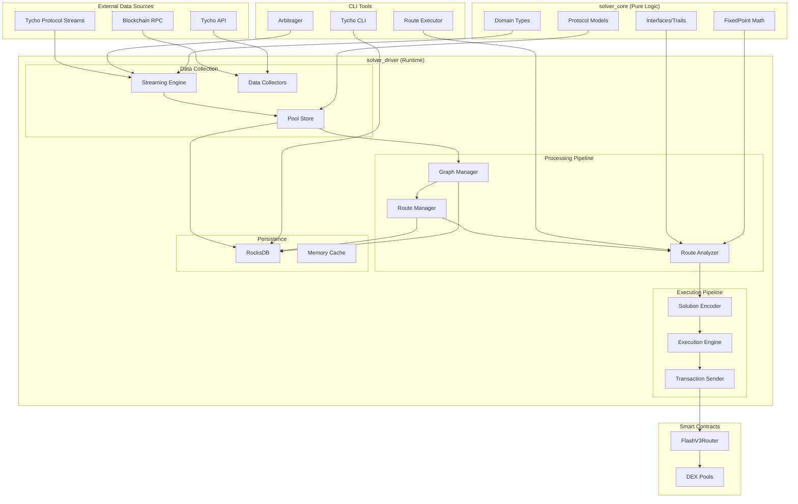
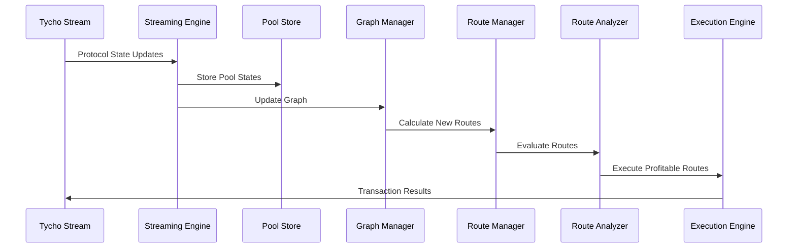

# Solving, Arbitrage & Market Making

## Evaluating over 1000 Routes Per Second and arbitraging them with no upfront capital.

In this article I discuss my personal Journey for 2025. Give an example of a cyclical arbitrage built on the latest high performant solving and market making infrastructure. Discuss how this infrastructure can be applied to Intent Based Solving Sytems (think UniswapX, CowSwap, 1inch) and give a full breakdown of the mathematics and technical implementation of a generic solving infrastructure service that I have been developing.

If you are an **investor**, **protocol**, or **market maker**, let’s connect to:

- **Investors**: Please help with introductions to portfolio companies and liquidity providers in the space. Also reach out if this technology can be utilized in startups you are currently evaluating.
- **Protocols**: Please reach out if this technology (or I personally) can help you drive more order flow to your protocol.
- **Market Makers (and liquidity providers)** please reach out if you want to develop advanced trading strategies and liquicity management functionality using this infrastructure.

This reserach is also availabe on [hackmd.io](https://hackmd.io/@jincubator/arbitrage)

> **Disclaimer:** This blog post covers an overview of a high performant solving, arbitrage and market making infrastructure. The example of a cyclical arbitrage is a simple one but useful for demonstration purposes. I really wanted to show the foundation for how to build and think about the foundational layers of collectors, strategies and execution. The codebase is private and at the time of writing has already been enhanced, but the concepts remain solid.

---

## 2025 – A Year of Research and Growth

### Personal Journey

This year I decided to spend my time coming up to speed on the latest innovations and technologies in crypto. My focus area is real-time market making and solving for intent-based protocols such as UniswapX, 1inch, and Cowswap. I’ve explored breakthroughs in real-time indexing, simulation, and execution pioneered by Tycho.

This journey included:

- Attending the **[Atrium Uniswap V4 Hook Academy](https://atrium.academy/)**
- Hacking on **1inch Limit Order Protocol** [article here](https://hackmd.io/@jincubator/1nchTychoNoLiquiditySwap)
- Prototyping [UniswapX](https://docs.uniswap.org/contracts/uniswapx/overviews) Fillers and [CowSwap](https://docs.cow.fi/cow-protocol/tutorials/solvers) Solvers
- Researching cross-chain intents and advanced resource locking using the **[the-compact](https://docs.uniswap.org/contracts/the-compact/overview)** (an ERC6909 vault with a robust ecosystem of sponsors, allocators, fillers, arbiters, and relayers)

I continually refined my understanding of high-performance solving and market-making using **[Alloy](https://alloy.rs/)**, **Rust**, and **[Tycho’s architecture](https://docs.propellerheads.xyz/tycho/overview)**, which leverages **[substreams](https://substreams.dev/)**, advanced **router**, **dispatcher**, and **executor technologies**. These abstractions allow seamless interaction with protocols such as Uniswap, Balancer, SushiSwap, and more.

There's no better way to come up to speed with the technology used in high performance, market making, solving and arbitrage then to build it. So this is what I set out to do and start with a simple goal.

**Goal:** Build an arbitrage bot capable of generating profit with **no upfront capital**.

### Result

Below are the details of the first positive (albeit for dust) cyclical arbitrage execeuted on Base [View on BaseScan](https://basescan.org/tx/0xde470c186d89aa02e6be2c066b99e7f4e39faebbca9ded80be766f64e28eacfa).

```bash
🌐 BASE  2025-09-13 09:51:39
💰 Profitable route found: 0x452c93c6f3cc3a10e11571e96bc7c88de3a33ea91a3c28a0d703a04b3bcd309c with profit: 959 (0.1568333333333405%)
🏆 Route: Profit 0.000941 USDC (0.156833%) Input Amount: 0.6 [USDC -> WETH -> MOJO -> USDC]
🔄 Route: [USDC -> WETH -> MOJO -> USDC] Route ID: 0x452c93c6f3cc3a10e11571e96bc7c88de3a33ea91a3c28a0d703a04b3bcd309c
⚙️ Protocols: [uniswap_v3 -> uniswap_v2 -> uniswap_v2]
⛓️ Tokens: 0x833589fcd6edb6e08f4c7c32d4f71b54bda02913:0x4200000000000000000000000000000000000006:0x6dba065721435cfca05caa508f3316b637861373:0x833589fcd6edb6e08f4c7c32d4f71b54bda02913
🪙 Start token: USDC 0x833589fcd6edb6e08f4c7c32d4f71b54bda02913 decimals:6
💎 Input amounts: 0.600000 -> 0.000129 -> 30728417.014588
⭐ Eval Raw amounts: 600000 -> 129458828870424 -> 30728417014587798013457008 = 600959
🔁 Pools: 0xd0b53d9277642d899df5c87a3966a349a798f224 : 0x7ef7a6e5b577a1c630e42291c25bca791d402493 : 0xfc49208c1222c8037d4be05890b841ad25ceec60
🔁 Flash pool: pool:0x021235b92a4f52c789f43a1b01453c237c265861 token: 2c8c89c442436cc6c0a77943e09c8daf49da3161 borrowToken0:false fee:0.01%
```

### Some Statistics

#### Performance Statistics

Below show route evaluation (and execution) capabilities of over 1000 routes per second, run on small relatively slow mini pc. This is a summary of several runs executed on mulitple chains over a total of 51 and a half minutes.

| 📊 Statistic                  | Value   |
| ----------------------------- | ------- |
| Total Routes Evaluated        | 182,746 |
| Peak Routes/sec               | 1,146   |
| Current Routes/sec (last run) | 1,069   |
| Average Route Eval Time (µs)  | 424     |
| DB Throughput (ops/sec)       | 0       |
| Memory Usage (MB)             | 657     |
| Batch Size (last run)         | 1       |
| Execution Success Rate (%)    | 100     |
| Metrics Capture Duration (s)  | 3,090   |

#### Chain Stats

Following are the chains we used for our evaluation, testing multiple chains, hop sizes and protocols to give a well balanced analysis.

| 📊 Statistic         | Base   | Ethereum | Unichain |
| -------------------- | ------ | -------- | -------- |
| Routes Total         | 85,986 | 33,226   | 24,600   |
| Graph Edges (Pools)  | 5,338  | 4,276    | 114      |
| Graph Nodes (Tokens) | 2,477  | 1,593    | 33       |
| Total Tokens         | 26,061 | 11,824   | 15,300   |
| TVL                  | 1      | 50       | 1        |
| Hops                 | 4      | 3        | 5        |
| Protocols            | 2      | 7        | 3        |

> Note run on Sep 26th 2025
> **Routes**: Represent how many cyclical routes we created (e.g. A -> B -> C -> A)
> **Graph Edges (Pools)** the number of pools we are selecting based on TVL and protocol filtering
> **Graph Nodes (Tokens)** the number of tokens associated with the selected pools
> **TVL** is in ETH and indicates the minimum TVL for the pools we selected
> **Hops** how many hops in the route we create, currently we support 2 to 5 hop routes. For prototyping we used different hops for experimentation all chains support up to 5 hops.
> **Protocols** the number of protocols we extracted see [Tycho Supported Protocols](https://docs.propellerheads.xyz/tycho/for-solvers/supported-protocols)

> Note this was run on a Small Computer Linux, AMD Ryzen 7 5700u (8C/16T,up to 4.3 GHz), Mini PC Gamer 64GB DDR4 RAM 2TB PCIe SSD, Mini Desktop Supports 4K@60Hz/Triple Display/WiFi/BT5.0/HDMI+DP+Type C/Home/Office

## An Overview of Intent-Based Protocols and Solving

### Resource Management and Capital-Efficient Liquidity

The key to building a high-performance system lies in efficient resource allocation. Pools themselves can act as liquidity sources, and flash-loans allow trades to execute **capital-efficient arbitrage** without requiring upfront capital. With the advances in DeFi protocols such as [Uniswap 4](https://docs.uniswap.org/contracts/v4/overview) with [hook capabilities](https://docs.uniswap.org/contracts/v4/quickstart/hooks/setup) this allowed me to build custom execution logic on top of large liquidity reserves giving endless opportunities.

I started out with a goal of building an intent based hook, which would record the intent (e.g. swap 1 ETH for 4500 USDC) and create an intent which I could solve, if I could solve that intent giving the swapper a better return, than I could keep the profit. For example if the pool offered a swap of 1 ETH for 4500 USDC, but I had a better route that could swap 1 ETH for 4600 USDC, I could solve the intent giving the swapper, say, 4550 USDC take the ETH and then perform the swap netting 50 USDC profit. Whilst this was an interesting idea, I soon came to realize that with V4's pool manager settlement functionality, it was better to build the intent outside the protocol (at the router level) rather than as a hook. Or better still build a hook which integrates with an Executor such Tycho with perhaps some Flash Loan functionality, more to come on this.

### Streaming, Simulation, and Execution

The architecture follows the principle: **Collectors → Strategies → Execution**

#### Collectors: Continuously stream on-chain data

The bedrock of the collection architecture is the [Tycho Indexer](https://docs.propellerheads.xyz/tycho/for-solvers/indexer) built on [substreams](https://docs.substreams.dev/). It provides real time state updates for multiple protocols filtered by TVL values for those protocols.

On top of this we build a graph manager and a route manager using Depth First Search of the graph to create the routes with a little flash_loan_manager to determine the optimal flash loan available. This includes choosing the flash loan with the lowest fee which does not have any locking conflicts with the route.

The key point for collection, once again enabled by Tycho streaming technology, is that on a state change to any of the protocols which I am monitoring. I trigger route evaluations for all routes that contain that pool. Evaluating whether a positive arbitrage cycle exists or not. I must admit its tireless work for the route evaluate and its queue manager, evaluating hundreds or even thousands of routes per block, but occasionally, just occasionally an opportunity will be found, which makes it all worthwhile.

#### Strategies: Analyze and simulate opportunities

The first (and only thus far) strategy implemented thus far is a cyclical arbitrage. Starting and ending with the same token traversing throough routes we simulate each input and output amount for the route and evaluate if a positve aribtrage exists. If so a Solution for the route with an input amount is Signalled. This will be received by the execution layer.

Below is the profitability calculation

#### Execution: Executing the transactions

The exeuction layer receives a Solution including input amount and the route to execute. It performs additional aumentation and encoding.

For example in the reference cylical aribtrage the executor maps both the flash loan parameters and swap parameters. It encodes the solution and using alloy binding for flashExecutor creates the calldata for the transaction.

The executor itself has pre-flight validation which will capture any identified routes which may no longer be profitabile or error because of other upstream analysis issues. This saves wasting gas on transactions that will revert.

## Profitability Calculation

Let `A0` be amount_in (start token), `Ak` be amount_out (end token), `fee_hundredths_bip` the flash fee in 1e-6 units.

- swap_profit_percentage = ((Ak − A0) / A0) × 100
- flash_fee_pct = fee_hundredths_bip / 10_000 (as percent)
- net_profit_percentage = swap_profit_percentage − flash_fee_pct
- net_profit_token = Ak − A0 − floor(A0 × fee_hundredths_bip / 1_000_000)

Threshold gating uses `net_profit_percentage >= profit_threshold` (default 0.0%).

At this time we then need to optimize the input amount for the route.
This is done using a binary doubling and halving algorithm until the optimal amount is found.

- **Execution**: Optimistically execute profitable paths

---

## Building a Liquidity Mapping Layer

Conceptually this was farly straight forward, create a graph with Tokens as Nodes, Pools as edges and then create routes for that graph. With the protocol abstraction offered by tycho's component and state model. A pool is a pool is a pool regardles of what the underlying protocol is. This simplified the implementation considerably

---

## My First Strategy: Cyclical Arbitrage

### (Hello Bellman-Ford)

- Analytical optimization for multi-hop routes
- Supports **2–5 hop cycles**
- Prioritizes **profitability and performance** (~1000 routes/sec)

> An open strategy framework is under development with the Cyclica Arbitrage (CARB) implemented and a TOKEN (token based arbitrage which groups all the routes for the input token and selects the route with the highest profitability) currently being tested in production.

---

## The Execution Layer – Making It Happen

### Some Flash Loan Magic

- Borrow liquidity directly from pools for capital-efficient trades
- Near-zero fees, instant execution

### The Beauty of Routes: Single and Sequential Swaps

- **Atomic Execution**: Trades revert if not profitable
- **Optimistic Recursive Execution**: Capture secondary opportunities generated by large trades

---

### Summary of Features

- Multi-chain, multi-protocol route evaluation
- Multi-hop arbitrage support
- Flash-loan enabled trades
- Persistent storage for faster startup
- Modular queues for streaming, graph, route management, evaluation, and execution

---

### Key Milestones

- **First Working Transaction:** [View on BaseScan](https://basescan.org/tx/0xde470c186d89aa02e6be2c066b99e7f4e39faebbca9ded80be766f64e28eacfa)
- Support for **2–5 hop routes**
- **Standalone persistence** for tokens, graphs, and routes
- **Multi-protocol support**:
  - Ethereum: Uniswap v2/v3/v4, Balancer v2, Curve, Sushiswap v2, Pancakeswap v2/v3, Ekubo v2
  - Base: Uniswap v2/v3
  - Unichain Uniswap v2/v3/v4
- SingleSwap Support takes advantage of complex routes using Uniswap V4 advanced Execution
- **Performance**: ~1000 route evaluations per second
- Prototype **v4 Flash Loans** (near-zero fees)

---

### Still to Come

At time of writing these features are being evaluated and/or implemented

- Gas manager
- MEV bundling
- Token based evaluation (grouping of all routes for a token to ensure the most profitable arbitrage)
- Additional protocol integrations
- Further performance optimizations
- Uniswap V4 Flash Hook (Access to V4 Liquidity integrated with complex routing and exeuction strategies)
- Liquidity Management (ERC-6909 based liquidity manageer build on [the-compact](https://docs.uniswap.org/contracts/the-compact/overview) from Uniswap)

---

## What’s Next – Opportunities & Integrations

### Filling Strategies

Multi protocol solver integrations including

- **UniswapX Solving**
- **1inch Limit Order Solver Integration**
- **Cowswap Solving**

### Flash Liquidity

- **Uniswap / Tycho Limit Order Hook Integration**

### Protocol Order Flow

Adding additional protocols to the simulation and execution framework to drive order flow.

### Liquidity Management

Introducing an advanced liquidity management infrastructure with real time settlement, JIT liqidity provioning and support for advanced trading strategies. (ERC-6909 based liquidity manageer build on [the-compact](https://docs.uniswap.org/contracts/the-compact/overview) from Uniswap)

### Miscellaneous

- Hosted services for Market Makers and Solvers
- Collaboration and Consulting for Protocols looking to attract more order flow.
- Strategy development for Solving, Market Making and Liquidation Engines.

# Appendices

## Appendix A: Mathematics

### Route Manager

The Route Manager enumerates all possible multi-hop routes through the liquidity graph. We use a modified Depth-First Search (DFS) traversal to explore potential sequences of swaps, iterating through multiple nodes while avoiding revisiting tokens in the same route.

Mathematically, for a graph $$G = (V, E)$$ with vertices $V$ representing tokens and edges $E$ representing liquidity pools, DFS can be described recursively as:

DFS(v) = visit all neighbors of v recursively without revisiting nodes in the current path

Our implementation supports two main modes:

1. **Full Graph Rebuild:** Clears all existing graph data and rebuilds from scratch, adding pools in bulk or individually depending on dataset size. V4 eligibility of tokens is processed for all pools.
2. **Incremental Updates:** Adds new pools to the existing graph without clearing prior data. Optimized for $O(n)$ complexity relative to the number of new pools.

Edges are bidirectional between token pairs:

$$
A \leftrightarrow B
$$

Each edge stores metadata including the pool identifier, output token, protocol, and fee basis points.

#### Modified DFS Traversal

Instead of a simple recursive DFS, the route manager iteratively explores each node while accounting for:

- Pool and token blacklists to prevent invalid routes
- Multi-protocol support (Uniswap V2/V3/V4, Sushiswap, Pancakeswap, Ekubo, Balancer, Curve)
- Flash loan constraints to avoid locking conflicts
- Real-time V4 eligibility of tokens

The traversal maintains a stack of paths, extending each path by iterating over neighbor tokens. If a neighbor has already been visited in the current path, it is skipped to prevent cycles that do not start and end at the same token.

#### Graph Construction Overview

- Assign unique identifiers for each pool and token
- Create bidirectional edges connecting the token pair
- Update adjacency structures for fast neighbor lookup
- Persist edges to storage in both compact and legacy formats

#### DFS Context

Depth-first search is an algorithm for traversing or searching tree or graph structures. Starting at a root node (or an arbitrary node in a general graph), DFS explores as far as possible along each branch before backtracking. A stack (explicit or via recursion) tracks the nodes visited along the current branch.

In the arbitrage solver, DFS enumerates all candidate routes for evaluation by the Route Evaluator, ensuring that profitable multi-hop cycles are identified while respecting token and pool constraints.

---

### Route Evaluator

The route evaluation process leverages the Bellman–Ford algorithm to detect negative-weight cycles that correspond to profitable arbitrage opportunities:

`d(v) = min_{(u,v) in E} [ d(u) + w(u,v) ]`

Negative-weight cycles represent opportunities where the sequence of swaps results in a net gain after accounting for fees.

> Token Evaluation is in progress this groups all the routes for the input token and selects the route with the highest profitability

---

### Optimal Amount Calculator

The function `find_optimal_input_amount` computes the **capital-efficient input amount** for a given arbitrage or swap route to maximize profit.  
Mathematically, it is an **iterative optimization problem** combining **exponential search** and **binary search** over discrete input amounts.

---

#### Step 0: Initialization

Let:

- `A_min` = initial minimum input (e.g., 0.1 token)
- `A_max` = upper bound (initialized as `A_min`)
- `P_best = 0` = best observed profit
- `A_best = A_min` = best input amount
- `ε` = minimum input resolution (based on token decimals, e.g., 0.001 token)

Define:

- `profit(amount)` = evaluation function that returns absolute profit from using `amount` on the route.

---

#### Phase 1: Doubling Search (Exponential Growth)

**Goal:** Quickly find an **upper bound** for profitable input.

1. Set `A = A_min`
2. Repeat for a maximum number of iterations:
   1. Evaluate profit: `P = profit(A)`
   2. If `P > P_best`, update:
      ```
      P_best = P
      A_best = A
      ```
   3. If profit drops below threshold or declines significantly, stop doubling
   4. Else, double the input:
      ```
      A = 2 * A
      ```

**Result:**

- `A_max = A` (approximate upper bound)
- `A_min` = last profitable input from doubling

> This phase is equivalent to an **exponential search** to find the range where the optimal input lies.

---

#### Phase 2: Binary Search (Refinement)

**Goal:** Refine the optimal input within `[A_min, A_max]`.

1. While `A_max - A_min > ε` and iterations < `max_search_iterations`:
   1. Compute midpoint:
      ```
      A_mid = (A_min + A_max) / 2
      ```
   2. Evaluate profit at midpoint: `P = profit(A_mid)`
   3. Update best:
      - If `P > P_best`, then:
        ```
        A_best = A_mid
        P_best = P
        ```
   4. Update bounds for next iteration:
      - If midpoint profit > previous profit → search higher: `A_min = A_mid`
      - Else → search lower: `A_max = A_mid`

**Result:**

- `A_best` approximates the **input amount that maximizes profit** within desired precision.

---

#### Mathematical Summary

- **Exponential search:** Quickly find search range `[A_min, A_max]`
- **Binary search:** Efficiently refine the optimum within that range
- **Profit metric:** Absolute profit (`output - input`) used to select best amount
- **Dynamic adjustments:** Optional function to tweak inputs if routes behave non-linearly or have state-dependent constraints.

```
maximize P(A) = profit from route given input A

subject to:
    A_min <= A <= A_max
    P(A) >= profit_threshold

where:
    A_max is found via exponential doubling
    A_best is refined via binary search
```

- **Exponential search:** Quickly find search range `[A_min, A_max]`
- **Binary search:** Efficiently refine the optimum within that range
- **Profit metric:** Absolute profit (`output - input`) used to select best amount
- **Dynamic adjustments:** Optional function to tweak inputs if routes behave non-linearly or have state-dependent constraints.

---

### Arbitrage Profit Calculation

Net profit percentage for a route:

```
swap_profit_pct = (A_k - A_0) / A_0 * 100

flash_fee_pct = fee_hundredths_bip / 10,000

net_profit_pct = swap_profit_pct - flash_fee_pct

net_profit_token = A_k - A_0 - floor( A_0 * fee_hundredths_bip / 1,000,000 )
```

## Appendix B: Performance

### Chain Breakdown

| 📊 Statistic                | Base   | Ethereum | Unichain |
| --------------------------- | ------ | -------- | -------- |
| Total Tokens                | 26,061 | 11,824   | 15,300   |
| Graph Nodes (Tokens)        | 2,477  | 1,593    | 33       |
| Graph Nodes (V4 Eligible)   | 838    | 826      | 33       |
| Graph Nodes (V4 Ineligible) | 1,639  | 767      | 0        |
| Graph Edges (Pools)         | 5,338  | 4,276    | 114      |
| Routes Total                | 85,986 | 33,226   | 24,600   |
| Routes Flash V4             | 85,616 | 19,284   | 68       |
| Routes Flash Other          | 2      | 11,762   | 19,162   |
| Routes Flash Error          | 368    | 2,180    | 5,370    |
| **TVL**                     | 1      | 50       | 1        |
| **HOPS**                    | 4      | 3        | 5        |

### Performance Summary

| 📊 Statistic                  | Value   |
| ----------------------------- | ------- |
| Total Routes Evaluated        | 182,746 |
| Peak Routes/sec               | 1,146   |
| Current Routes/sec (last run) | 1,069   |
| Average Route Eval Time (µs)  | 424     |
| DB Throughput (ops/sec)       | 0       |
| Memory Usage (MB)             | 657     |
| Batch Size (last run)         | 1       |
| Execution Success Rate (%)    | 100     |
| Metrics Capture Duration (s)  | 3,090   |

### Performance Detail

| Timestamp           | Total Routes | Avg Eval Time (µs) | Peak Routes/sec | Current Routes/sec | DB Throughput (ops/sec) | Memory (MB) | Batch Size | Success Rate (%) | Metrics Capture Duration (s) |
| ------------------- | ------------ | ------------------ | --------------- | ------------------ | ----------------------- | ----------- | ---------- | ---------------- | ---------------------------- |
| 2025-09-26T18:02:16 | 9,248        | 57,020             | 0               | 0                  | 0                       | 190         | 3,122      | 0                | 0.10                         |
| 2025-09-27T01:27:13 | 33,042       | 1,159              | 576             | 507                | 0                       | 279         | 1          | 0                | 31.60                        |
| 2025-09-27T01:28:31 | 0            | 0                  | 0               | 0                  | 0                       | 142         | 0          | 0                | 0.10                         |
| 2025-09-27T01:29:52 | 13,896       | 4,799              | 464             | 10                 | 0                       | 247         | 1          | 100              | 36.82                        |
| 2025-09-27T02:28:52 | 8,508        | 3,188              | 483             | 334                | 0                       | 243         | 1          | 100              | 36.02                        |
| 2025-09-27T05:26:44 | 24,262       | 1,160              | 641             | 90                 | 0                       | 248         | 1          | 40               | 38.74                        |
| 2025-09-27T06:10:32 | 57           | 1,456,807          | 0               | 0                  | 0                       | 207         | 57         | 0                | 0.24                         |
| 2025-09-27T06:25:54 | 928          | 185,317            | 0               | 0                  | 0                       | 302         | 928        | 0                | 0.16                         |
| 2025-09-27T06:39:39 | 2,138        | 289,502            | 0               | 0                  | 0                       | 418         | 2,138      | 0                | 0.25                         |
| 2025-09-27T07:51:53 | 38,810       | 605                | 1,023           | 674                | 0                       | 412         | 1          | 100              | 226.02                       |
| 2025-09-27T10:36:00 | 3,135        | 2,514,005          | 0               | 0                  | 0                       | 450         | 3,135      | 0                | 7,885.70                     |
| 2025-09-27T16:51:53 | 182,746      | 354                | 1,146           | 1,069              | 0                       | 657         | 1          | 100              | 3,090.32                     |
| 2025-09-27T17:08:56 | 60,618       | 424                | 1,033           | 968                | 0                       | 494         | 1          | 87               | 416.48                       |

## Appendix C: Reference Implementation

### Architecture Overview

The Tycho solver system implements a sophisticated arbitrage bot capable of generating profit with **no upfront capital** through flash loan-based execution. The architecture follows a **streaming-first approach** that processes real-time blockchain data to identify and execute profitable arbitrage opportunities.

#### Core Design Principles

1. **Collectors → Strategies → Execution**: Modular architecture with clear separation of concerns
2. **Real-time Processing**: Live blockchain data streaming via Tycho protocol streams
3. **Capital Efficiency**: Flash loan integration eliminates upfront capital requirements
4. **Multi-protocol Support**: Uniswap V2, V3, V4 with extensible protocol framework
5. **Performance Optimization**: Microsecond-level route evaluation and execution

#### System Architecture



### Liquidity Mapping Collector

The liquidity mapping collector system provides comprehensive chain indexing capabilities through integration with Tycho protocol streams, enabling real-time monitoring of blockchain state changes across multiple supported chains.

#### Persistence

The system uses **RocksDB** as its primary database engine with a column family architecture optimized for high-performance operations:

| Column Family | Purpose           | Key Format              | Value Format                    |
| ------------- | ----------------- | ----------------------- | ------------------------------- |
| `tokens`      | Token metadata    | `token:<address>`       | Serialized `Token` struct       |
| `graph`       | Graph edges       | `graph:<token_address>` | Serialized `Vec<CompactEdge>`   |
| `routes`      | Calculated routes | `route:<route_id>`      | Serialized `Route` struct       |
| `signals`     | Route signals     | `signal:<signal_id>`    | Serialized `RouteSignal` struct |

**Performance Optimizations**:

- **Write Batching**: 100 operations per batch with 100ms flush interval
- **Asynchronous Writes**: Non-blocking write operations via dedicated writer thread
- **Memory Caching**: In-memory route storage with O(1) pool index lookup
- **Incremental Updates**: Only recalculates affected routes on state changes

#### Graph Manager

The Graph Manager constructs and maintains trading graphs using tokens as nodes and pools as edges in a multi-graph structure:

```rust
pub struct GraphManager {
    token_to_id: HashMap<Bytes, u32>,
    id_to_token: HashMap<u32, Bytes>,
    pool_to_id: HashMap<String, u32>,
    id_to_pool: HashMap<u32, String>,
    next_token_id: u32,
    next_pool_id: u32,
}

#[derive(Debug, Clone, Serialize, Deserialize)]
pub struct CompactEdge {
    pub pool_id: u32,
    pub token_out: u32,
    pub protocol: u8, // 0=UniV2, 1=UniV3, 2=UniV4, etc.
    pub fee_bps: u32,
}
```

**Key Features**:

- **Dynamic Graph Building**: Real-time graph construction with generic `build_or_update_graph()` function
- **Edge Management**: Pool rate edges with metadata
- **Node Management**: Token nodes with properties
- **Graph Traversal**: Efficient path finding algorithms using Depth-First Search (DFS)
- **Cycle Detection**: Arbitrage cycle identification
- **Incremental Updates**: Optimized for streaming performance with every-block updates

**Graph Building Performance**:

- **193µs** for 37 pools
- **33µs** for 2 pools
- **O(deg)** updates for efficient streaming

#### Flash Loan Manager

The Flash Loan Manager selects optimal flash loan pools based on fee structure and compatibility rules:

```rust
#[derive(Debug, Clone, PartialEq)]
pub enum FlashLoanProvider {
    /// Uniswap V3 flash loans - always available for all routes
    UniswapV3,
    /// Uniswap V4 flash loans - conditionally available
    ///
    /// **IMPORTANT ELIGIBILITY RULE**:
    /// V4 flash loans are only allowed when the route does NOT contain Uniswap V4 pools.
    /// This prevents recursive dependencies and potential locking issues.
    UniswapV4,
}

#[derive(Debug, Clone)]
pub struct FlashLoanCriteria {
    pub min_liquidity_eth: f64,
    pub max_fee_bps: u32,
    pub preferred_providers: Vec<FlashLoanProvider>,
}
```

**Flash Loan Selection Logic**:

1. **V3 Flash Loans**: Always compatible with any route (30 bps fee)
2. **V4 Flash Loans**: Only compatible with routes that do NOT contain V4 pools (0 bps fee)
3. **Priority Order**: V3 (priority 1), V4 (priority 2)
4. **Liquidity Requirements**: Minimum 0.1 ETH liquidity for testing

**Compatibility Rules**:

- ✅ Route [USDC → WETH → WBTC] (V2/V3 only) → V4 flash loans allowed
- ❌ Route [USDC → WETH (V4) → DAI] → V4 flash loans blocked, fallback to V3

#### Route Manager

The Route Manager discovers and manages arbitrage routes using sophisticated algorithms:

```rust
pub struct EnhancedRouteManager {
    cache: AHashMap<String, RouteCacheEntry>, // route_id -> cache entry
    token_routes: AHashMap<Bytes, AHashSet<String>>, // token -> route_ids
    route_deps: AHashMap<String, AHashSet<String>>, // pool_id -> route_ids
    max_hops: usize,
    config: RouteManagerConfig,
}
```

**Route Discovery Process**:

1. **BFS-based Discovery**: Uses Breadth-First Search for efficient route generation
2. **Incremental Updates**: Only processes affected routes when pools change
3. **Pruning Heuristics**: Applies smart filtering to prevent route explosion
4. **Cycle Detection**: Identifies profitable arbitrage cycles
5. **Flash Loan Integration**: Automatically selects compatible flash loans

**Route Performance**:

- **2.42µs** for 3-hop routes
- **833ns** for 4-hop routes
- **791ns** for 5-hop routes
- **1,983,160 routes** (3-hop) generated in ~222 seconds

**Pruning Heuristics**:

- Avoid cycles (unless for cycle arbitrage)
- Check for duplicate pools in route
- Limit routes per token to prevent explosion
- Protocol-specific pruning (V4 overflow protection)

### Streaming Engine Collector

The MinimalStreamingEngine serves as the central orchestrator for the entire arbitrage system, coordinating real-time data ingestion, route discovery, profitability evaluation, and transaction execution.

#### Core Components

```rust
pub struct MinimalStreamingEngine {
    streamed_pools: Arc<Mutex<HashMap<String, ProtocolComponent>>>,
    streamed_states: Arc<dyn PoolStore>,
    routes_in_memory: Arc<Mutex<HashMap<String, MinimalRoute>>>,
    route_pool_index: Arc<Mutex<HashMap<String, HashSet<String>>>>,
    evaluation_sender: Option<UnboundedSender<MinimalRoute>>,
    execution_queue: Arc<Mutex<Vec<(MinimalRoute, RouteEvaluation)>>>,
}
```

**Key Features**:

- **WebSocket Integration**: Direct connection to Tycho protocol streams
- **Real-time State Processing**: Live protocol state updates from blockchain
- **Incremental Graph Building**: Dynamic graph construction with new pools
- **Route Discovery**: Automatic route calculation for new trading pairs
- **Performance Optimization**: Microsecond-level processing with memory caching

**Initialization Process**:

1. Initialize token store from RPC
2. Start Tycho streaming connection
3. Build initial graph from pool data
4. Find routes with flash loans
5. Start route evaluation loop

### Stream and State Updates

The streaming system processes real-time blockchain data through a sophisticated pipeline:

#### Stream Message Processing

```rust
async fn process_stream_message(&mut self, message: StreamMessage) -> Result<()> {
    // Update pool states
    self.update_pool_states(&message).await?;

    // Check for new trading pairs
    if self.has_new_pairs(&message) {
        self.process_new_pools(&message).await?;
    }

    // Re-evaluate existing routes if state changed
    if self.has_state_updates(&message) {
        self.re_evaluate_routes().await?;
    }
}
```

#### State Update Flow



**Processing Stages**:

1. **State Updates**: Pool states updated in real-time
2. **Graph Updates**: Trading graph rebuilt incrementally
3. **Route Calculation**: New routes calculated for affected pools
4. **Route Evaluation**: Routes evaluated for profitability
5. **Execution**: Profitable routes executed automatically

### Route Evaluation Triggering

Route evaluation is triggered by state changes in the streaming system:

#### Evaluation Conditions

Routes are evaluated when:

1. **New Pools Detected**: New trading pairs added to the system
2. **Pool State Changes**: Liquidity or rate changes in existing pools
3. **Periodic Re-evaluation**: Scheduled evaluation of all routes
4. **Manual Triggers**: CLI-triggered evaluation for testing

#### Evaluation Pipeline

```rust
async fn evaluate_routes_continuously(&mut self) -> Result<()> {
    loop {
        // Get routes from queue
        if let Some(route) = self.route_evaluation_queue.pop().await {
            // Evaluate route
            let evaluation = self.route_analyzer.evaluate_route(&route).await?;

            // Check if profitable
            if evaluation.execution_viable {
                // Queue for execution
                self.execution_queue.push((route, evaluation)).await?;
            }
        }

        // Process execution queue
        self.process_execution_queue().await?;

        // Small delay to prevent busy waiting
        tokio::time::sleep(Duration::from_millis(10)).await;
    }
}
```

### Cyclical Arbitrage Strategy

The cyclical arbitrage strategy implements sophisticated route evaluation algorithms that analyze potential arbitrage opportunities across multiple DEX protocols.

#### Route Evaluation for Profitability

The RouteAnalyzer component uses real-time protocol states to calculate accurate swap amounts and profitability metrics:

```rust
impl RouteAnalyzer {
    pub async fn evaluate_route(
        &self,
        route: &Route,
        pool_store: &dyn PoolStore,
    ) -> Result<RouteEvaluation> {
        // Get current pool states
        let pool_states = pool_store.get_pool_states(&route.pools).await?;

        // Calculate optimal input amount
        let optimal_amount = self.find_optimal_input_amount(route, &pool_states).await?;

        // Calculate swap amounts using ProtocolSim
        let swap_result = self.protocol_sim.calculate_swap(
            route,
            optimal_amount,
            &pool_states,
        ).await?;

        // Apply V4 overflow protection
        let protected_amounts = self.apply_v4_overflow_protection(
            route,
            &swap_result,
        ).await?;

        // Calculate profitability
        let profit = self.calculate_profitability(
            route,
            &protected_amounts,
        ).await?;

        Ok(RouteEvaluation {
            route_id: route.id.clone(),
            input_amount: optimal_amount,
            output_amount: protected_amounts.final_output,
            profit: profit.net_profit,
            roi_percentage: profit.roi_percentage,
            gas_cost: profit.estimated_gas_cost,
            flash_loan_fee: profit.flash_loan_fee,
            execution_viable: profit.net_profit > 0.0,
        })
    }
}
```

#### Optimal Amount Calculation

The system uses a sophisticated **exponential search + binary search** algorithm to find the optimal input amount:

##### Phase 1: Doubling Search (Exponential Growth)

**Goal**: Quickly find an upper bound for profitable input.

1. Set `A = A_min`
2. Repeat for maximum iterations:
   - Evaluate profit: `P = profit(A)`
   - If `P > P_best`, update best values
   - If profit drops below threshold, stop doubling
   - Else, double the input: `A = 2 * A`

##### Phase 2: Binary Search (Refinement)

**Goal**: Refine the optimal input within `[A_min, A_max]`.

1. While `A_max - A_min > ε` and iterations < max:
   - Compute midpoint: `A_mid = (A_min + A_max) / 2`
   - Evaluate profit at midpoint
   - Update best if midpoint is better
   - Update bounds based on profit comparison

**Mathematical Summary**:

```
maximize P(A) = profit from route given input A
subject to A_min ≤ A ≤ A_max, P(A) ≥ profit_threshold
where A_max found via exponential doubling and A_best refined via binary search.
```

#### Solution Creation

Solution encoding transforms route evaluations into executable smart contract calldata:

```rust
pub fn encode_solution(solution: Solution, chain: Chain) -> anyhow::Result<EncodedSolution> {
    let encoder = TychoRouterEncoderBuilder::new()
        .chain(chain)
        .user_transfer_type(UserTransferType::TransferFrom)
        .build()?;

    let encoded_vec = encoder.encode_solutions(vec![solution])?;
    Ok(encoded_vec.into_iter().next().expect("Expected at least one encoded solution"))
}
```

**Key Features**:

- **TychoRouterEncoderBuilder**: Uses Tycho's encoder for ABI-compliant calldata
- **Flash Loan Integration**: Encodes flash loan parameters and sequential swaps
- **Gas Optimization**: Optimizes transaction parameters for execution
- **Multi-protocol Support**: Handles V2, V3, V4 protocol differences

#### Signal Generation

The system generates execution signals for profitable routes:

```rust
#[derive(Debug, Clone, Serialize, Deserialize)]
pub struct RouteSignal {
    pub route_id: String,
    pub route: MinimalRoute,
    pub evaluation: RouteEvaluation,
    pub timestamp: SystemTime,
    pub execution_attempts: u32,
    pub priority_score: f64,
    pub status: SignalStatus,
}

#[derive(Debug, Clone, Serialize, Deserialize)]
pub enum SignalStatus {
    Pending,
    Evaluating,
    ReadyForExecution,
    Executing,
    Executed,
    Failed,
    Expired,
}
```

**Signal Flow**:

1. **Route Discovery** → Create RouteSignal
2. **Evaluation Phase** → Check profitability
3. **Execution Phase** → Execute if profitable
4. **Result Processing** → Update signal status

### Execution Engine

The Execution Engine handles the actual transaction execution with comprehensive error handling and retry logic:

```rust
impl ExecutionEngine {
    pub async fn execute_signal(&mut self, signal: &RouteSignal) -> Result<EvaluationResult> {
        // Pre-flight simulation
        let simulation_result = self.preflight_simulation(signal).await?;
        if !simulation_result.success {
            return Err(anyhow::anyhow!("Pre-flight simulation failed"));
        }

        // Check account balance
        let balance_check = self.check_account_balance(signal).await?;
        if !balance_check.sufficient {
            return Err(anyhow::anyhow!("Insufficient balance"));
        }

        // Encode solution
        let encoded_solution = self.encode_solution(signal).await?;

        // Send transaction
        let tx_hash = self.send_flash_transaction(signal, &encoded_solution).await?;

        // Wait for confirmation
        let receipt = self.wait_for_confirmation(tx_hash).await?;

        // Parse execution result
        let result = self.parse_execution_result(&receipt, signal).await?;

        Ok(result)
    }
}
```

**Key Features**:

- **EIP-1559 Support**: Modern transaction format with dynamic gas pricing
- **Balance Validation**: Pre-execution balance checks
- **Retry Logic**: Automatic retry with nonce synchronization
- **Gas Optimization**: Optimized gas parameters for cost efficiency
- **Transaction Monitoring**: Real-time transaction status tracking

### Flash Loan and Sequential Swap Mappings

The system implements sophisticated flash loan integration with sequential swap execution:

#### Flash Loan Selection

```rust
async fn find_best_flash_loan_pool_with_v4_eligibility(
    &self,
    token: &Bytes,
    _amount_needed: u128,
    streamed_states: &dyn PoolStore,
    excluded_pool_ids: Option<&[String]>,
    route_info: Option<&str>,
    route_tokens: Option<&[Bytes]>,
    route_has_v4_pools: bool,
    input_token_is_v4_eligible: bool,
) -> Result<Option<FlashLoanCandidate>> {
    let mut flash_loan_candidates = Vec::new();

    // V4 Addition: If input token is v4 eligible and route has no V4 pools
    if input_token_is_v4_eligible && !route_has_v4_pools {
        let synthetic_pool = self.create_v4_pool_manager_synthetic_pool(token);
        let candidate = FlashLoanCandidate::new(
            synthetic_pool,
            FlashLoanProvider::UniswapV4,
            1000000.0, // Assume very high liquidity for PoolManager
        );
        flash_loan_candidates.push(candidate);
    }

    // V3 Additions: Find all V3 pools containing the token
    // ... V3 pool selection logic

    // Return best candidate based on score
    flash_loan_candidates.sort_by(|a, b| b.score.partial_cmp(&a.score).unwrap());
    Ok(flash_loan_candidates.first().cloned())
}
```

#### Sequential Swap Execution

The system executes multi-hop swaps atomically through flash loans:

1. **Flash Loan Borrow**: Borrow required tokens from selected pool
2. **Sequential Swaps**: Execute swaps in sequence through route
3. **Flash Loan Repay**: Repay borrowed tokens with profit
4. **Profit Capture**: Keep remaining profit after repayment

**Example Execution Flow**:

```
Route: [USDC → WETH → MOJO → USDC]
1. Borrow 1000 USDC via flash loan
2. Swap 1000 USDC → 0.4 WETH (Uniswap V3)
3. Swap 0.4 WETH → 1000 MOJO (Uniswap V2)
4. Swap 1000 MOJO → 1000.96 USDC (Uniswap V2)
5. Repay 1000 USDC + 0.9 USDC fee = 1000.9 USDC
6. Keep 0.06 USDC profit
```

### Encoding

The encoding system converts route evaluations into executable smart contract calldata:

#### TychoRouterEncoderBuilder Integration

```rust
pub fn encode_solution(solution: Solution, chain: Chain) -> anyhow::Result<EncodedSolution> {
    let encoder = TychoRouterEncoderBuilder::new()
        .chain(chain)
        .user_transfer_type(UserTransferType::TransferFrom)
        .build()?;

    let encoded_vec = encoder.encode_solutions(vec![solution])?;
    Ok(encoded_vec.into_iter().next().expect("Expected at least one encoded solution"))
}
```

**Encoding Features**:

- **ABI Compliance**: Standardized function call encoding
- **Multi-protocol Support**: Handles V2, V3, V4 protocol differences
- **Gas Optimization**: Minimizes calldata size
- **Error Handling**: Comprehensive validation and error reporting

#### Calldata Structure

The encoded calldata includes:

1. **Flash Loan Parameters**: Pool address, token, amount, fee
2. **Swap Parameters**: Route, amounts, protocols
3. **Execution Metadata**: Gas limits, deadlines, slippage
4. **Callback Data**: Post-swap execution parameters

### Execution

The execution system manages transaction lifecycle from creation to confirmation:

#### Transaction Building

```rust
async fn build_transaction(&self, signal: &RouteSignal) -> Result<TransactionRequest> {
    let encoded_solution = self.encode_solution(signal).await?;

    Ok(TransactionRequest {
        to: Some(self.config.router_address.into()),
        data: Some(encoded_solution.calldata.into()),
        gas: Some(U256::from(self.estimate_gas(signal).await?)),
        gas_price: Some(self.get_current_gas_price().await?),
        value: Some(U256::ZERO),
        from: Some(self.signer.address()),
        ..Default::default()
    })
}
```

#### Execution Flow

1. **Pre-flight Validation**: Simulate transaction before sending
2. **Gas Estimation**: Calculate optimal gas parameters
3. **Transaction Submission**: Send to network
4. **Confirmation Waiting**: Monitor transaction status
5. **Result Parsing**: Extract execution results

### PreFlight Evaluation

Pre-flight evaluation simulates transactions before execution to validate profitability:

```rust
async fn preflight_simulation(&self, signal: &RouteSignal) -> Result<SimulationResult> {
    let encoded_solution = self.encode_solution(signal).await?;

    // Create simulation transaction
    let simulation_tx = TransactionRequest {
        to: Some(self.config.router_address.into()),
        data: Some(encoded_solution.calldata.into()),
        gas: Some(U256::from(self.config.preflight_gas_limit)),
        gas_price: Some(self.get_current_gas_price().await?),
        value: Some(U256::ZERO),
        from: Some(self.signer.address()),
        ..Default::default()
    };

    // Execute simulation
    match self.client.call(&simulation_tx, None).await {
        Ok(_) => Ok(SimulationResult {
            success: true,
            error_message: String::new(),
            gas_used: 0,
        }),
        Err(e) => {
            // Log the failure but don't stop execution
            tracing::warn!(
                "Pre-flight simulation failed for route {}: {}",
                signal.route_id,
                e
            );

            Ok(SimulationResult {
                success: false,
                error_message: e.to_string(),
                gas_used: 0,
            })
        }
    }
}
```

**Critical Issue**: There is a **critical issue** in the current preflight simulation implementation where `eth_call` failures are logged but **not used to stop execution**. This can lead to failed transactions being sent to the network.

**Recommended Fix**:

```rust
async fn execute_signal(&mut self, signal: &RouteSignal) -> Result<EvaluationResult> {
    // Pre-flight simulation
    let simulation_result = self.preflight_simulation(signal).await?;

    // CRITICAL FIX: Actually check simulation result
    if !simulation_result.success {
        return Err(anyhow::anyhow!(
            "Pre-flight simulation failed: {}",
            simulation_result.error_message
        ));
    }

    // Continue with execution...
}
```

### Profitability Logging

The system provides comprehensive profitability logging and analysis:

#### Profitability Calculation

The mathematical formulas for profitability calculation:

##### 1. Swap Profit Percentage

```
swap_profit_percentage = ((amount_out - amount_in) / amount_in) * 100
```

##### 2. Flash Fee Percentage

```
flash_fee_pct = (flash_loan_fee / amount_in) * 100
```

##### 3. Net Profit Percentage

```
net_profit_percentage = swap_profit_percentage - flash_fee_pct - gas_cost_pct
```

##### 4. Net Profit in Token Units

```
net_profit_token = amount_out - amount_in - flash_loan_fee - gas_cost_token
```

### Persistence Mechanism

The persistence system uses RocksDB with optimized column families for different data types:

**Database Configuration**:

```rust
let cf_names = vec!["tokens", "graph", "routes", "signals"];
let db = Arc::new(DB::open_cf(&opts, db_path, &cf_names)?);
```

**Write Optimization**:

- **Batch Writes**: 100 operations per batch
- **Async Flushing**: 100ms flush interval
- **Memory Buffering**: In-memory caching before persistence
- **Incremental Updates**: Only persist changed data

### Queuing Configuration

The system uses multiple queues for different processing stages:

**Queue Types**:

1. **Streaming Queue**: Raw blockchain data processing
2. **Evaluation Queue**: Route profitability evaluation
3. **Execution Queue**: Transaction execution
4. **Signal Queue**: Arbitrage opportunity signals

**Queue Management**:

```rust
pub struct ExecutionQueue {
    queue: VecDeque<(MinimalRoute, RouteEvaluation)>,
    max_queue_size: usize,
    priority_scores: HashMap<String, f64>,
}
```

**Priority Calculation**:

```rust
fn calculate_priority(&self, route: &MinimalRoute, evaluation: &RouteEvaluation) -> f64 {
    // Higher profit = higher priority
    let profit_score = evaluation.net_profit_percentage;

    // Shorter routes = higher priority (less gas)
    let gas_score = 1.0 / (route.hops as f64 + 1.0);

    // Combine scores
    profit_score * 0.7 + gas_score * 0.3
}
```

## References

- [Bellman-Ford Alogorithm](https://en.wikipedia.org/wiki/Bellman%E2%80%93Ford_algorithm)
- [Depth First Search Algorithm](https://en.wikipedia.org/wiki/Depth-first_search)
